# SQL-Server-With-Python

# I. SQL Server

## 1. Cài đặt SQL Server và SQL Server Manager Studio
Tải SQL Server từ trang chủ Microsoft [tại đây](https://www.microsoft.com/en-us/sql-server/sql-server-downloads). Mình đang dùng với phiên bản `Express`. Tải về và cài đặt theo mục `Basic`.  


Sau khi cài xong `SQL Server` thì tiếp tục tải và cài đặt `SQL Server Management Studio (SSMS)`.  


Sau đó mở `SSMS` lên và kích hoạt một số chức năng bằng cách sau:  
Bước 1: Mở `Server Properties` bằng cách click chuột phải vào tên server và chọn `Properties`  


Bước 2: Cho phép đăng nhập SQL Server bằng tài khoản:  


Bước 3: Kích hoạt tài khoản `sa` để đăng nhập.  


Sau đó chọn `Properties` để cấu hình tài khoản.  
Bước 4: Kích hoạt tài khoản sa và đặt mật khẩu  


Khởi động lại SQL Server là đã hoàn tất cài đặt SQL Server

## 2. Cấu hình SQL Server bằng SQL Server Configuration Manager

Mở `SQL Server Configuration Manager` lên và vào các mục bên dưới theo hướng dẫn.  


Bước 1: Mở kết nối phương thức `TCP/IP`.  


Và cấu hình địa chỉ để có thể kết nối bằng cách vào tab `IP Addresses --> IPAll` và cấu hình 2 thông số `TCP Dynamic Ports` và `TCP Port` như ảnh bên dưới.    


Để hoàn tất cài đặt thì bạn cần `khởi động lại SQL Server` bằng cách như hướng dẫn bên dưới:  


Để kiểm tra xem đã thành công chưa thì các bạn thử đăng nhập lại với tài khoản `sa` xem kết quả.  


Nếu bạn đăng nhập thành công thì đã hoàn tất các bước cấu hình SQL Server.  

# II. Kết nối SQL Server bằng Python

## 1. Cài đặt driver và thư viện

Để sử dụng `SQL Server` với `Python` thì chúng ta cần có driver chính thức từ Microsoft có tên là `ODBC Driver` và thư viện `pyodbc`.  
Đầu tiên cài đặt `ODBC Driver` ta cần lưu ý như sau. Ta phải biết được phiên bản driver mà ta vừa cài đặt là bao nhiêu để khi kết nối ta phải thông báo rõ với python là ta sử dụng phiên bản đó. Ta có thể tải về từ trang chủ chính thức đến từ Microsof [tại đây](https://learn.microsoft.com/en-us/sql/connect/odbc/download-odbc-driver-for-sql-server?view=sql-server-ver16).  


Có thể thấy phiên bản driver mà mình vửa tải về là `18`. Hoặc có thể cài đặt phiên bản mình đã tai về [tại đây](Setup/msodbcsql.msi). Sau đó cài đặt `ODBC Driver` là hoàn tất.  
Thư viện `pyodbc` sẽ giúp chúng ta kết nối `Python` cùng với `SQL Server` thông qua `ODBC Driver`. Ta cần cài đặt thư viện này cho dự án của chúng ta bằng câu lệnh sau:  

```python
pip install pyodbc
```
Cài đặt thư viện nên cài trong môi trường ảo để có môi trường làm việc chuyên nghiệp và sạch sẽ hơn. Chi tiết về môi trường ảo trong Python xem [tại đây](https://github.com/NguyenDucQuan12/virtual_environment_python)


Tham khảo chi tiết thư viện `pyodbc` [tại đây](https://pypi.org/project/pyodbc/)  

Sau khi có thư viện `pyodbc`. Có thể kiểm tra phiên bản `ODBC Driver` đã cài trên máy bằng câu lệnh sau:  
```python
import pyodbc
# LIST OF INSTALLED DATA SOURCES (DSNs)
print(pyodbc.dataSources())

# LIST OF INSTALLED DRIVERS
print(pyodbc.drivers())
```


## 2. Kết nối CSDL

Để kết nối tới CSDL trong SQL Server thì ta cần một `chuỗi kết nối` có cú pháp như sau:  

```python 
connection_string = (
        "DRIVER={ODBC Driver 18 for SQL Server};"
        "SERVER=localhost;"
        "DATABASE=TestDB;"
        "UID=sa;"
        "PWD=123456789;"
        "TrustServerCertificate=yes;"
    )
```
Có một số chú ý như sau:  

> `DRIVER={ODBC Driver 18 for SQL Server};` ta thay thế nó bằng phiên bản mà ta đã cài `ODBC Driver` trước đó. Đây mình phiên bản `18`  
> `SERVER=localhost;` sẽ là địa chỉ IP của máy tính chứa DB `ví dụ: "192.168.10.13"` hoặc để `localhost` cho chính máy đang chạy phần mềm  
> `DATABASE=TestDB;` sẽ là tên CSDL cần truy cập  
> `UID PWD` sẽ là thông tin đăng nhập  
> `TrustServerCertificate=yes;` thiếu chuỗi này sẽ không được đăng nhập  

Sau đó ta truyền chuối kết nối để có thể thao tác với `Database`. Ví dụ như sau:  

```python
import pyodbc
from contextlib import contextmanager

# Kết nối tới CSDL trước khi làm gì đó
@contextmanager
def open_db_connection(self, commit=False):
    try:
        self.connection = pyodbc.connect(self.connection_string)
        self.cursor = self.connection.cursor()
        yield self.cursor # tương tự return nhưng nó sẽ lưu trữ các trạng thái của biến cục bộ
        # Thường đi kèm với hàm with, trả về cursor và tạm dừng ở đây để thực hiện các lệnh trong with trước
        # Sau khi kết thúc các lệnh trong with sẽ tiếp tục thực hiện các dòng mã bên dưới
        # Nếu không có lỗi thì sẽ commit (xác nhận các giao dịch thêm, sửa, xóa là hợp lệ và lưu vào CSDL)
        # Hoặc tự động rollback nếu không cài tham số commit = True
        if commit:
            self.cursor.execute("COMMIT")
        else:
            self.cursor.execute("ROLLBACK")

    except pyodbc.DatabaseError as err:
        
        # Nếu có ngoại lệ, lỗi, ... xảy ra trong khối lệnh with ngay lập tức rollback (quay trở lại) trước khi lệnh with chạy
        error= err.args[0]
        sys.stderr.write(str(error))
        error_cannot_connect(cannot_write_db)
        self.cursor.execute("ROLLBACK") 
        raise err

    finally:
        # Cuối cùng luôn đóng kết nối với CSDL
        self.cursor.close()
        self.connection.close()

# Hàm gọi lệnh truy vấn đến SQL Server
def get_number_vehicle(self):
    get_number_vehicle_query = "SELECT COUNT(License_Plate_Number)\
                                    FROM License_Plate\
                                    WHERE Status = 'IN' AND Result = 'OK';"
    with self.open_db_connection(commit = False) as cursor:
        cursor.execute(get_number_vehicle_query)
        number_vehicle = cursor.fetchone() # lấy 1 hàng dữ liệu, gọi thêm 1 lần nữa là lấy hàng tiếp theo, fetchall là lấy hết các hàng dữ liệu
        number_vehicle = number_vehicle[0]
        return number_vehicle
```

## 3. Truy vấn CSDL

Khi chúng ta nhận dữ liệu liên tục từ nhiều nguồn (3-4 tín hiệu truyền đến). Để tránh xung đột khi ghi dữ liệu vào SQL Server thì ta chỉ nên `sử dụng một số ít luồng` thực hiện ghi xuống CSDL. Vì thế phương pháp tốt nhất là ta sử dụng `Queue và Thread` cho việc này.  

Cụ thể như sau:  

- Các nguồn dữ liệu (3 - 4 nguồn) sẽ cung cấp dữ liệu để ghi vào CSDL  
- Các dữ liệu này sẽ được đưa lần lượt vào hàng đợi  
- Ta mở một luồng riêng chuyên chịu trách nhiệm ghi dữ liệu vào SQL Server  
- Luồng này sẽ lấy dữ liệu lần lượt từ hàng đợi và ghi nó vào SQL Server  

### 1. Sử dụng 1 luồng chuyên ghi dữ liệu

Việc này giúp ta dễ dàng quản lý luồng ghi, ít khả năng xung đột, sai sót. Số lượng kết nối đến CSDL chỉ là 1 luồng (hoặc có thể thêm 2, 3 luồng nữa). Tuy nhiên ta cần có thêm cơ chế quản lý luồng `(Thread)` để dừng luồng, xử lý khi luồng xảy ra lỗi một cách an toàn, và việc ghi dữ liệu sẽ có độ trễ bởi vì chỉ có 1 luồng ghi dữ liệu mà tận 3,4 nguồn dữ liệu đẩy dữ liệu vào hàng đợi.  

Ví dụ về một luồng ghi dữ liệu, 3-4 nguồn cung cấp thông tin có thể xem [tại đây](Code/insert_data_to_SQL_Server_using_thread_and_queue.py).  

Để sử dụng được code mẫu trên bạn cần tạo CSDL mẫu như hình bên dưới:  

> Database Name: `TestDB`  
> Table: `TestTable`  


Và `TestTable` có cấu trúc như sau:  


>  Tuy nhiên việc xử lý luồng ghi dữ liệu vẫn đang còn đơn giản, chưa xử lý tốt, vì vậy cần chỉnh sửa thêm, không thể sử dụng code trực tiếp được cho các dự án lớn

### 2. Sử dụng 2 luồng ghi dữ liệu

Nếu việc chỉ sử dụng 1 luồng ghi dữ liệu chưa đáp ứng được tốc độ thì bạn có thể tăng lên 2 luồng cùng ghi dữ liệu đồng thời. Hoặc Khi tốc độ ghi 1 thread là không đủ (queue tích lũy quá nhiều dữ liệu, 1 thread ghi xử lý không kịp) thì lúc đó ta sử dụng đồng thời 2 luồng ghi dữ liệu.  

`Queue` trong Python là `thread-safe`. Hai luồng cùng `get()` từ một queue không gây xung đột.

Thông thường, `INSERT` vào một bảng khác hàng (những dòng mới) thì hiếm khi gây xung đột, nhưng nếu cùng `UPDATE/DELETE` các dòng giống nhau, có thể xảy ra tranh chấp khóa hoặc thậm chí deadlock. Nếu hai luồng chỉ `INSERT` những dòng mới (mỗi insert có dữ liệu mới không trùng nhau, ví dụ key tăng tự động), thì SQL Server sẽ xử lý đồng thời tốt và không gây ảnh hưởng gì nhiều, chỉ có chút cạnh tranh lock ở cấp tài nguyên “nhỏ” hơn (thường là page/extent)..  

Vì vậy ta cần chú ý khi sử dụng nhiều luồng  

> Hai luồng cùng `UPDATE/DELETE` trên những row `“trùng”`: Có thể gây `lock` hoặc `deadlock` nếu code transaction phức tạp.  
> Mỗi `INSERT/UPDATE` nên gọn, `commit sớm`, tránh giữ khóa lâu  

Có thể tham khảo ví dụ sử dụng đồng thời 2 luồng để ghi vào CSDL [tại đây](Code/insert_to_sql_use_queue_and_2_thread_write.py)

Tuy nhiên có thay đổi 1 chút, thêm một cột `Time` cho CSDL ban đầu.  


### 3. Vừa ghi dữ liệu vào CSDL vừa đọc dữ liệu ra từ CSDL

Trong một số trường hợp, ta không thể chỉ dành tất cả các luồng cho việc ghi dữ liệu, mà trong lúc đó ta cũng truy vấn để lấy dữ liệu ra `SELECT`. Ta có thể sử dụng các cách sau:  

> Việc ghi dữ liệu `(INSERT/UPDATE/DELETE)` và việc lấy dữ liệu `(SELECT)` không thực hiện trên cùng 1 hàng dữ liệu  

Có nghĩa là mình sẽ `SELECT` dữ liệu `A`, còn `INSERT/UPDATE/DELETE` thao tác với dữ liệu `B`. Hai câu lệnh `ghi` và `đọc` không thực hiện trên cùng 1 dữ liệu  

Tất cả thao tác `“ghi” (INSERT, UPDATE, DELETE)` được đưa vào `Queue` cùng với một (hoặc vài) thread chuyên xử lý ghi (write thread) như [sử dụng hai luồng ghi dữ liệu](#2-sử-dụng-2-luồng-ghi-dữ-liệu).  
Thao tác `“đọc”` trong ứng dụng không cần xếp hàng chờ vì `SELECT không làm thay đổi dữ liệu`. Thay vào đó, ta mở kết nối, chạy `SELECT trực tiếp (hoặc sử dụng connection pooling)`.  

Có thể xem ví dụ sử dụng `python` thao tác với CSDL [tại đây](Code/use_CUD_in_one_thread.py).  

Lưu ý để sử dụng code này ta cần thêm 1 cột `ID` có giá trị tự tăng lên để định danh cho các hàng trong dữ liệu, tránh trường hợp các hàng có giá trị trùng nhau. Ta sử dụng lệnh sau để thêm cột này vào CSDL.  


```SQL Server
ALTER TABLE TestTable
ADD ID INT IDENTITY(1,1) NOT NULL
```
Sau đó chạy file code ví dụ để kiểm tra.  

### 4. Tìm kiếm với từ khóa

Để sử dụng phương pháp tìm kiếm hỗ trợ không dấu, có từ ngữ liên quan đến từ tìm kiếm thì có thể sử dụng phương pháp `Full-Text Search (Tìm kiếm toàn văn bản)`. Phương pháp này tối ưu hóa cho việc tìm kiếm văn bản phức tạp, cung cấp kết quả nhanh chóng. Và đặc biệt phương pháp này tối ưu hóa cho việc tùm kiếm văn bản không phân biệt dấu.  

`Full-Text Search` cho phép tìm kiếm văn bản phức tạp như tìm kiếm `từ đồng nghĩa`, tìm kiếm theo `cụm từ (phrase search)`, tìm kiếm các `từ gần nhau` trong văn bản, hoặc sử dụng các bộ lọc chuyên sâu (điều này không thể thực hiện bằng `LIKE` hoặc `COLLATE`).  

`Full-Text Search` yêu cầu cài đặt chỉ mục trước và có thể tốn tài nguyên khi tạo chỉ mục ban đầu, nhưng sau khi chỉ mục được xây dựng, việc tìm kiếm sẽ rất nhanh chóng và hiệu quả.  

Bây giờ sẽ tiến hành thử nghiệm với bảng `Employee` gồm các cột như sau:  

```
Employee_Code
Employee_Name
Department
Section
Position
Rank
Start_Rank
Privilege
Email
Status_Work
Status
```

#### 4.1 Cài dặt Full-Text Search
Để có thể sử dụng `Full-Text Search` ta cần kiểm tra xem tính năng này đã được cài đặt hay chưa (Mặc định nó được cài đặt trên các phiên bản SQL Server `Enterprise` và `Standar`).  

```SQL Server
SELECT FULLTEXTSERVICEPROPERTY('IsFullTextInstalled');
```
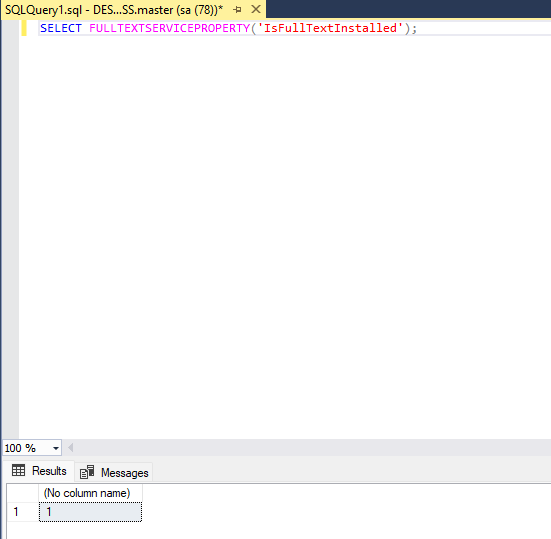  

> Nếu trả về 1 thì Full-Text Search đã được cài đặt  
> Nếu trả về 0 thì cần cài đặt Full-Text Search  

Nếu bạn sử dụng phiên bản SQL Server không có sẵn tính năng `Full-Text Search`, bạn cần cài đặt nó từ `SQL Server Installation Center`.  

`Cài đặt Full-Text Search từ SQL Server Installation Center`  

Cách 1: Cài mới SQL Server  
Để cài đặt `Full-Text Search`, bạn sẽ phải thực hiện lại quá trình cài đặt SQL Server và chọn cài đặt tính năng Full-Text Search.  
- `Chạy SQL Server Installation Center`:  
    - Mở `SQL Server Installation Center` từ menu Start hoặc từ đường dẫn cài đặt SQL Server.  
    - Chọn `"New SQL Server stand-alone installation or add feature to an existing installation"`.  

- Chọn tính năng cài đặt:  
    - Trong `Feature Selection`, chọn `Full-Text and Semantic Extractions for Search`.  

- Tiếp tục các bước cài đặt bình thường. SQL Server sẽ yêu cầu bạn cài đặt một số tính năng bổ sung nếu cần thiết.  

- Hoàn tất cài đặt:  

- Sau khi cài đặt xong, khởi động lại SQL Server (nếu cần thiết) để kích hoạt tính năng Full-Text Search.  

Cách 2: Cài thêm tính năng nếu đã có SQL Server  
Nếu bạn đã cài đặt SQL Server nhưng không chọn `Full-Text Search`, bạn có thể thêm tính năng này mà không cần cài đặt lại toàn bộ SQL Server. Dưới đây là các bước:  
- Mở SQL Server Setup:  

    - Chạy SQL Server Setup từ nơi bạn đã tải SQL Server với quyền admin `(run as administrator)`.  

    - Chọn `"Add feature to an existing instance"`:  

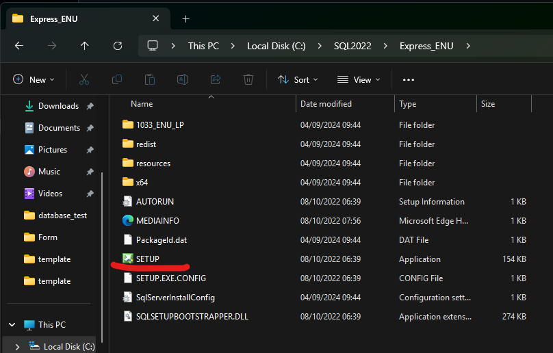  

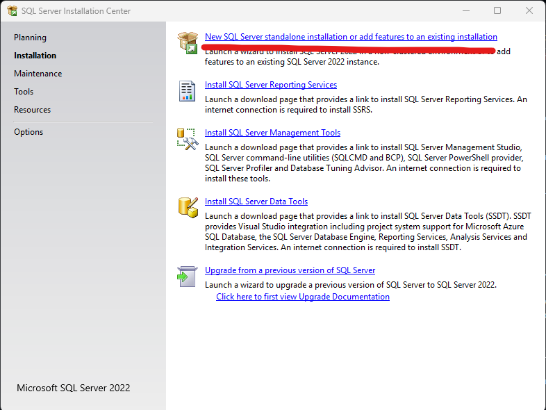  

Ấn `next` cho đến mục `Installion Type`  

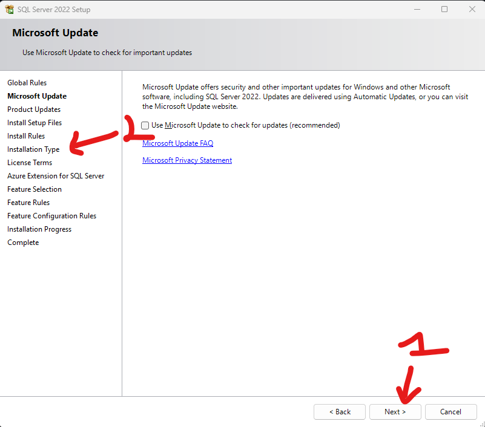  

- Khi cửa sổ SQL Server Setup mở ra, chọn `"Add feature to an existing instance"`.  

    - Chọn `instance SQL Server` mà bạn muốn cài đặt `Full-Text Search` cho nó.  

  

Bỏ tick mục tài khoản azura và ấn next  

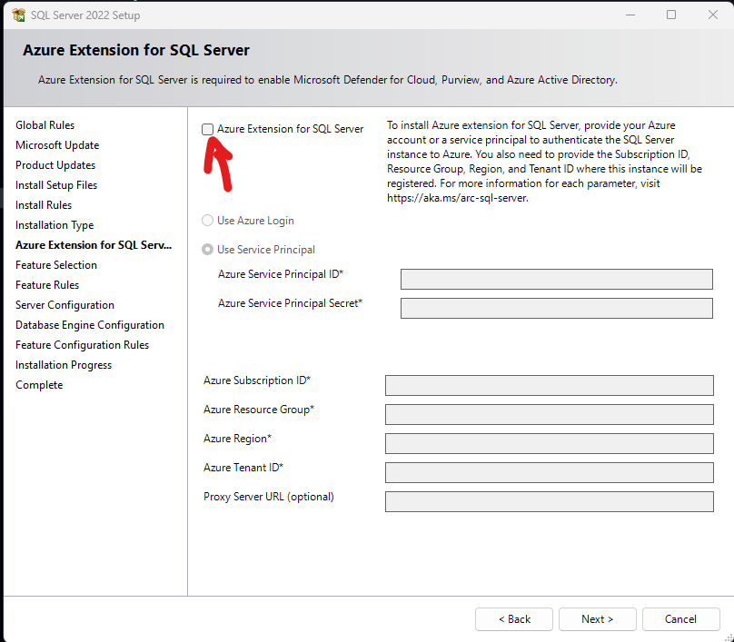  

- Chọn `Full-Text Search`:  

    - Trong phần `Instance Feature`, chọn `Full-Text and Semantic Extractions for Search`.  

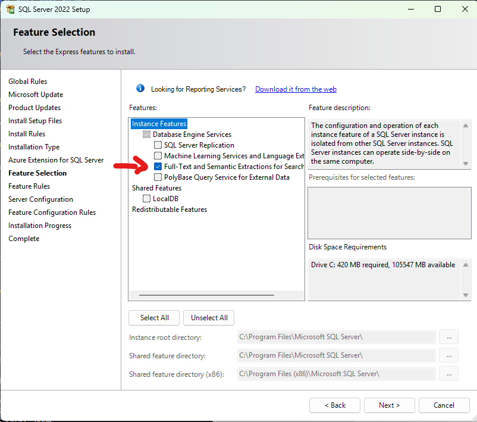  

- Tiếp tục cài đặt và hoàn tất quá trình.  

Nếu bước chọn tính năng `Full-Text Search` mà không có `Full-Text and Semantic Extractions for Search` thì trong quá trình cài đặt bạn đã cài thiếu chức năng, cần tải thêm chức năng này. Mình đang dùng SQL Server 2022 nên lên trang chủ tải về file cài đặt tương ứng.  

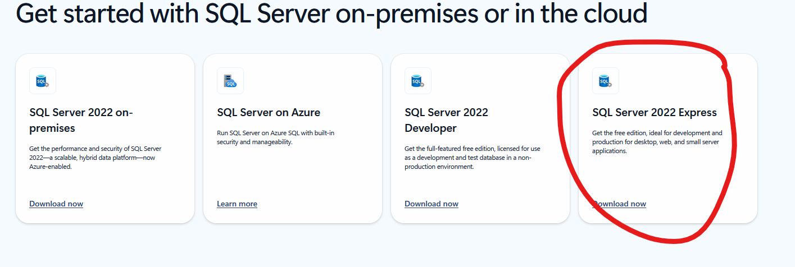  

Chạy tệp cài đặt 2022 Express [tại đây](Setup/SQL2022-SSEI-Expr.rar)  

  

Sau đó chọn mục `Download Media`  

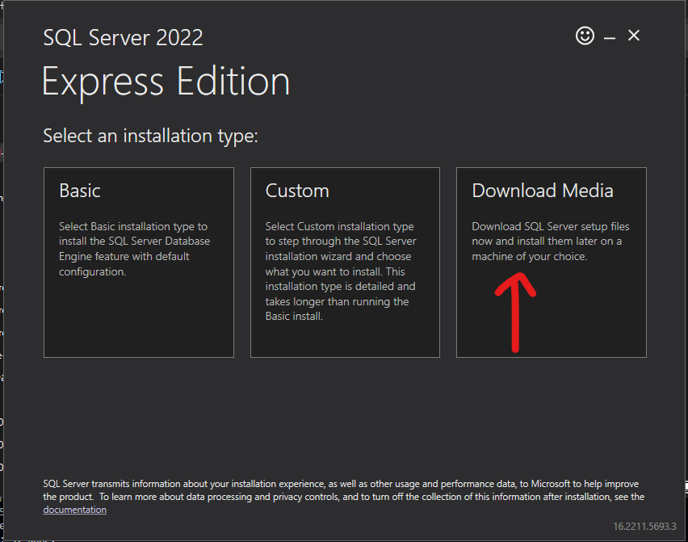  

Rồi chọn mục `Full-Text Search` như hình dưới rồi nhấn download.  

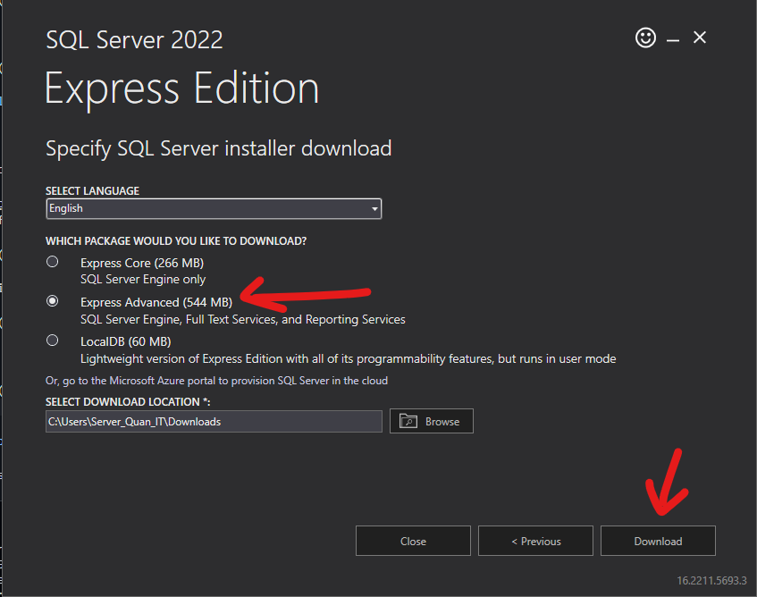  

Sau khi cài thành công thì nó hiển thị như bên dưới và ấn close.  

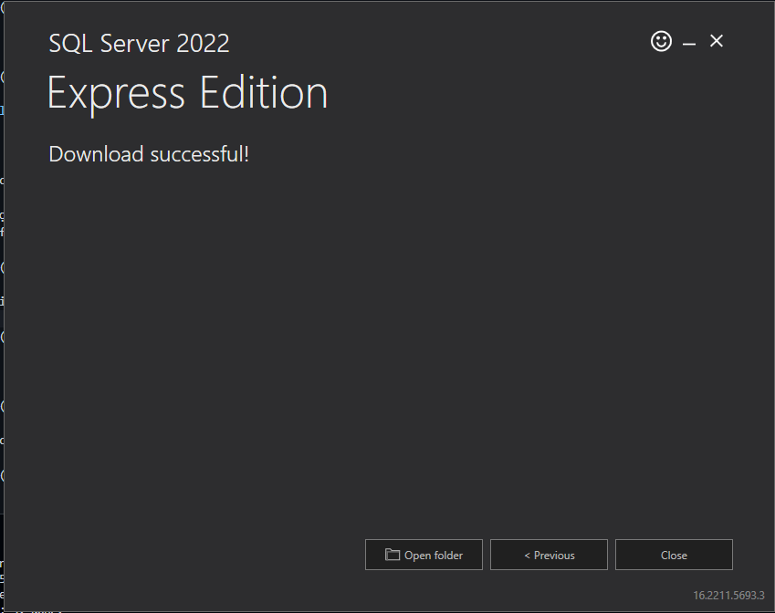  

Sau khi cài thành công quay trở lại thư mục download sẽ có 1 tệp mới là `SQLEXPRADV_x64_ENU`  

  

Mở thư mục này lên để extract ra 1 thư mục của nó.  

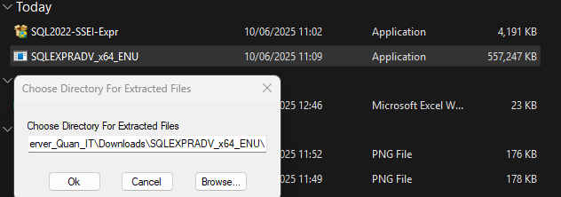  

Sau đó nó sẽ khởi động lại từ bước 1 và thao tác tương tự.  

  

Ấn `Next` để nó downlaod về.  

  

Ấn `close` để hoàn thành. Và quay lại kiểm tra bằng lệnh `SELECT FULLTEXTSERVICEPROPERTY('IsFullTextInstalled');`  

#### 4.2 Tạo Full-Text Catalog và Full-Text Index

Để bắt đầu sử dụng `Full-Text Search`, bạn cần tạo một `Full-Text Catalog` và `Full-Text Index` trên bảng mà bạn muốn tìm kiếm.  

`Full-Text Catalog` là nơi lưu trữ các chỉ mục `Full-Text`. Bạn có thể tạo một `Full-Text Catalog` như sau:  

```SQL Server
CREATE FULLTEXT CATALOG EmployeeFTCatalog AS DEFAULT;
```
Trong đó:
- `EmployeeFTCatalog` là tên của `Full-Text Catalog`. Bạn có thể đặt tên khác tùy ý.  

Sau khi tạo `Full-Text Catalog`, ta sẽ tạo `Full-Text Index` trên cột mà bạn muốn tìm kiếm, ví dụ như cột `Employee_Name`. Yêu cầu phải có khóa chính.  

Nếu chưa có khóa chính ta có thể cài đặt khóa chính cho bảng `Employee` với cột khóa chính là `Employee_Code` như sau:  
```SQL Server
ALTER TABLE Employee
ADD CONSTRAINT PK_Employee_Code PRIMARY KEY (Employee_Code);
```

Sau đó mới thực hiện câu lệnh tạo FullText Index bên dưới.  

```SQL Server
CREATE FULLTEXT INDEX ON Employee(Employee_Name) 
KEY INDEX PK_Employee;
``` 
Trong đó:  
- `Employee_Name`: Là cột chứa dữ liệu mà bạn muốn tìm kiếm (tên nhân viên).  
- `PK_Employee`: Là chỉ mục khóa chính (primary key) của bảng `Employee`. SQL Server yêu cầu bạn chỉ định một chỉ mục khóa chính để tạo `Full-Text Index`.  

Nếu gặp lỗi:  
> Msg 7653, Level 16, State 1, Line 17  
> 'PK_Employee' is not a valid index to enforce a full-text search key. A full-text search key must be a unique, non-nullable, single-column index which is not offline, is not defined on a non-deterministic or imprecise nonpersisted computed column, does not have a filter, and has maximum size of 900 bytes. Choose another index for the full-text key.  

Có nghĩa là bảng này chưa có khóa chính hoặc ko có cột nào là duy nhất (Cột khóa chính yêu cầu không được phép null).  

Bạn cần tạo một chỉ mục duy nhất (Unique Index) trên cột khóa chính hoặc cột không phải là khóa chính mà bạn muốn tạo Full-Text Index. Ví dụ, bạn có thể tạo một chỉ mục UNIQUE trên cột `Employee_Code` nếu cột này là duy nhất.  

Sử dụng cột `Employee_Code` làm khóa duy nhất để làm chỉ mục cho `Full-Text Index` như sau:  

```SQL Server
CREATE UNIQUE NONCLUSTERED INDEX IX_Employee_Code ON Employee(Employee_Code);
```
Sau đó chạy lại lệnh tạo `Full-Text Search` trên cột `Employee_Name` như sau:  

```SQL Server
CREATE FULLTEXT INDEX ON Employee(Employee_Name)
KEY INDEX IX_Employee_Code;
```

Trong đó:  
- `Employee_Name` là cột bạn muốn tạo `Full-Text Index` để tìm kiếm.  
- `IX_Employee_Code` là chỉ mục duy nhất mà bạn vừa tạo để làm chỉ mục khóa cho `Full-Text Index`.  

Chú ý: `Full-Text Index` chỉ có thể được tạo trên các cột có kiểu dữ liệu văn bản (như VARCHAR, TEXT, NVARCHAR, v.v.).  

#### 4.3 Cập nhật chỉ mục Full-Text

SQL Server `tự động duy trì chỉ mục Full-Text` khi có thay đổi trong dữ liệu (thêm, sửa, xóa). Tuy nhiên, để đảm bảo chỉ mục `Full-Text` luôn được tối ưu, bạn có thể thực hiện các bước sau để duy trì và cập nhật chỉ mục:  

Khi có sự thay đổi lớn trong bảng, hoặc khi chỉ mục `Full-Text` bị phân mảnh, bạn có thể `rebuild` chỉ mục `Full-Text`. Điều này giúp làm mới chỉ mục và cải thiện hiệu suất tìm kiếm.  

```SQL Server
ALTER FULLTEXT INDEX ON Employee REBUILD;
```
Câu lệnh này sẽ tái xây dựng chỉ mục Full-Text, giúp tối ưu hóa quá trình tìm kiếm.  

Nếu chỉ mục bị phân mảnh nhẹ, bạn có thể reorganize chỉ mục thay vì rebuild toàn bộ chỉ mục. Điều này giúp cải thiện hiệu suất mà không tốn quá nhiều tài nguyên.  

```SQL Server
ALTER FULLTEXT INDEX ON Employee REORGANIZE;
```
Câu lệnh này giúp giảm thiểu sự phân mảnh chỉ mục mà không làm gián đoạn quá trình tìm kiếm.  

Để kiểm tra trạng thái chỉ mục và mức độ phân mảnh của nó, bạn có thể truy vấn các bảng hệ thống của SQL Server như sau:  

```SQL Server
SELECT * FROM sys.dm_fts_index_population WHERE table_name = 'Employee';
``` 
#### 4.4 Thực hiện truy vấn Full-Text Search

Sau khi đã tạo chỉ mục `Full-Text` và tối ưu hóa, bạn có thể sử dụng các câu lệnh `CONTAINS` hoặc `FREETEXT` để thực hiện tìm kiếm Full-Text.  

Sử dụng `CONTAINS` để tìm kiếm từ hoặc cụm từ chính xác:  

```SQL Server
SELECT 
    Employee_Code, 
    Employee_Name, 
    Section, 
    Position
FROM 
    Employee
WHERE 
    CONTAINS(Employee_Name, 'thuy');
```

> Câu lệnh này sẽ tìm tất cả các nhân viên có tên chứa từ thuy, bao gồm các từ có dấu và không có dấu.  

Sử dụng `FREETEXT` để tìm kiếm từ có nghĩa tương tự:  

```SQL Server
SELECT 
    Employee_Code, 
    Employee_Name, 
    Section, 
    Position
FROM 
    Employee
WHERE 
    FREETEXT(Employee_Name, 'thuy');
```

> Câu lệnh này sẽ tìm kiếm những tên có nghĩa gần giống với từ khóa thuy.  

#### 4.5 Cập nhật chỉ mục khi có sự thay đổi trong dữ liệu

Khi có thay đổi trong bảng (thêm, sửa, xóa), SQL Server sẽ tự động cập nhật chỉ mục Full-Text. Tuy nhiên, bạn vẫn có thể thực hiện các bước sau để tối ưu hóa chỉ mục:  

Các thao tác cụ thể:  
- `Thêm nhân viên mới`: Khi thêm mới nhân viên vào bảng, chỉ mục Full-Text sẽ tự động cập nhật để bao gồm các từ khóa mới.  
- `Cập nhật thông tin nhân viên`: Nếu bạn cập nhật tên của nhân viên (hoặc bất kỳ dữ liệu nào trong cột Employee_Name), chỉ mục Full-Text cũng sẽ tự động cập nhật.  
- `Xóa nhân viên`: Khi xóa một nhân viên, chỉ mục Full-Text sẽ loại bỏ dữ liệu liên quan đến nhân viên đó.  

- Cập nhật chỉ mục sau khi thêm hoặc cập nhật dữ liệu:  
Mặc dù SQL Server tự động cập nhật chỉ mục `Full-Text`, bạn có thể gọi lại `REBUILD` hoặc `REORGANIZE` sau mỗi lần cập nhật lớn dữ liệu.  

Việc tái xây dựng chỉ mục `Full-Text (rebuild)` là một cách hiệu quả để làm mới chỉ mục và giúp hệ thống hoạt động tốt hơn. Điều này nên thực hiện định kỳ, đặc biệt là khi có nhiều thay đổi trong bảng. Bạn có thể thực hiện `rebuild` chỉ mục như sau:  

```SQL Server
-- Sau khi thêm hoặc cập nhật dữ liệu lớn, thực hiện tái xây dựng chỉ mục
ALTER FULLTEXT INDEX ON Employee REBUILD;
```
Tuy nhiên, việc tái xây dựng chỉ mục có thể tốn một chút thời gian và tài nguyên hệ thống, nên bạn nên lên lịch cho tác vụ này vào thời gian thấp điểm hoặc sau khi có nhiều thay đổi lớn.  

- Quản lý tần suất cập nhật  

Nếu bảng `Employee` thay đổi thường xuyên (nhiều bản ghi mới, sửa đổi, xóa), bạn có thể lên lịch các tác vụ bảo trì cho chỉ mục `Full-Text`, ví dụ như `mỗi đêm hoặc cuối tuần`.  
Bạn có thể lên lịch tái xây dựng chỉ mục `Full-Text` bằng cách sử dụng `SQL Server Agent` hoặc các công cụ lập lịch công việc `(`như Task Scheduler của Windows)`.  

#### 4.6 Quản lý Full-Text Search

Bạn có thể kiểm tra trạng thái của các chỉ mục Full-Text đã tạo trên cơ sở dữ liệu bằng cách truy vấn các bảng hệ thống của SQL Server:  

```SQL Server
SELECT * 
FROM sys.fulltext_indexes 
WHERE object_id = OBJECT_ID('Employee');
```

Nếu bạn muốn xóa Full-Text Index và Full-Text Catalog, bạn có thể sử dụng câu lệnh sau:  

```SQL Server
-- Xóa chỉ mục Full-Text
DROP FULLTEXT INDEX ON Employee;

-- Xóa Catalog nếu không sử dụng nữa
DROP FULLTEXT CATALOG EmployeeFTCatalog;
```

# III. Sao lưu dữ liệu

Để tránh sai sót trong quá trình vận hành, hay hạn chế rủi ro khi thao tác với CSDL, ta cần sao lưu dữ liệu thường xuyên. Cần lưu ý các điểm sau:  

> Mất dữ liệu tối đa cho phép (RPO): thường được khuyến cáo là 15 phút  
> Thời gian khôi phục (RTO): Tùy vào quy mô của CSDL thì thường là 30-120 phút  
> Chế độ sao lưu: full, day, transaction  
> 3–2–1 + “immutability”: 3 bản sao lưu, 2 loại phương tiện và 1 bản offsite (đám mây, không cho hép sửa xóa)  
> Hệ thống backup: Sử dụng backup gốc của SQL Server là lựa chọn tốt nhất, tránh sao lưu ở tầng ứng dụng (xuất csv, ...) làm phương án chính  
> Tách biệt hạ tầng: Các nơi lưu trữ backup nên là các nơi khác nhau để tránh rủi ro **mất mát tập trung**  
> Tự động hóa: Tự động hóa các quy trình, có cảnh báo/theo dõi, thử nghiệp khôi phục dữ liệu định kỳ để đảm bảo hệ thống hoạt động trơn tru  

`Backup FULL/DIFF/LOG` đều là online, cho phép đọc/ghi đồng thời. Chúng không khoá bảng theo kiểu chặn DML, nhưng tạo I/O đọc nhiều → có thể tăng latency I/O nếu đĩa yếu.  
Vì thế ta cần lên lịch backup vào khung giờ hợp lý, dùng `striping + tách ổ Data/Log/Backup` để giảm tác động.  

## 1. Thời gian sao lưu
Với hệ thống vận hành 24/7 thì lịch sao lưu được khuyến cáo như sau:  
Với sao lưu full: `Mỗi chủ nhật 00:00 (tần suất 1 lần/1 tuần)`  
Với sao lưu differential: Sao lưu mỗi ngày `0:30 hằng ngày` và không trùng vào ngày sao lưu full vì nó chứa luôn cả ngày rồi  
Với sao lưu transaction log: Sao lưu mỗi 15 phút, bắt đầu từ `0:45` sau khi sao lưu hằng ngày  

## 2. Thiết lập SQL Server

### 2.1 Bật backup compression và tạo chứng chỉ

Khi backup sử dụng chế độ `Compression` là nén khi backup, giúp việc sao lưu tốt hơn, tuy nhiên sẽ tốn dung lượng CPU một chút.  
Tuy nhiên ở các phiên bản `SQL Server Express` hay `Local` thì không thể sử dụng chức năng này được. Nếu máy bạn sử dụng 2 loại trên thì loại bỏ tham số `COMPRESSION` trong các câu truy vấn ở mục dưới.  
Hoặc có một mẹo nhỏ là bật chế độ `Compression` làm mặc định như bên dưới đây, câu lệnh này chỉ khả dụng với các phiên bản SQL khác ngoài `Express và local`.  

```sql
EXEC sp_configure 'show advanced options', 1; RECONFIGURE;
EXEC sp_configure 'backup compression default', 1; RECONFIGURE;
```

### 2.1 Thư mục lưu trữ
Dùng UNC share (ví dụ: \\backup-svr\sql\...) hoặc Object Storage (S3/MinIO/Azure Blob) qua gateway/mount.  

Không lưu chung đĩa với file dữ liệu/transaction log của DB.  

## 3. Lệnh T-SQL

Các lệnh dưới đây được chạy ở Script trong phần mềm `SSMS: SQL Server Managerman Studio`.  

> [!IMPORTANT]  
> Thay đổi You_DB, My_DB bằng các tên Database thật sự    

### 3.1 Full backup
`Full Backup` thường được sao lưu vào cuối tuần, nơi bắt đầu cho 1 tuần mới, có thể sao lưu lúc 0h00.  
Việc tạo `full backup` là điều kiện tiên quyết cho các bản backup còn lại. Vì các bản backup còn lại sẽ so sánh sự khác nhau tại thời điểm `full backup` gần nhất.  
Tạo 1 `full backup` như sau:  
```sql
BACKUP DATABASE [YourDB]
TO DISK = N'E:\SQL_Backup\YourDB\Full\YourDB_FULL_20250916_000000.bak'
WITH            
    CHECKSUM,             -- kiểm tra toàn vẹn khi backup
    COMPRESSION,          -- thường giảm kích thước đáng kể
    STATS = 5;            -- báo tiến độ
```
Trong đó:  
- **[YourDB]**:  Là tên CSDL muốn tạo bản backup full
- **N'E:\SQL_Backup\YourDB\Full\YourDB_FULL_20250916_000000.bak'**: Là đường dẫn đến tệp backup full được lưu  
- **CHECKSUM**: Tính và ghi checksum vào file backup; khi restore/verify, SQL Server sẽ so–khớp checksum để phát hiện lỗi đọc/ghi/corruption  
- **COMPRESSIOM**: Nén file backup (thường giảm 30–70% dung lượng). Tuy nhiên tốn CPU khi backup và restore (Không khả dụng với SQL Server Express)  
- **STATS**: Hiển thị tiến độ mỗi 5% (Theo dõi tiến độ khi chạy job Agent)  

> [!NOTE]  
> #### Thư mục đích lưu trữ tệp backup

Đường dẫn thư mục chứa các tệp đích phải là thư mục nằm trên máy `đang chạy SQL Server` hoặc 1 thư mục được chi sẻ qua network.  
SQL Server phải có quyền thao tác với thư mục đó, nếu không khi backup thì vẫn tạo được các thư mục con, nhưng đến tệp `.bak` thì không có quyền tạo.  
Khi backup mà gặp lỗi `Operating system error 5(Access is denied.)` có nghĩa là thư mục không có quyền tạo tệp backup, ta sửa như sau.  
Chạy lệnh sau để lấy tên tài khoản SQL Server:  
```sql
SELECT servicename, service_account
FROM sys.dm_server_services
WHERE servicename LIKE 'SQL Server (%';
```
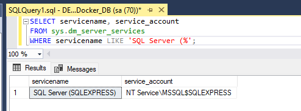  

Sau đó vào thư mục muốn lưu trữ các tệp backup chọn `Properties --> Security`  

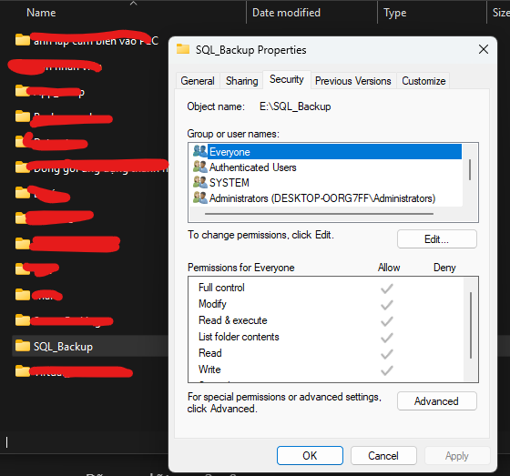  

Chọn `Edit` mục `Group or user names` sau đó chọn `Add` và điền tên `service_account` và sử dụng `Check Names` kiểm tra xem nó có ra tên người dùng không.  

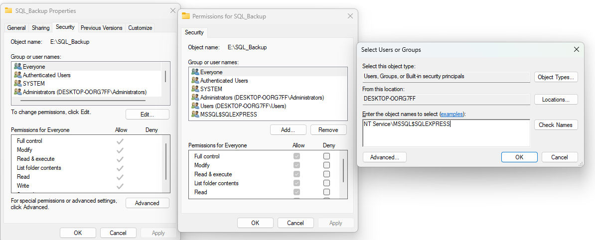 

Sau đó nhấn `OK` và tiến hành chọn quyền hạn cho người dùng vừa thêm. Có thể chọn `Full Control` cho tài khoản vừa thêm.  

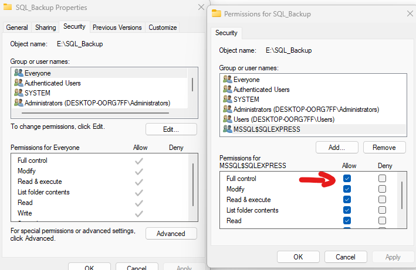  

Như vậy là đã sửa được lỗi `Acess Denied`.  

Với các CSDL lớn có thể ảnh hưởng đến hiệu suất, sử dùng striping (nhiều file .bak) cho DB rất lớn để tăng throughput; cân nhắc MAXTRANSFERSIZE, BUFFERCOUNT nếu cần tối ưu hiệu năng. Việc này giúp tăng thông lượng I/O và rút ngắn thời gian backup/restore. Tất cả các `stripe` đều bắt buộc phải có mặt khi khôi phục CSDL.  

```sql
BACKUP DATABASE [YourDB]
TO  DISK = N'E:\SQL_Backup\YourDB\Full\YourDB_FULL_20250916_000000_1.bak',
    DISK = N'F:\SQL_Backup\YourDB\Full\YourDB_FULL_20250916_000000_2.bak',
    DISK = N'G:\SQL_Backup\YourDB\Full\YourDB_FULL_20250916_000000_3.bak',
    DISK = N'H:\SQL_Backup\YourDB\Full\YourDB_FULL_20250916_000000_4.bak'
WITH NAME = N'YourDB Full 20250916_000000',
    CHECKSUM, COMPRESSION, STATS = 5,
    MAXTRANSFERSIZE = 4194304,    -- 4 MB
    BUFFERCOUNT = 64;             -- điều chỉnh theo I/O thực tế
```

Ta có thể sử dụng `Dynamic SQL` để tự động tạo tệp theo ngày giờ hiện tại như sau:  
```SQL
DECLARE @stamp sysname =
    CONVERT(varchar(8), GETDATE(), 112) + '_' +
    REPLACE(CONVERT(varchar(8), GETDATE(), 108), ':', '');

DECLARE @cmd nvarchar(max);

SET @cmd = 
N'BACKUP DATABASE [Docker_DB] TO ' +
    N'DISK = N''E:\SQL_Backup\Docker_DB\Full\Docker_DB_FULL_' + @stamp + '_1.bak'','  +
    N' DISK = N''E:\SQL_Backup\Docker_DB\Full\Docker_DB_FULL_' + @stamp + '_2.bak'',' +
    N' DISK = N''E:\SQL_Backup\Docker_DB\Full\Docker_DB_FULL_' + @stamp + '_3.bak'',' +
    N' DISK = N''E:\SQL_Backup\Docker_DB\Full\Docker_DB_FULL_' + @stamp + '_4.bak'''  +
N'WITH NAME = N''Docker_DB Full ' + @stamp + ''',
    CHECKSUM, COMPRESSION, STATS = 5,
    MAXTRANSFERSIZE = 4194304,
    BUFFERCOUNT = 64;';

PRINT @cmd;  -- kiểm tra chuỗi trước khi chạy
EXEC sp_executesql @cmd;  -- Thực hiện lệnh
```

Trong đó:  
- Số file tạo ra: 3–8 stripes là khoảng hay dùng (tuỳ số volume/đĩa và băng thông).  
- MAXTRANSFERSIZE: 1–4–8MB là giá trị hay thử  
- BUFFERCOUNT tăng dần đến khi không còn thêm lợi ích.  

Khi cần tạo 1 bản `Full backup` mới để gửi cho người khác hoặc thao tác khác, ta có thể tạo 1 bản copy bằng lệnh `COPY_ONLY`:  
```sql
BACKUP DATABASE [YourDB]
TO DISK = N'E:\SQL_Backup\YourDB\YourDB_FULL_20250916_000000.bak'
WITH COPY_ONLY, CHECKSUM, COMPRESSION, STATS = 5;
```
Bản copy này là độc lập, ko ảnh hưởng đến việc sao lưu cho differentical hay log vì 2 bản backup ấy sẽ sử dụng những bản full mà ko có thuộc tính `COPY_ONLY`.  

### 3.2 Differential
Đối với `Differential` được sao lưu hằng ngày, nó chỉ sao lưu những dữ liệu mà có sự thay đổi so với bản `Full backup` gần nhất (không có thuộc tính `COPY_ONLY`).  
Vì vậy ta luôn phải tạo 1 `Backup full` trước khi backup các kiểu còn lại  

> Diff backup ngày thứ 2 sẽ chứa các thay đổi ngày chủ nhật  
> Diff backup ngày thứ 3 sẽ chứa các thay đổi ngày chủ nhật, ngày thứ 2 (bao gồm các thay đổi trước đó cho đến Full backup gần nhất)  
> Diff backup ngày thứ 4 sẽ chứa các thay đổi ngày chủ nhật, ngày thứ 2, 3 (bao gồm các thay đổi trước đó cho đến Full backup gần nhất)  


```sql
BACKUP DATABASE [YourDB]
TO DISK = N'E:\SQL_Backup\MyYourDBDB\YourDB_DIFF_20250916_060000.bak'
WITH DIFFERENTIAL,
    CHECKSUM, COMPRESSION, STATS = 5;
```

Ta cũng có thể strip cho các `Differencetial backup` như sau.  
```sql
BACKUP DATABASE [YourDB]
TO  DISK = N'E:\SQL_Backup\YourDB\Diff\YourDB_DIFF_20250916_060000_1.bak',
    DISK = N'E:\SQL_Backup\YourDB\Diff\YourDB_DIFF_20250916_060000_2.bak',
    DISK = N'E:\SQL_Backup\YourDB\Diff\YourDB_DIFF_20250916_060000_3.bak',
    DISK = N'E:\SQL_Backup\YourDB\Diff\YourDB_DIFF_20250916_060000_4.bak'
WITH DIFFERENTIAL, NAME = N'YourDB Diff 20250916_060000',
    CHECKSUM, COMPRESSION, STATS = 5,  -- Compression chỉ dùng được với SQL Server ko phải là express
    MAXTRANSFERSIZE = 4194304, BUFFERCOUNT = 64;
```

### 3.2 Transaction Log
`Log Backup` được thực hiện khi CSDL ở chế độ `FULL` hoặc `BULK_LOGGED` (mặc định CSDL sẽ ở chế độ `SIMPLE`), và cần ít nhất một bản `FULL Backup (không phụ thuộc vào Log Diferential)` tồn tại **Sau khi CSDL chuyển sang chế độ FULL hoặc BULK_LOGGED**.  
Sau đó thì có thể thực hiện `Log backup` mà không cần chuyển sang `FULL hoặc FULL_LOGGED`.  
Đối với `Transaction Log` được sao lưu 15 phút 1 lần.  

Có thể kiểm tra chế độ hiện tại của CSDL bằng lệnh sau:  
```sql
SELECT name, recovery_model_desc
FROM sys.databases
WHERE name = N'You_DB_Name';
```
Nếu CSDL đang ở chế độ `SIMPLE` thì chuyển nó sang chế độ `FULL`.  
```sql
-- Chỉ làm 1 lần trước khi bắt đầu chuỗi log:
ALTER DATABASE [YourDB] SET RECOVERY FULL;
```

Tiến hành tạo 1 bản `Full Backup` mới.  
```sql
BACKUP DATABASE [YourDB]
TO  DISK = N'E:\SQL_Backup\YourDB\Full\YourDB_FULL_20250916_000000_1.bak',
    DISK = N'F:\SQL_Backup\YourDB\Full\YourDB_FULL_20250916_000000_2.bak',
    DISK = N'G:\SQL_Backup\YourDB\Full\YourDB_FULL_20250916_000000_3.bak',
    DISK = N'H:\SQL_Backup\YourDB\Full\YourDB_FULL_20250916_000000_4.bak'
WITH NAME = N'YourDB Full 20250916_000000',
    CHECKSUM, COMPRESSION, STATS = 5,  -- Compression chỉ dùng được với SQL Server ko phải là express
    MAXTRANSFERSIZE = 4194304,    -- 4 MB
    BUFFERCOUNT = 64;             -- điều chỉnh theo I/O thực tế
```

Sau đó thực hiện `Log backup` mà ko cần chuyển hay gọi `Full backup` trước mỗi lần gọi cho các lần sau.  
```sql
BACKUP LOG [YourDB]
TO DISK = N'\\backup-svr\sql\YourDB\log\YourDB_LOG_$(ESCAPE_SQUOTE(DATETIME)).trn'
WITH COMPRESSION, CHECKSUM, STATS = 10,
    ENCRYPTION (ALGORITHM = AES_256, SERVER CERTIFICATE = MyBackupCert);
```

Hoặc có thể sử dụng strip file cho `Log backup` nếu số lượng dữ liệu lớn để tăng tốc backup.  
```sql
BACKUP LOG [YourDB]
TO  DISK = N'E:\SQL_Backup\YourDB\log\YourDB_LOG_'+@stamp+'_1.trn',
    DISK = N'E:\SQL_Backup\YourDB\log\YourDB_LOG_'+@stamp+'_2.trn',
    DISK = N'E:\SQL_Backup\YourDB\log\YourDB_LOG_'+@stamp+'_3.trn',
    DISK = N'E:\SQL_Backup\YourDB\log\YourDB_LOG_'+@stamp+'_4.trn'
WITH NAME = N'YourDB Log '+@stamp,
    CHECKSUM, COMPRESSION, STATS = 5,
    MAXTRANSFERSIZE = 4194304, BUFFERCOUNT = 64;
```

### 3.3 Xem danh sách lịch sử ghi log
Có thể truy vấn các lần ghi log của 1 CSDL như sau:  
```sql
SELECT TOP (200)
       database_name, backup_start_date, backup_finish_date,
       type, -- D=Full, I=Diff, L=Log
       first_lsn, last_lsn, checkpoint_lsn, database_backup_lsn
FROM msdb.dbo.backupset
WHERE database_name = 'YourDB'
ORDER BY backup_finish_date DESC
```
Thay `database_name` đúng với tên DB cần kiểm tra. Các trạng thái log được quy định như sau, `D: Full backup`, `I: Differential backup` và `L: Log backup`.  

Ta có câu lệnh sau có thể xem chi tiết hơn, hoặc dùng nó để tìm các bản backup rồi ghép với nhau.  
```sql
;WITH S AS (
  SELECT
    bs.backup_set_id, bs.database_name, bs.type, bs.is_copy_only,
    bs.backup_start_date, bs.backup_finish_date,
    bs.first_lsn, bs.last_lsn,
    bs.database_backup_lsn, bs.differential_base_lsn,
    STRING_AGG(bmf.physical_device_name, ' | ') WITHIN GROUP (ORDER BY bmf.family_sequence_number) AS files
  FROM msdb.dbo.backupset bs
  JOIN msdb.dbo.backupmediafamily bmf
    ON bs.media_set_id = bmf.media_set_id
  WHERE bs.database_name = N'Docker_DB'
  GROUP BY bs.backup_set_id, bs.database_name, bs.type, bs.is_copy_only,
           bs.backup_start_date, bs.backup_finish_date,
           bs.first_lsn, bs.last_lsn, bs.database_backup_lsn, bs.differential_base_lsn
)
SELECT
  CASE type WHEN 'D' THEN 'FULL'
            WHEN 'I' THEN 'DIFF'
            WHEN 'L' THEN 'LOG'  END AS bk_type,
  is_copy_only,
  backup_start_date, backup_finish_date,
  database_backup_lsn, differential_base_lsn,
  first_lsn, last_lsn,
  files
FROM S
ORDER BY backup_finish_date;
```

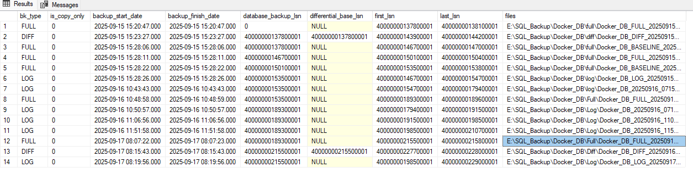  

Ta đọc dữ liệu như sau:  

- Full backup: Là bản sao lưu đầy đủ của 1 tuần, ta muốn khôi phục tuần nào thì ta lấy tuần đó, hoặc lấy bản full mới nhất làm gốc (ko sử dụng bản có cột `IS_COPY_ONLY` là 1 làm gốc).  
- Diff backup: Là bản sao lưu hằng ngày, 1 tuần sẽ có 6 bản sao lưu (ngày chủ nhật ko có vì trùng với `full backup` được thực hiện ở chủ nhật), nếu ta cần khôi phục đến thứ 2 thì chỉ cần lấy 1 bản `Diff backup` của ngày thứ 2, còn nếu khôi phục đến thứ 5 thì cần lấy 4 bản `Diff backup`, các bản `Diff backup` lần lượt nằm phía dưới bản `Full backup` ta lấy trước đó.  
- Log backup: Là các bản sao lưu cách nhau 15 phút trong 1 ngày, 1 ngày sẽ có `74 bản sao lưu` tính từ 0:45 - 24:00 (0:30 sao lưu Diff nên bắt đầu từ 0:45), nếu ta cần khôi phục đến thời điểm 0:45 thì chỉ cần lấy 1 bản `Log backup` của ngày cuối cùng, còn nếu sao lưu đến thời điểm khác thì lấy tương ứng số lượng bản `Log backup` cho đến thời điểm gần với thời điểm đó.   

Với mỗi bản `Diff backup` thì có cột `differential_base_lsn` tham chiếu tới cột `first_lsn` của `Full backup` để biết `Diff backup` này **Phải đi cùng khi khôi phục** với bản `Full backup` tương ứng đấy.  

Với mỗi bản `Log backup` luôn nằm dưới bản `Full backup (nếu ko có Diff backup)` hoặc `Diff backup` trước nó và giá trị 2 cột `first_lsn` và `last_lsn` luôn nối tiếp nhau theo thời gian. Nếu bạn lấy 3 bản `Log backup` thì phải lấy 3 bản có thời gian nối tiếp nhau thì mới sử dụng được cho việc khôi phục CSDL.  

Cột `files` sẽ chứa các đường dẫn tới tệp sao lưu được lưu khi nó thực hiện sao lưu. Để sử dụng đường dẫn này thì **luôn luôn phải kiểm tra xem tệp này còn tồn tại ở thư mục này không**, bởi lúc sao lưu nó có thể ằm ở đây, nhưng sau 1 thời gian bị chuyển đi chỗ khác.  

## 4. Khôi phục dữ liệu

Khi ta có các bản backup dữ liệu từ trước thì ta có thể khôi phục lại dữ liệu tại từng thời điểm tương ứng với các bản backup.  
> Lưu ý nếu khi sao lưu dữ liệu sử dụng striping để tách nhỏ các file thì khi khôi phục phải có đầy đủ các file đã tách nhỏ ra.  

Khi khôi phục dữ liệu mà `ghi đè dữ liệu lên CSDL gốc`, ta cần lưu ý tránh gây xung đột trong quá trình khôi phục như sau.  

- Backup tail-log with norecovery  
```sql
BACKUP LOG [YourDB]
TO DISK = N'E:\...\YourDB_TAIL_yyyymmdd_hhmmss.trn'
WITH NORECOVERY, CHECKSUM, STATS = 5;
```
Trước khi khôi phục ta chạy lệnh trên, lệnh này sẽ tạo ra 1 bản `log backup` ngay tức thì, và khi chạy xong nó sẽ đưa CSDL vào trạng thái `RESTORING`, khiến cho mọi kết nối mới tới CSDL đều bị chặn, chỉ còn mỗi kết nối khôi phục dữ liệu hiện tại. Điều này đảm bảo trong quá trình khôi phục không xảy ra lỗi ngoài ý muốn đến từ người dùng thực hiện các lệnh `INSERT`, `DELETE`, `UPDATE`, ...  

- SINGER_USER/MULTI_USER  
Trong trường hợp CSDL hỏng, không thể tạo `backup tail-log` thì ta sử dụng phương án này.  
Tiến hành hủy mọi kết nối hiện tại và chỉ cho 1 kết nối tới DB để khôi phục.  
```sql
ALTER DATABASE [YourDB] SET SINGLE_USER WITH ROLLBACK IMMEDIATE;
```

Ngay sau khi hủy mọi kết nối, chỉ còn duy nhất được phép 1 kết nối tới CSDL, vì vậy ta cần ngay lập tức tiến hành `RESTORE` CSDL để không bị người khác cướp mất 1 kết nối duy nhất còn lại.  

Còn nếu kết nối đã bị chiếm bởi người khác, ta tiến hành xem kết nối đấy đến từ đâu bằng cách chạy lệnh truy vấn sau:  
```sql
SELECT s.session_id, s.host_name, s.program_name, s.login_name
FROM sys.dm_exec_sessions s
JOIN sys.dm_exec_connections c ON s.session_id = c.session_id
WHERE c.most_recent_sql_handle IS NOT NULL
    AND DB_ID(N'YourDB') = DB_ID(s.database_id); -- nếu version hỗ trợ
```

Hoặc chạy lệnh sau để xem:  
```sql
SELECT session_id, host_name, program_name, login_name
FROM sys.dm_exec_sessions
WHERE database_id = DB_ID(N'YourDB');
```

Sau đó tiến hành hủy bỏ kết nối đấy bằng lệnh:  
```sql
KILL <session_id>;
```

Rồi chạy lại lệnh `ALTER DATABASE [YourDB] SET SINGLE_USER WITH ROLLBACK IMMEDIATE;` và tiến hành `RESTORE` ngay lập tức.  
Và ngay khi xong quá trình khôi phục, ta cần trả lại `MULTI_USER` để cho phép kết nối cùng lúc.  

```sql
ALTER DATABASE [YourDB] SET MULTI_USER;
```
### 4.1 Xác minh các file backup
Trước khi khôi phục dữ liệu ta cần tiến hành xác minh các file backup, có 3 mức độ phổ biến như sau:  
Đọc siêu dữ liệu của 1 tệp backup.  

```sql
RESTORE HEADERONLY
FROM DISK = N'E:\SQL_Backup\Docker_DB\Log\Docker_DB_20250916_071500.trn';
```
Câu lệnh này trả về các thông tin của tệp backup tại đường dẫn trên có chứa: tên DB, phiên bản, thời gian tạo backup, thời gian hoàn thành tạo backup, ...  

```sql
RESTORE FILELISTONLY
FROM DISK = N'E:\SQL_Backup\Docker_DB\Log\Docker_DB_20250916_071500.trn';
```
Câu lệnh này trả về mối quan hệ của tệp log này được tạo từ tệp full nào gần nhất.  

```sql
RESTORE VERIFYONLY
FROM DISK = N'E:\SQL_Backup\Docker_DB\Log\Docker_DB_20250916_071500.trn'
WITH CHECKSUM;
```
Câu lệnh này kiểm tra tính toàn vẹn ở mức backup (không tạo DB mới) dựa trên checksum được tạo ở tệp backup khi backup ban đầu.
Lưu ý: `VERIFYONLY` không phát hiện mọi dạng lỗi logic trong dữ liệu. Kiểm tra triệt để nhất vẫn là test restore lên môi trường khác rồi chạy DBCC CHECKDB.  
Lệnh này cũng được gọi sau mỗi lần backup, kiểm tra xem tệp backup có hỏng hay không.  

Chạy câu lệnh này sau khi `thử nghiệm restore ở DB mới`:  
```sql
DBCC CHECKDB('YourDB_Clone') WITH NO_INFOMSGS;
```
Nếu 
### 4.2 Kịch bản thực hiện khôi phục dữ liệu
Để khôi phục được CSDL thì ta cần có ít nhất 1 bản `Full backup` tại thời điểm mới nhất (gần thời gian ta muốn dữ liệu trở về như cũ)  
Các bản `Differential backup` hoặc `Log backup` nếu có thì việc khôi phục dữ liệu càng chi tiết, càng đầy đủ hơn tại thời điểm ta muốn.  
Đầu tiên ta cần khôi phục bản `Full backup`  
Tiếp theo nếu có bản `Differential backup` thì ta khôi phục tiếp bản này  
Cuối cùng là những bản `Log backup` nếu tồn tại thì thực hiện khôi phục từng bản `Log backup` cho đến thời điểm ta muốn.  
Chi tiết như sau.  

> Ví dụ muốn khôi phục CSDL về thời điểm : `10:23:00 16/09/2025` (thứ 3 trong tuần).  

Ta có 2 lựa chọn, 1 là khôi phục dữ liệu vào 1 Database mới, hoặc có thể khôi phục dữ liệu cũ về Database gốc.  
Ta cần phải thực hiện theo thứ tự từng bước từ `Full --> Diff --> Log` cho đến khi đến thời điểm cần khôi phục hoặc gần với thời điểm đấy nhất.  

Trước khi restore ta cần chuyển `context sang master` để thao tác.  

```sql
USE master;
GO
```

#### 4.1 Khôi phục bản full gần nhất
Bản `Full backup` mới nhất, gần nhất với thời điểm cần khôi phục là `00:00:00 14/09/2025` là ngày sao lưu vào chủ nhật của tuần trước đó.  

`Khôi phục vào Database gốc`  
Trước khi ghi đè dữ liệu vào database gốc, ta **nên backup thêm 1 tệp Log backup lần nữa** cho các giao dịch cuối cùng, sau đó sẽ đưa DB vào trạng thái `RESTORE`, không còn cho phép mở các kết nối mới nữa .  
Bản `Tail backup` này dùng cho trường hợp khôi phục dữ liệu đến thời điểm hiện tại, mới nhất(có nghĩa là bây giờ vừa đúng 10:25:00 16/09/2025).  

```sql
BACKUP LOG [YourDB]
TO DISK = N'E:\SQL_Backup\YourDB\tail\YourDB_TAIL_20250916_104500.trn'
WITH NORECOVERY, CHECKSUM, STATS = 5;
```

Nếu không thể thao tác đưa DB đang hoạt động vào trạng thái `RESTORE` (do DB đã hỏng), thì ta thực hiện các bước sau:  

- Cô lập kết nối tới DB trước khi thực hiện khôi phục dữ liệu.  
```sql
ALTER DATABASE [YourDB] SET SINGLE_USER WITH ROLLBACK IMMEDIATE;
```
- Mở lại kết nối cho các user khác sau khi hoàn tất quá trình khôi phục DB (Sau bước WITH RECOVERY).  
```sql
ALTER DATABASE [YourDB] SET MULTI_USER;
```
Sau khi cô lập kết nối thì mới bắt đầu tiến hành khôi phục DB bằng việc khôi phục từ bản `Full backup` đầu tiên.  

`Khôi phục vào database cũ (ghi đè dữ liệu vào DB gốc)`  
```sql
RESTORE DATABASE [YourDB]
FROM DISK = N'E:\SQL_Backup\YourDB\Full\YourDB_FULL_20250914_020000.bak' -- FULL ngày chủ nhật gần nhất với thời điểm khôi phục
WITH NORECOVERY, REPLACE, CHECKSUM, STATS = 5;
```

`Khôi phục vào 1 database mới`  
Việc khôi phục vào 1 DB mới không cần chuyển DB sang trạng thái `RESTORE` hay `Cô lập kết nối DB`. Khôi phục vào DB mới, kiểm tra xem DB mới có an toàn, có truy cập bình thường không, rồi sau đó mới thật sự ghi đè dữ liệu lên DB cũ, đây cũng là 1 cách thực hiện chuyên nghiệp.  
Tuy nhiên trong các bản backup luôn có 2 thông tin chứa đường dẫn tệp `Log` và `Data` của mỗi Database. Khi ta chuyển sang 1 Database mới thì cần chỉ định chỗ lưu trữ mới cho 2 tệp này tương ứng với Database mới.  

Hai đường dẫn này có thể đặt tùy ý, miễn thư mục đấy tồn tại và tài khoản SQL Server có quyền thêm file. Hoặc có thể sử dụng đường dẫn mặc định của SQL Server bằng câu lệnh sau:  
```sql
SELECT
    SERVERPROPERTY('InstanceDefaultDataPath') AS DefaultDataPath,
    SERVERPROPERTY('InstanceDefaultLogPath')  AS DefaultLogPath;
```
Tuy nhiên nên đặt 2 tệp này vào 2 thư mục khác nhau để tránh chen nhau ghi dữ liệu vào cùng 1 thư mục, cũng như 2 tệp này có thể nặng nếu dữ liệu lớn.  
Sau đó tiến hành bắt đầu ghi dữ liệu vào DB bằng bản Full gần nhất như dưới đây.

```sql
-- Restore FULL (đến DB mới)
RESTORE DATABASE [YourDB_Clone]
FROM DISK = N'E:\SQL_Backup\YourDB\Full\YourDB_FULL_20250914_020000_1.bak',
    DISK = N'E:\SQL_Backup\YourDB\Full\YourDB_FULL_20250914_020000_2.bak',
    DISK = N'E:\SQL_Backup\YourDB\Full\YourDB_FULL_20250914_020000_3.bak',
    DISK = N'E:\SQL_Backup\YourDB\Full\YourDB_FULL_20250914_020000_4.bak'
WITH NORECOVERY, REPLACE, CHECKSUM, STATS = 5,
    MOVE N'YourDB'     TO N'X:\SQL_Data\YourDB_Clone.mdf',
    MOVE N'YourDB_log' TO N'Y:\SQL_Log\YourDB_Clone.ldf';
```

> Nếu thời điểm cần khôi phục trùng với bản full backup hay chỉ muốn dừng ở bản full backup thì thay tham số `NORECOVERY` thành `RECOVERY`  

#### 4.2 Khôi phục bản Diff gần nhất
Các `Diffferential backup` được sao lưu hằng ngày (trừ ngày chủ nhật trùng với `Full backup`) thì bản Diff gần nhất là `00:30:00 16/09/2025`.  
Ta tiến hành khôi phục tiếp theo (tham số `NORECOVERY` là có ý nghĩa chưa hoàn thành khôi phục) từ bản Diff gần nhất.  

`Khôi phục tiếp phần Diff Log nếu có các bản backup này vào Databse gốc`  
```sql
RESTORE DATABASE [YourDB]
FROM DISK = N'E:\SQL_Backup\YourDB\Diff\YourDB_DIFF_20250916_000000.bak' -- DIFF 0h30 sáng
WITH NORECOVERY, CHECKSUM, STATS = 5;
```

`Khôi phục tiếp phần Diff Log nếu có các bản backup này vào Databse mới`  

```sql
RESTORE DATABASE [YourDB_Clone]
FROM DISK = N'E:\SQL_Backup\YourDB\Diff\YourDB_DIFF_20250916_090000_1.bak',
    DISK = N'E:\SQL_Backup\YourDB\Diff\YourDB_DIFF_20250916_090000_2.bak',
    DISK = N'E:\SQL_Backup\YourDB\Diff\YourDB_DIFF_20250916_090000_3.bak',
    DISK = N'E:\SQL_Backup\YourDB\Diff\YourDB_DIFF_20250916_090000_4.bak'
WITH NORECOVERY, CHECKSUM, STATS = 5;
```

> Nếu thời điểm cần khôi phục trùng với bản Diff backup hay chỉ muốn dừng ở bản Diff backup thì thay tham số `NORECOVERY` thành `RECOVERY`  
> Nếu không có các Diff backup thì có thể bỏ qua, nhảy luôn xuống Log backup (sẽ lâu hơn, nhiều file hơn)  
> Chỉ cần khôi phục 1 bản Diff backup gần nhất với thời điểm khôi phục

#### 4.3 Khôi phục các bản Log gần nhất
Các bản `Log backup` được sao lưu cách nhau 15 phút hằng ngày bắt đầu từ `00:45:00` (00:30 đã có bản Diff).  
Từ thời điểm cần khôi phục `10:23:00 16/09/2025` ta có các bản `Log backup` sau:  

- 00:45:00 16/09/2025  
- 01:00:00 16/09/2025  
- 01:15:00 16/09/2025  
- 01:30:00 16/09/2025  
... 
- 10:30:00 16/09/2025

Khi đó ta sẽ chạy lần lượt các tệp `Log Backup` như sau:  

`Khôi phục tiếp phần Log backup nếu có các bản backup này vào Databse cũ`  

```sql
-- 3) LOGs nối tiếp sau DIFF đến lúc @T
RESTORE LOG [YourDB]
FROM DISK = N'E:\SQL_Backup\YourDB\Log\YourDB_LOG_20250916_004500.trn' WITH NORECOVERY, CHECKSUM, STATS = 5;
RESTORE LOG [YourDB]
FROM DISK = N'E:\SQL_Backup\YourDB\Log\YourDB_LOG_20250916_010000.trn' WITH NORECOVERY, CHECKSUM, STATS = 5;
RESTORE LOG [YourDB]
FROM DISK = N'E:\SQL_Backup\YourDB\Log\YourDB_LOG_20250916_011500.trn' WITH NORECOVERY, CHECKSUM, STATS = 5;
-- ... các file thời gian còn lại ...

-- File LOG cuối cùng chứa thời gian cần khôi phục: dừng tại đúng thời điểm (10:23:00 16/09/2025), hoặc bỏ qua tham số STOPAT thì nó khôi phục đến 10:30
RESTORE LOG [YourDB]
FROM DISK = N'E:\SQL_Backup\YourDB\Log\YourDB_LOG_20250916_103000.trn'
WITH STOPAT = '2025-09-16T10:23:00', RECOVERY, CHECKSUM, STATS = 5;
```

Đối với viêc ghi đè DB cũ, nếu muốn sử dụng tệp `Tail Log` khi backup lần cuối (trước khi đưa DB vào chế độ RECOVERY) thì `LOG backup` cuối cùng thay tham số `RECOVERY` thành `NORECOVERY` và thay thêm lệnh `RESTORE` như sau:  
```sql
-- TAIL cuối cùng: dừng đúng thời điểm (nếu cần)
RESTORE LOG [Docker_DB]
FROM DISK = N'E:\SQL_Backup\Docker_DB\Tail\Docker_DB_TAIL_20250916_105000.trn'
WITH STOPAT = '2025-09-16T10:23:00',  -- hoặc bỏ STOPAT nếu muốn tới cuối tail
    RECOVERY, CHECKSUM, STATS = 5;
```

>  Lưu ý:  
>  Mở lại nhiều user (nếu bạn từng Single_User)  
> ALTER DATABASE [Docker_DB] SET MULTI_USER;  

`Khôi phục tiếp phần Log backup nếu có các bản backup này vào Databse mới`  
```sql
RESTORE LOG [YourDB_Clone]
FROM DISK = N'E:\SQL_Backup\YourDB\log\YourDB_LOG_20250916_091500_1.trn',
    DISK = N'E:\SQL_Backup\YourDB\log\YourDB_LOG_20250916_091500_2.trn',
    DISK = N'E:\SQL_Backup\YourDB\log\YourDB_LOG_20250916_091500_3.trn',
    DISK = N'E:\SQL_Backup\YourDB\log\YourDB_LOG_20250916_091500_4.trn'
WITH NORECOVERY, CHECKSUM, STATS = 5;

-- ... tiếp các LOG ...
RESTORE LOG [YourDB_Clone]
FROM DISK = N'E:\SQL_Backup\YourDB\log\YourDB_LOG_20250916_103000_1.trn',
    DISK = N'E:\SQL_Backup\YourDB\log\YourDB_LOG_20250916_103000_2.trn',
    DISK = N'E:\SQL_Backup\YourDB\log\YourDB_LOG_20250916_103000_3.trn',
    DISK = N'E:\SQL_Backup\YourDB\log\YourDB_LOG_20250916_103000_4.trn'
WITH STOPAT = '2025-09-16T10:23:00', RECOVERY, CHECKSUM, STATS = 5;
```

> STOPAT sẽ dừng backup tại thời điểm 10:23 phút, mặc dù tệp cuối cùng đến 10:30  
> Nếu muốn dừng tại 10:30 thì có thể bỏ đi tham số STOPAT  
> Tệp log cuối cùng dừng lại quá trình khôi phục DB sẽ có tham số `RECOVERY`  

## 5. Tự động hóa quá trình

### 5.1 Tạo lệnh Backup tự động
#### 5.1 Sử dụng SQL Agent
SQL có công cụ gọi là `SQL Agent` tự động thực thi các lệnh được cài đặt tự động.  `SQL Agent` chỉ khả dụng trên các phiên bản `Develop`, `Standard`, `Enterprise` ... (ngoại trừ bản `SQL Express` và `Local`)  

Ta sẽ tách thành các 3 công việc chính: `Backup_FULL_weekly`, `Backup_DIFF_daily`, `Backup_LOG_15min`.  

Với kiểu lịch WEEKLY (freq_type = 8), freq_interval là bitmask ngày trong tuần của SQL Agnet sẽ như sau:  

- CN=1, T2=2, T3=4, T4=8, T5=16, T6=32, T7=64.  
- “T2→T7” = 2+4+8+16+32+64 = 126. 

Với `Job Full` được chạy mỗi chủ nhật lúc `00:00:00`:  
- Đầu tiên ta tạo thư mục theo ngày bằng `PowerShell`: `E:\SQL_Backup\<DB>\<Full|Diff|Log>\<YYYYMMDD>\`   
- Sau đó backup Full vào thư mục vừa tạo và `VERIFYONLY` để xác thực tệp backup vừa rồi có hỏng hay không.  

```sql
USE msdb;
GO
-- Job: FULL mỗi Chủ nhật 00:00
EXEC sp_add_job @job_name = N'BK_FULL_weekly', @enabled = 1;

-- Step 1: PowerShell - tạo thư mục E:\SQL_Backup\<DB>\Full\<YYYYMMDD>
EXEC sp_add_jobstep
    @job_name = N'BK_FULL_weekly',
    @step_name = N'CreateFolder',
    @subsystem = N'PowerShell',
    @command = N"
                $Db = 'Docker_DB'
                $base = 'E:\SQL_Backup'
                $backup_task = 'Full'
                $day  = Get-Date -Format 'yyyyMMdd'
                $path = Join-Path $base (Join-Path $Db (Join-Path $backup_task $day))
                New-Item -ItemType Directory -Force -Path $path | Out-Null
    ";

-- Step 2: T-SQL - BACKUP FULL vào đúng thư mục ngày
EXEC sp_add_jobstep
    @job_name = N'BK_FULL_weekly',
    @step_name = N'BackupFull',
    @subsystem = N'TSQL',
    @command = N'
                    DECLARE @db sysname = N''Docker_DB'';
                    DECLARE @dateFolder nvarchar(20) = CONVERT(nvarchar(8), GETDATE(), 112);         -- YYYYMMDD
                    DECLARE @timePart   nvarchar(6)  = REPLACE(CONVERT(nvarchar(8), GETDATE(), 108), '':'', ''''); -- HHmmss
                    DECLARE @dir        nvarchar(4000)= N''E:\SQL_Backup\'' + @db + N''\Full\'' + @dateFolder + N''\'';
                    DECLARE @file       nvarchar(4000)= @dir + @db + N''_FULL_'' + @timePart + N''.bak'';

                    -- (OPTION) Tự tạo thư mục nếu step PowerShell bị tắt:
                    EXEC xp_cmdshell N''IF NOT EXIST "''
                    + REPLACE(@dir, ''"'', ''\"'') + N''" MD "''
                    + REPLACE(@dir, ''"'', ''\"'') + N''"'', NO_OUTPUT;

                    DECLARE @canCompress bit = CASE WHEN SERVERPROPERTY(''EngineEdition'') = 4 THEN 0 ELSE 1 END; -- 4 = Express

                    DECLARE @sql nvarchar(max) =
                    N''BACKUP DATABASE '' + QUOTENAME(@db) + N''
                    TO DISK = N'''''' + REPLACE(@file, '''''', '''''''''') + N''''''''
                    WITH '' +
                    CASE WHEN @canCompress=1 THEN N''COMPRESSION, '' ELSE N'''' END +
                    N''CHECKSUM, STATS=5;''
                    +
                    N'' RESTORE VERIFYONLY FROM DISK = N'''''' + REPLACE(@file, '''''', '''''''''') + N'''''''' WITH CHECKSUM;''

                    EXEC (@sql);
';

-- Schedule: Chủ nhật 00:00
EXEC sp_add_schedule
    @schedule_name = N'WEEKLY_SUN_0000',
    @freq_type = 8,           -- weekly
    @freq_interval = 1,       -- Sunday
    @active_start_time = 000000;

EXEC sp_attach_schedule @job_name = N'BK_FULL_weekly', @schedule_name = N'WEEKLY_SUN_0000';
EXEC sp_add_jobserver  @job_name = N'BK_FULL_weekly';
GO

```
Đối với bản `Diff` ta sẽ không backup vào chủ nhật vì đã có bản `backup full` rồi.   

```sql
USE msdb;
GO
EXEC sp_add_job @job_name = N'BK_DIFF_daily_MonSat', @enabled = 1;

EXEC sp_add_jobstep
    @job_name = N'BK_DIFF_daily_MonSat',
    @step_name = N'CreateFolder',
    @subsystem = N'PowerShell',
    @command = N"
                $Db = 'Docker_DB'
                $base = 'E:\SQL_Backup'
                $backup_task = 'Diff'
                $day  = Get-Date -Format 'yyyyMMdd'
                $path = Join-Path $base (Join-Path $Db (Join-Path $backup_task $day))
                New-Item -ItemType Directory -Force -Path $path | Out-Null
    ";

EXEC sp_add_jobstep
    @job_name = N'BK_DIFF_daily_MonSat',
    @step_name = N'BackupDiff',
    @subsystem = N'TSQL',
    @command = N'
                DECLARE @db sysname = N''Docker_DB'';
                IF DATENAME(WEEKDAY, GETDATE()) = N''Sunday'' RETURN;  -- phòng trường hợp schedule bị cấu hình nhầm

                DECLARE @dateFolder nvarchar(8) = CONVERT(nvarchar(8), GETDATE(), 112);
                DECLARE @timePart   nvarchar(6) = REPLACE(CONVERT(nvarchar(8), GETDATE(), 108), '':'', '''');
                DECLARE @dir  nvarchar(4000)= N''E:\SQL_Backup\'' + @db + N''\Diff\'' + @dateFolder + N''\'';
                DECLARE @file nvarchar(4000)= @dir + @db + N''_DIFF_'' + @timePart + N''.dif'';

                EXEC xp_cmdshell N''IF NOT EXIST "''
                + REPLACE(@dir, ''"'', ''\"'') + N''" MD "''
                + REPLACE(@dir, ''"'', ''\"'') + N''"'', NO_OUTPUT;

                DECLARE @canCompress bit = CASE WHEN SERVERPROPERTY(''EngineEdition'') = 4 THEN 0 ELSE 1 END;

                DECLARE @sql nvarchar(max) =
                N''BACKUP DATABASE '' + QUOTENAME(@db) + N''
                TO DISK = N'''''' + REPLACE(@file, '''''', '''''''''') + N''''''''
                WITH DIFFERENTIAL, '' +
                CASE WHEN @canCompress=1 THEN N''COMPRESSION, '' ELSE N'''' END +
                N''CHECKSUM, STATS=5;'';

                EXEC (@sql);
    ';

-- Schedule: Mon..Sat 00:30
EXEC sp_add_schedule
  @schedule_name = N'DIFF_MONSAT_0030',
  @freq_type = 8,             -- weekly
  @freq_interval = 126,       -- Mon..Sat (bitmask: 2+4+8+16+32+64)
  @active_start_time = 003000;

EXEC sp_attach_schedule @job_name = N'BK_DIFF_daily_MonSat', @schedule_name = N'DIFF_MONSAT_0030';
EXEC sp_add_jobserver  @job_name = N'BK_DIFF_daily_MonSat';
GO

```

Còn đối với `Log` mỗi `15 phút` ta sẽ tránh thời gian trùng với `Diff` và `Full`. Trước mỗi lần backup ta sẽ kiểm tra xem có lệnh `Diff` hay `Full` đang chạy hay không, nếu có thì bỏ qua lần backup này.  

```sql
USE msdb;
GO
EXEC sp_add_job @job_name = N'BK_LOG_15min', @enabled = 1;

EXEC sp_add_jobstep
    @job_name   = N'BK_LOG_15min',
    @step_name  = N'CreateFolder',
    @subsystem  = N'PowerShell',
    @command    = N"
                    $Db = 'Docker_DB'
                    $base = 'E:\SQL_Backup'
                    $backup_task = 'Log'
                    $day  = Get-Date -Format 'yyyyMMdd'
                    $path = Join-Path $base (Join-Path $Db (Join-Path $backup_task $day))
                    New-Item -ItemType Directory -Force -Path $path | Out-Null
    ";

EXEC sp_add_jobstep
    @job_name   = N'BK_LOG_15min',
    @step_name  = N'BackupLog_IfNoOtherBackup',
    @subsystem  = N'TSQL',
    @command    = N'
                    IF EXISTS (
                    SELECT 1
                    FROM sys.dm_exec_requests
                    WHERE command IN (''BACKUP DATABASE'', ''BACKUP LOG'')
                        AND database_id = DB_ID(N''Docker_DB'')
                    )
                    BEGIN
                    PRINT ''A backup is in progress. Skipping LOG backup.'';
                    RETURN;
                    END

                    DECLARE @db sysname = N''Docker_DB'';
                    DECLARE @dateFolder nvarchar(8) = CONVERT(nvarchar(8), GETDATE(), 112);
                    DECLARE @timePart   nvarchar(6) = REPLACE(CONVERT(nvarchar(8), GETDATE(), 108), '':'', '''');
                    DECLARE @dir  nvarchar(4000)= N''E:\SQL_Backup\'' + @db + N''\Log\'' + @dateFolder + N''\'';
                    DECLARE @file nvarchar(4000)= @dir + @db + N''_LOG_'' + @timePart + N''.trn'';

                    DECLARE @sql nvarchar(max) =
                    N''BACKUP LOG '' + QUOTENAME(@db) + N''
                    TO DISK = N'''''' + REPLACE(@file, '''''', '''''''''') + N''''''''
                    WITH CHECKSUM, STATS=5;'';

                    EXEC (@sql);
            ';

-- Schedule: mỗi 15 phút
EXEC sp_add_schedule
    @schedule_name = N'Every_15_Min',
    @freq_type = 4, @freq_interval = 1,         -- daily
    @freq_subday_type = 4, @freq_subday_interval = 15,  -- minutes
    @active_start_time = 000000;

EXEC sp_attach_schedule @job_name = N'BK_LOG_15min', @schedule_name = N'Every_15_Min';
EXEC sp_add_jobserver  @job_name = N'BK_LOG_15min';
GO

```

> Bản hoàn chỉnh tự động chạy cho SQL Agent, thêm tham số strip file để chia nhỏ các tệp sao lưu thành nhiều file giúp tăng tốc tốt hơn cho backup  


```sql
/* ===================================================================
   SQL Agent Jobs: FULL weekly, DIFF Mon–Sat, LOG every 15'
   - Thư mục: E:\SQL_Backup\<DB>\<Full|Diff|Log>\<YYYYMMDD>\
   - Striping: @Stripes (số file/backup)
   - LOG skip khi đang có BACKUP chạy
   - FULL có VERIFYONLY
   =================================================================== */

USE msdb;
GO

/* -------------------------
   COMMON: tiện ích format thời gian
   ------------------------- */

IF OBJECT_ID('tempdb..#noop') IS NOT NULL DROP TABLE #noop;
CREATE TABLE #noop(i int);  -- chỉ để tránh GO segmentation warnings


/* =========================
   JOB 1: FULL (Chủ nhật 00:00)
   ========================= */

DECLARE @DbName sysname = N'Docker_DB';  -- Tên Database cần backup
DECLARE @BasePath nvarchar(4000) = N'E:\SQL_Backup';   -- Thư mục lưu trữ, nhớ cấp quyền ghi tệp vào thư mục
DECLARE @Stripes int = 4; -- số file stripe cho FULL (thường nên chọn 2-4-8)

-- Xóa công việc backup nếu nó đã tồn tại trước đó và thực hiện lại job mới
IF EXISTS (SELECT 1 FROM msdb.dbo.sysjobs WHERE name = N'BK_FULL_weekly')
    EXEC sp_delete_job @job_name = N'BK_FULL_weekly';

EXEC sp_add_job @job_name = N'BK_FULL_weekly', @enabled = 1;

-- STEP 1 (PowerShell): tạo thư mục E:\SQL_Backup\<DB>\Full\<YYYYMMDD>
EXEC sp_add_jobstep
    @job_name = N'BK_FULL_weekly',
    @step_name = N'CreateFolder_Full',
    @subsystem = N'PowerShell',
    @command = N"
                $Db = '" + REPLACE(@DbName,'''','''''') + N"'
                $base = '" + REPLACE(@BasePath,'''','''''') + N"'
                $task = 'Full'
                $day  = Get-Date -Format 'yyyyMMdd'
                $path = Join-Path $base (Join-Path $Db (Join-Path $task $day))
                New-Item -ItemType Directory -Force -Path $path | Out-Null
    ";

-- STEP 2 (T-SQL): BACKUP FULL (striping), VERIFYONLY
EXEC sp_add_jobstep
    @job_name = N'BK_FULL_weekly',
    @step_name = N'BackupFull',
    @subsystem = N'TSQL',
    @on_success_action = 1,  -- Quit with success
    @command = N'
                DECLARE @Db sysname       = N''' + REPLACE(@DbName,'''','''''') + N''';
                DECLARE @Base nvarchar(4000) = N''' + REPLACE(@BasePath,'''','''''') + N''';
                DECLARE @Stripes int = ' + CAST(@Stripes AS nvarchar(10)) + N';

                DECLARE @dateFolder nvarchar(8) = CONVERT(nvarchar(8), GETDATE(), 112);
                DECLARE @timePart   nvarchar(6) = REPLACE(CONVERT(nvarchar(8), GETDATE(), 108), '':'' , '''');
                DECLARE @dir        nvarchar(4000) = @Base + N''\'' + @Db + N''\Full\'' + @dateFolder + N''\''; 
                -- (phòng khi Step1 bị tắt)
                EXEC xp_cmdshell N''IF NOT EXIST "''
                + REPLACE(@dir, ''"'', ''\"'') + N''" MD "''
                + REPLACE(@dir, ''"'', ''\"'') + N''"'', NO_OUTPUT;

                -- Ghép danh sách DISK = N''..._i.bak''
                DECLARE @targets nvarchar(max) = N'''';
                DECLARE @i int = 1;
                WHILE @i <= @Stripes
                BEGIN
                SET @targets += CASE WHEN LEN(@targets)=0 THEN N'''''''' ELSE N'', DISK = N'''''' END +
                                REPLACE(@dir + @Db + N''_FULL_'' + @timePart + N''_'' + CAST(@i AS nvarchar(10)) + N''.bak'', '''''', '''''''''') +
                                N'''''''';
                SET @i += 1;
                END;

                DECLARE @canCompress bit = CASE WHEN SERVERPROPERTY('EngineEdition') = 4 THEN 0 ELSE 1 END; -- 4=Express

                DECLARE @sql nvarchar(max) =
                N''BACKUP DATABASE '' + QUOTENAME(@Db) + N''
                TO '' + @targets + N''
                WITH '' +
                CASE WHEN @canCompress=1 THEN N''COMPRESSION, '' ELSE N'''' END +
                N''CHECKSUM, STATS = 5;''
                + N'' RESTORE VERIFYONLY FROM '' + @targets + N'' WITH CHECKSUM;'';

                EXEC (@sql);
    ';

-- Schedule: Sunday 00:00
EXEC sp_add_schedule
    @schedule_name = N'WEEKLY_SUN_0000',
    @freq_type = 8, @freq_interval = 1,
    @active_start_time = 000000;
EXEC sp_attach_schedule @job_name = N'BK_FULL_weekly', @schedule_name = N'WEEKLY_SUN_0000';
EXEC sp_add_jobserver  @job_name = N'BK_FULL_weekly';
GO


/* =========================
   JOB 2: DIFF (Mon..Sat 00:30)
   ========================= */
DECLARE @DbName2 sysname = N'Docker_DB';
DECLARE @BasePath2 nvarchar(4000) = N'E:\SQL_Backup';
DECLARE @Stripes2 int = 4; -- số file stripe cho DIFF

IF EXISTS (SELECT 1 FROM msdb.dbo.sysjobs WHERE name = N'BK_DIFF_MonSat')
    EXEC sp_delete_job @job_name = N'BK_DIFF_MonSat';

EXEC sp_add_job @job_name = N'BK_DIFF_MonSat', @enabled = 1;

EXEC sp_add_jobstep
    @job_name = N'BK_DIFF_MonSat',
    @step_name = N'CreateFolder_Diff',
    @subsystem = N'PowerShell',
    @command = N"
                $Db = '" + REPLACE(@DbName2,'''','''''') + N"'
                $base = '" + REPLACE(@BasePath2,'''','''''') + N"'
                $task = 'Diff'
                $day  = Get-Date -Format 'yyyyMMdd'
                $path = Join-Path $base (Join-Path $Db (Join-Path $task $day))
                New-Item -ItemType Directory -Force -Path $path | Out-Null
    ";

EXEC sp_add_jobstep
    @job_name = N'BK_DIFF_MonSat',
    @step_name = N'BackupDiff',
    @subsystem = N'TSQL',
    @on_success_action = 1,
    @command = N'
                DECLARE @Db sysname        = N''' + REPLACE(@DbName2,'''','''''') + N''';
                DECLARE @Base nvarchar(4000)= N''' + REPLACE(@BasePath2,'''','''''') + N''';
                DECLARE @Stripes int = ' + CAST(@Stripes2 AS nvarchar(10)) + N';

                IF DATENAME(WEEKDAY, GETDATE()) = N''Sunday'' RETURN; -- an toàn

                DECLARE @dateFolder nvarchar(8) = CONVERT(nvarchar(8), GETDATE(), 112);
                DECLARE @timePart   nvarchar(6) = REPLACE(CONVERT(nvarchar(8), GETDATE(), 108), '':'' , '''');
                DECLARE @dir  nvarchar(4000)= @Base + N''\'' + @Db + N''\Diff\'' + @dateFolder + N''\''; 
                EXEC xp_cmdshell N''IF NOT EXIST "''
                + REPLACE(@dir, ''"'', ''\"'') + N''" MD "''
                + REPLACE(@dir, ''"'', ''\"'') + N''"'', NO_OUTPUT;

                DECLARE @targets nvarchar(max) = N'''';
                DECLARE @i int = 1;
                WHILE @i <= @Stripes
                BEGIN
                SET @targets += CASE WHEN LEN(@targets)=0 THEN N'''''''' ELSE N'', DISK = N'''''' END +
                                REPLACE(@dir + @Db + N''_DIFF_'' + @timePart + N''_'' + CAST(@i AS nvarchar(10)) + N''.dif'', '''''', '''''''''') +
                                N'''''''';
                SET @i += 1;
                END;

                DECLARE @canCompress bit = CASE WHEN SERVERPROPERTY('EngineEdition') = 4 THEN 0 ELSE 1 END;

                DECLARE @sql nvarchar(max) =
                N''BACKUP DATABASE '' + QUOTENAME(@Db) + N''
                TO '' + @targets + N''
                WITH DIFFERENTIAL, '' +
                CASE WHEN @canCompress=1 THEN N''COMPRESSION, '' ELSE N'''' END +
                N''CHECKSUM, STATS = 5;'';

                EXEC (@sql);
    ';

EXEC sp_add_schedule
    @schedule_name = N'DIFF_MonSat_0030',
    @freq_type = 8, @freq_interval = 126,  -- Mon..Sat
    @active_start_time = 003000;
EXEC sp_attach_schedule @job_name = N'BK_DIFF_MonSat', @schedule_name = N'DIFF_MonSat_0030';
EXEC sp_add_jobserver  @job_name = N'BK_DIFF_MonSat';
GO


/* =========================
   JOB 3: LOG (mỗi 15 phút, cả ngày)
   ========================= */
DECLARE @DbName3 sysname = N'Docker_DB';
DECLARE @BasePath3 nvarchar(4000) = N'E:\SQL_Backup';
DECLARE @Stripes3 int = 1; -- thường 1 stripe cho LOG; có thể tăng nếu log rất lớn

IF EXISTS (SELECT 1 FROM msdb.dbo.sysjobs WHERE name = N'BK_LOG_15min')
    EXEC sp_delete_job @job_name = N'BK_LOG_15min';

EXEC sp_add_job @job_name = N'BK_LOG_15min', @enabled = 1;

EXEC sp_add_jobstep
    @job_name = N'BK_LOG_15min',
    @step_name = N'CreateFolder_Log',
    @subsystem = N'PowerShell',
    @command = N"
                $Db = '" + REPLACE(@DbName3,'''','''''') + N"'
                $base = '" + REPLACE(@BasePath3,'''','''''') + N"'
                $task = 'Log'
                $day  = Get-Date -Format 'yyyyMMdd'
                $path = Join-Path $base (Join-Path $Db (Join-Path $task $day))
                New-Item -ItemType Directory -Force -Path $path | Out-Null
    ";

EXEC sp_add_jobstep
    @job_name = N'BK_LOG_15min',
    @step_name = N'BackupLog_SkipIfBusy',
    @subsystem = N'TSQL',
    @on_success_action = 1,
    @command = N'
                IF EXISTS (
                SELECT 1
                FROM sys.dm_exec_requests
                WHERE command IN (''BACKUP DATABASE'', ''BACKUP LOG'')
                    AND database_id = DB_ID(N''' + REPLACE(@DbName3,'''','''''') + N''')
                )
                BEGIN
                PRINT ''A backup is in progress. Skipping LOG backup.'';
                RETURN;
                END

                DECLARE @Db sysname         = N''' + REPLACE(@DbName3,'''','''''') + N''';
                DECLARE @Base nvarchar(4000)= N''' + REPLACE(@BasePath3,'''','''''') + N''';
                DECLARE @Stripes int = ' + CAST(@Stripes3 AS nvarchar(10)) + N';

                DECLARE @dateFolder nvarchar(8) = CONVERT(nvarchar(8), GETDATE(), 112);
                DECLARE @timePart   nvarchar(6) = REPLACE(CONVERT(nvarchar(8), GETDATE(), 108), '':'' , '''');
                DECLARE @dir  nvarchar(4000)= @Base + N''\'' + @Db + N''\Log\'' + @dateFolder + N''\''; 
                EXEC xp_cmdshell N''IF NOT EXIST "''
                + REPLACE(@dir, ''"'', ''\"'') + N''" MD "''
                + REPLACE(@dir, ''"'', ''\"'') + N''"'', NO_OUTPUT;

                DECLARE @targets nvarchar(max) = N'''';
                DECLARE @i int = 1;
                WHILE @i <= @Stripes
                BEGIN
                SET @targets += CASE WHEN LEN(@targets)=0 THEN N'''''''' ELSE N'', DISK = N'''''' END +
                                REPLACE(@dir + @Db + N''_LOG_'' + @timePart + N''_'' + CAST(@i AS nvarchar(10)) + N''.trn'', '''''', '''''''''') +
                                N'''''''';
                SET @i += 1;
                END;

                DECLARE @sql nvarchar(max) =
                N''BACKUP LOG '' + QUOTENAME(@Db) + N''
                TO '' + @targets + N''
                WITH CHECKSUM, STATS = 5;'';

                EXEC (@sql);
    ';

EXEC sp_add_schedule
    @schedule_name = N'Every_15_Min',
    @freq_type = 4, @freq_interval = 1,
    @freq_subday_type = 4, @freq_subday_interval = 15,
    @active_start_time = 000000;
EXEC sp_attach_schedule @job_name = N'BK_LOG_15min', @schedule_name = N'Every_15_Min';
EXEC sp_add_jobserver  @job_name = N'BK_LOG_15min';
GO
```

Và cách để kiểm tra xem `SQL Agent` có đang chạy chạy và các công việc có chạy không.  

```sql
-- Agent có tồn tại/chạy?
SELECT servicename, startup_type_desc, status_desc
FROM sys.dm_server_services
WHERE servicename LIKE 'SQL Server Agent%';

-- Liệt kê job + trạng thái gần nhất
SELECT j.name, ja.start_execution_date, ja.stop_execution_date,
       CASE WHEN ja.start_execution_date IS NOT NULL AND ja.stop_execution_date IS NULL THEN 'Running'
            ELSE 'Not Running' END AS job_state
FROM msdb.dbo.sysjobactivity ja
JOIN msdb.dbo.sysjobs j ON ja.job_id = j.job_id
WHERE ja.session_id = (SELECT MAX(session_id) FROM msdb.dbo.sysjobactivity)
ORDER BY j.name;
```

#### 5.2 Sử dụng cho các SQL không có SQL Agent (Express, Local)

> Sử dụng Task Schedule  

Ta tạo 3 tệp dành cho 3 tác vụ đó là `backup_full.sql`, `backup_diff.sql`, `backup_log.sql`.  
```sql
BACKUP DATABASE [Docker_DB]
TO DISK = N'E:\SQL_Backup\Docker_DB\full\Docker_DB_FULL_$(ESCAPE_SQUOTE(DATE))_$(ESCAPE_SQUOTE(TIME)).bak'
WITH CHECKSUM, STATS = 5;
RESTORE VERIFYONLY FROM DISK = N'E:\SQL_Backup\Docker_DB\full\Docker_DB_FULL_$(ESCAPE_SQUOTE(DATE))_$(ESCAPE_SQUOTE(TIME)).bak' WITH CHECKSUM;
```

Sau đó tạo tác vụ gọi `Scheduler`:  
```mathematica
sqlcmd -S .\SQLEXPRESS -E -b -i "E:\scripts\backup_full.sql"
```

Hoặc có thể sử dụng 1 script cho tất cả các tác vụ.  
Ta tạo tệp `C:\Scripts\Backup-Db.ps1` để lưu toàn bộ lệnh backup.  

```powershell
param(
  [Parameter(Mandatory=$true)] [string]$Instance  = ".\SQLEXPRESS",
  [Parameter(Mandatory=$true)] [string]$Database  = "Docker_DB",
  [Parameter(Mandatory=$true)] [string]$BasePath  = "E:\SQL_Backup",
  [Parameter(Mandatory=$true)] [ValidateSet("Full","Diff","Log")] [string]$Type,
  [Parameter(Mandatory=$true)] [int]$Stripes      = 1
)

# 1) Tạo thư mục: E:\SQL_Backup\<DB>\<Type>\<YYYYMMDD>\
$day = Get-Date -Format "yyyyMMdd"
$dir = Join-Path $BasePath (Join-Path $Database (Join-Path $Type $day))
New-Item -ItemType Directory -Force -Path $dir | Out-Null

# 2) Tạo danh sách file striping
$time   = Get-Date -Format "HHmmss"
$ext    = if ($Type -eq "Log") { "trn" } elseif ($Type -eq "Diff") { "dif" } else { "bak" }
$targets = @()
for ($i=1; $i -le $Stripes; $i++) {
  $targets += (Join-Path $dir ("{0}_{1}_{2}_{3}.{4}" -f $Database, $Type.ToUpper(), $time, $i, $ext))
}
# DISK = N'path' , DISK = N'path2'
$disks = ($targets | ForEach-Object { "DISK = N'" + $_.Replace("'", "''") + "'" }) -join ", "

# 3) Sinh T-SQL rõ ràng (không “xâu chuỗi phức tạp”)
if ($Type -eq "Full") {
  $tsql = @"
IF SERVERPROPERTY('EngineEdition') <> 4
BEGIN
  BACKUP DATABASE [$Database]
  TO $disks
  WITH COMPRESSION, CHECKSUM, STATS = 5;
END
ELSE
BEGIN
  BACKUP DATABASE [$Database]
  TO $disks
  WITH CHECKSUM, STATS = 5;
END;
RESTORE VERIFYONLY FROM $disks WITH CHECKSUM;
"@
}
elseif ($Type -eq "Diff") {
  $tsql = @"
BACKUP DATABASE [$Database]
TO $disks
WITH DIFFERENTIAL, CHECKSUM, STATS = 5;
"@
}
else { # Log
  $tsql = @"
IF EXISTS (
  SELECT 1
  FROM sys.dm_exec_requests
  WHERE command IN ('BACKUP DATABASE','BACKUP LOG')
    AND database_id = DB_ID(N'$Database')
)
BEGIN
  PRINT 'Backup in progress. Skipping LOG backup.';
  RETURN;
END;

BACKUP LOG [$Database]
TO $disks
WITH CHECKSUM, STATS = 5;
"@
}

# (Tùy chọn) In ra để bạn xem thử trước khi chạy
# Write-Host "===== T-SQL to run ====="
# Write-Host $tsql

# 4) Thực thi qua sqlcmd
# -NoProfile & -ExecutionPolicy Bypass nên dùng khi gọi từ Task Scheduler, ở đây không cần.
& sqlcmd -S $Instance -d master -E -b -Q $tsql
if ($LASTEXITCODE -ne 0) { throw "Backup failed with exit code $LASTEXITCODE" }

Write-Host "Backup $Type completed. Files:"
$targets | ForEach-Object { Write-Host "  $_" }

```

Có thể test lệnh này như sau:  

> Mở PowerShell và chạy bằng Administrator  
> C:\Scripts\Backup-Db.ps1 -Instance ".\SQLEXPRESS" -Database "Docker_DB" -BasePath "E:\SQL_Backup" -Type Full -Stripes 2
> C:\Scripts\Backup-Db.ps1 -Instance ".\SQLEXPRESS" -Database "Docker_DB" -BasePath "E:\SQL_Backup" -Type Diff -Stripes 2
> C:\Scripts\Backup-Db.ps1 -Instance ".\SQLEXPRESS" -Database "Docker_DB" -BasePath "E:\SQL_Backup" -Type Log  -Stripes 1

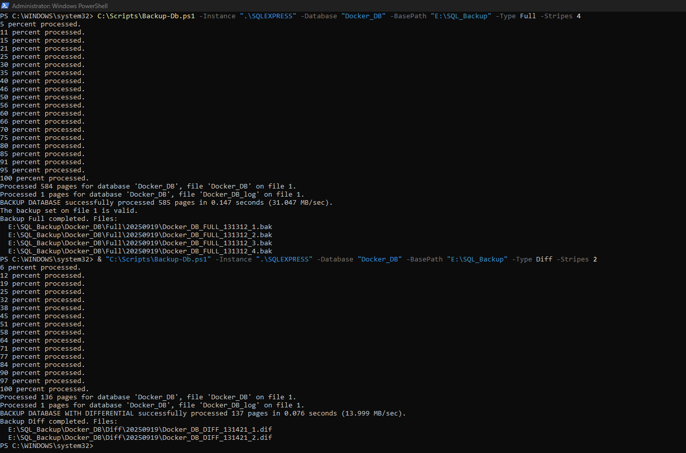  

Tạo lệnh backup `Task Scheduler` bằng `Command Prompt` như sau.  
Tìm kiếm `Command Prompt` và chạy nó với quyền `Administrator`, sau đó chạy từng lệnh bên dưới tương ứng với mỗi tệp backup.  
`Full backup` vào chủ nhật 00:00  
```pgsql
schtasks /Create /TN "BK_FULL_weekly" /SC WEEKLY /D SUN /ST 00:00 ^
  /TR "powershell.exe -NoProfile -ExecutionPolicy Bypass -File \"C:\Scripts\Backup-Db.ps1\" -Instance \".\SQLEXPRESS\" -Database \"Docker_DB\" -BasePath \"E:\SQL_Backup\" -Type Full -Stripes 2" ^
  /RL HIGHEST /F

```

`Diff backup` vào 00:03 từ T2-T7  
```pgsql
schtasks /Create /TN "BK_DIFF_MonSat" /SC WEEKLY /D MON,TUE,WED,THU,FRI,SAT /ST 00:30 /TR "powershell.exe -NoProfile -ExecutionPolicy Bypass -File \"C:\Scripts\Backup-Db.ps1\" -Instance \".\SQLEXPRESS\" -Database \"Docker_DB\" -BasePath \"E:\SQL_Backup\" -Type Diff -Stripes 2" /RL HIGHEST /F
```

`Log backup` chạy hằng ngày mỗi 15 phút ( để 00:01 để tránh trùng 00:00 của full và 00:30 của diff).  
```pgsql
schtasks /Create /TN "BK_LOG_15min" /SC DAILY /ST 00:01 /RI 15 /DU 24:00 ^
  /TR "powershell.exe -NoProfile -ExecutionPolicy Bypass -File \"C:\Scripts\Backup-Db.ps1\" -Instance \".\SQLEXPRESS\" -Database \"Docker_DB\" -BasePath \"E:\SQL_Backup\" -Type Log -Stripes 1" ^
  /RL HIGHEST /F
```

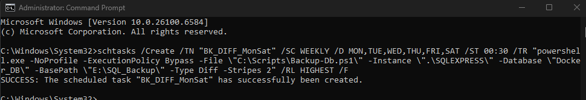  

Cuối cùng vào `Task Scheduler` xem danh sách các nhiệm vụ được lập lịch:  

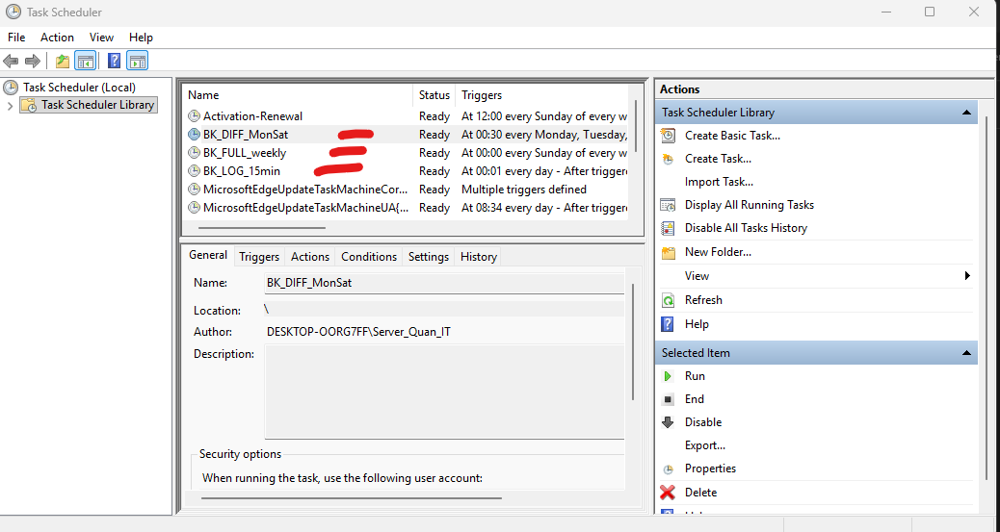  


> Hoặc sử dụng ứng dụng `Task Scheduler` như sau:  

Bước 1: Mở `Task Scheduler` bằng cách bấm `Start` rồi tìm kiếm `Task Scheduler`.  

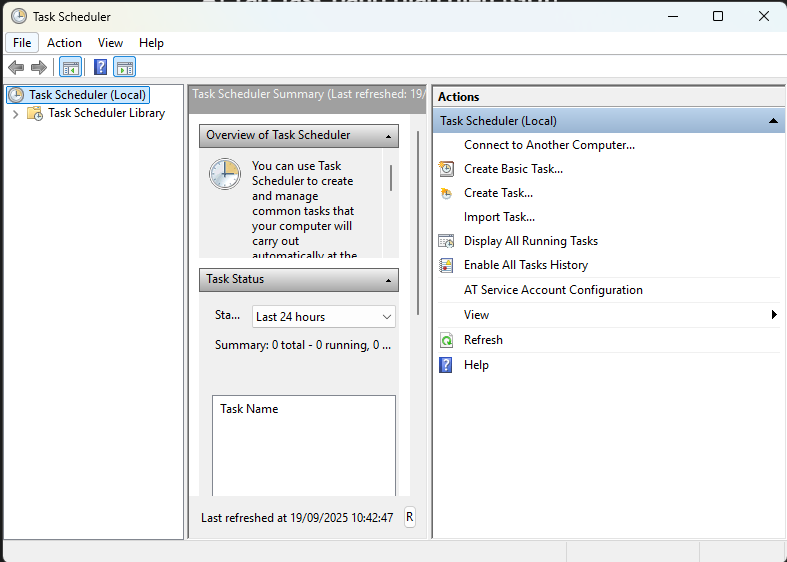  

Sau đó chọn `Action` --> `Create Task ...`  

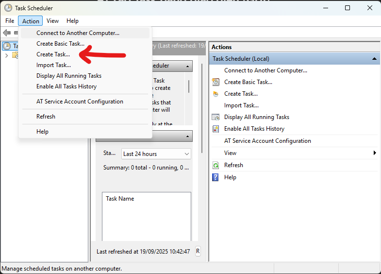  

Tiếp theo điền thông tin vào bảng `Ganeral`:  

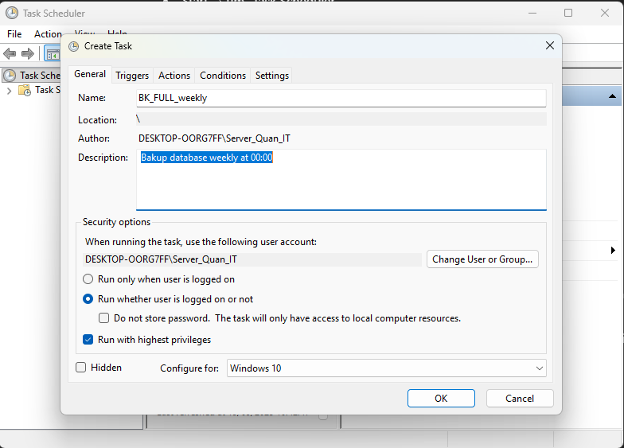

Trong đó:  
- `Name`: Ta đặt tương ứng với mỗi lần chạy: `BK_FULL_weekly` là cho chạy full (với Diff đặt `BK_DIFF_MonSat`, Log đặt `BK_LOG_15min`).  
- `Run whether user is logged on or not`:  Để lịch này chạy nền  
- `Run with highest privileges`: Chạy với quyền Admin  
- `Configure for: Windows Server/Windows`:  phù hợp máy bạn  

Tiếp theo vào tab `Triggers` chọn `New` và cài đặt các thông số như trong ảnh:  

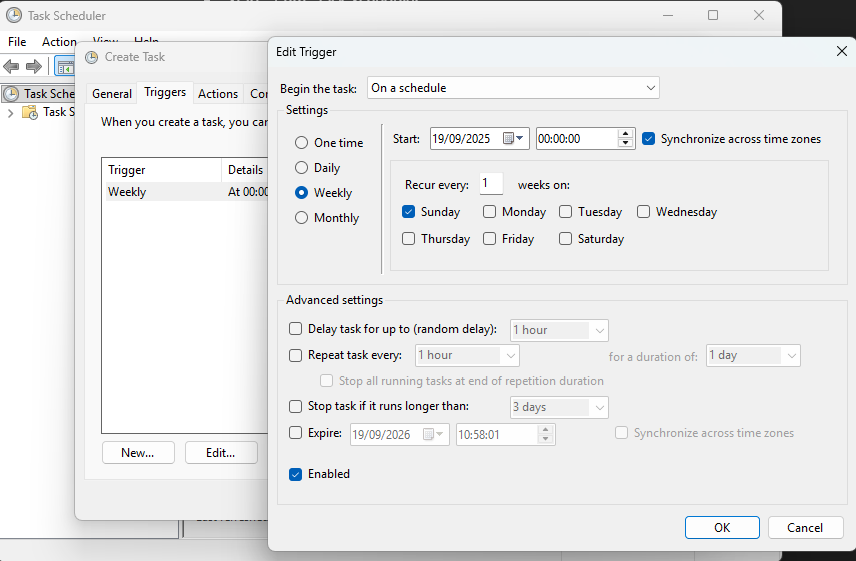  

Trong đó:  
- Full backup: Weekly → Sunday → 00:00.  
- Diff backup: Weekly → check Mon..Sat → 00:30.
- Log backup: Daily → 00:00 → “Repeat task every” = 15 minutes, “for a duration of” = 1 day.

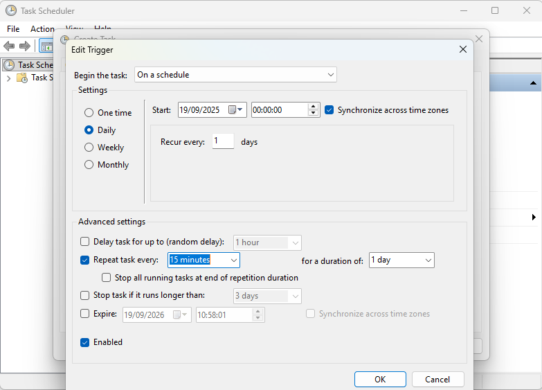  

Tiếp theo chuyển sang tab `Action` và cài đặt như sau:  

- Action = `Start a program`  
- Program/script: `powershell.exe`  

Và `Arguments` sẽ thay đổi tương ứng với mỗi loại:  
- Full: `-NoProfile -ExecutionPolicy Bypass -File "C:\Scripts\Backup-Db.ps1" -Instance ".\SQLEXPRESS" -Database "Docker_DB" -BasePath "E:\SQL_Backup" -Type Full -Stripes 2`  
- Diff: `-NoProfile -ExecutionPolicy Bypass -File "C:\Scripts\Backup-Db.ps1" -Instance ".\SQLEXPRESS" -Database "Docker_DB" -BasePath "E:\SQL_Backup" -Type Diff -Stripes 2`  
- Log: `-NoProfile -ExecutionPolicy Bypass -File "C:\Scripts\Backup-Db.ps1" -Instance ".\SQLEXPRESS" -Database "Docker_DB" -BasePath "E:\SQL_Backup" -Type Log -Stripes 1`  

> (Option) Start in (optional): C:\Scripts (giúp đường dẫn tương đối, nhưng script đang dùng đường dẫn tuyệt đối nên không bắt buộc).  

Chuyển sang tab `Condition` và bỏ chọn 2 mục:  

- `Start the task only if the computer is on AC power`: Nếu là server cắm điện 24/7 thì ko cần chức năng này  
- `Stop if the computer switches to battery power`:  Nếu là laptop muốn chạy cả khi dùng pin  

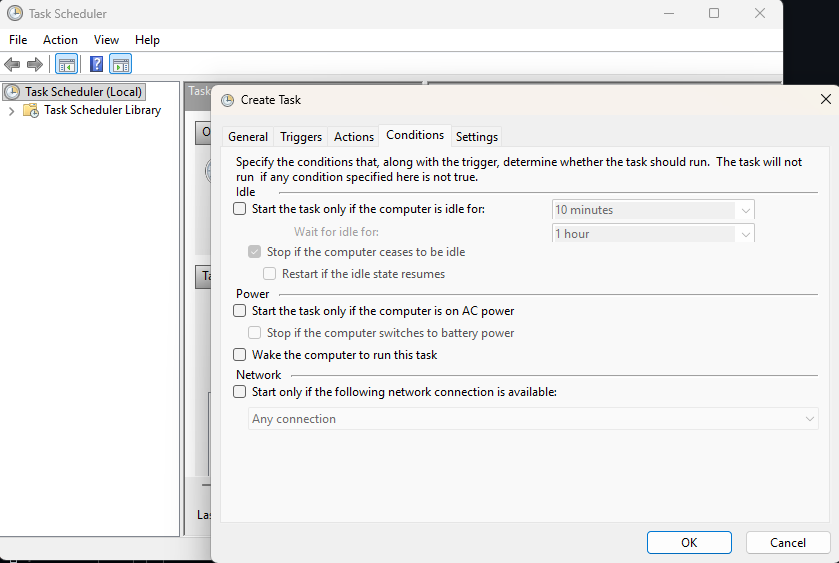  

Chuyển sang tab `Settings` và chọn các mục như ảnh:  

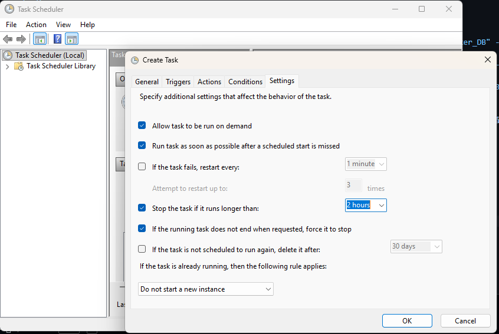  

- `Allow task to be run on demand`:  để test Run ngay.

- `If the task is already running, then → chọn Do not start a new instance`: Đặc biệt quan trọng cho task LOG để tránh chồng chéo.

- (Tùy chọn) Set Stop the task if it runs longer than 2 hours (FULL/Diff), 30 phút (LOG) — tùy môi trường.

Cuối cùng nhấn `OK` và nhập maatk khẩu tài khoản chạy task, `nên dùng tài khoản có quyền chạy backup và quyền ghi vào thư mục ta đã tạo để lưu trữ tệp backup: E:\SQL_Backup`  

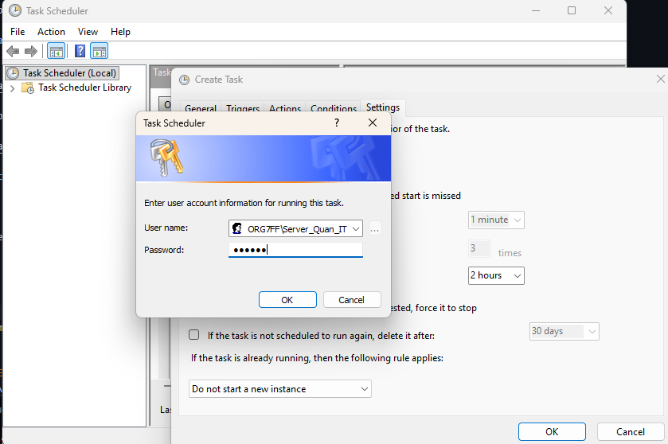  

Để thử nghiệm thì có thể sử dụng lệnh `Run` và xem kết quả có thực hiện đúng ko.  

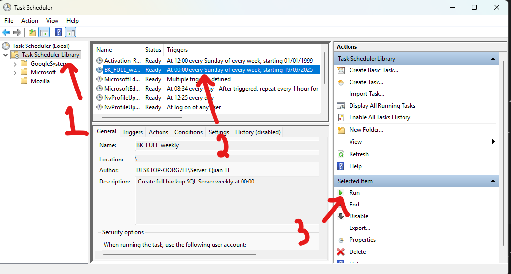  

Có thể đặt thêm hạn vào `metadata` (chỉ ngăn ghi đè bằng cùng media set, không tự xóa file).  

```sql
BACKUP DATABASE [Docker_DB]
TO DISK = N'E:\SQL_Backup\Docker_DB\full\Docker_DB_FULL_20250916_000000.bak'
WITH CHECKSUM, STATS = 5,
     RETAINDAYS = 14;  -- hoặc EXPIREDATE = '2025-10-01'
```

### 5.2 Tự động tìm tệp và đường dẫn sao lưu
Đoạn mã tự động tìm các bản backup tương ứng từ lịch sử backup của DB và ghép chuỗi lại với nhau và khôi phục.  

```sql
SET NOCOUNT ON;
```
Câu lệnh này ngăn chặn hiển thị `X rows affected` để ko nhầm lẫn với các câu lệnh print.  

Tiếp theo ta cấu hình các tham số cho quá trình khôi phục dữ liệu.  
```sql
DECLARE @SourceDb sysname = N'Docker_DB';  -- tên DB nguồn mà ta đã tạo bản backup
DECLARE @TargetDb sysname = N'Docker_DB_Restore';  -- tên DB sẽ được khôi phục, nếu ghi trùng tên DB gốc thì sẽ tiến hành ghi đè dữ liệu cũ vào DB gốc
DECLARE @StopAt   datetime = '2025-09-16T11:52:30';  -- Thời điểm khôi phục, nếu NULL sẽ tự động khôi phục tới cuối chuỗi LOG Backup
DECLARE @Overwrite bit = 0;   -- nếu giá trị 1 thì ghi đè DB đích nếu đã tồn tại (tương ứng lệnh WITH REPLACE), dùng cho nếu ghi đè dữ liệu cũ của DB gốc
DECLARE @DryRun    bit = 1;  -- 1: Hiển thị câu lệnh cuối cùng (không thực thi lệnh mà chỉ hiển thị cho người xem),  0: thực thi câu lệnh restore
DECLARE @UseChecksum bit = 1;  -- Tương ứng lệnh WITH CHECKSUM dùng để kiểm tra CHECKSUM của các bản backup
DECLARE @UseStats    int = 5;  -- SQL sẽ báo tiến độ với 5% mỗi lần, đổi thành số nào tuywf ý từ 1-100
DECLARE @Relocate    bit = 1;  -- 1: tạo MOVE sang thư mục đích (@DataPath, @LogPath); 0 → giữ nguyên đường dẫn trong backup (dễ lỗi nếu trùng/không tồn tại).
DECLARE @DataPath nvarchar(260)= N'D:\SQL_Data\'; -- nơi đặt file .mdf/.ndf và .ldf (khi @Relocate=1).
DECLARE @LogPath  nvarchar(260)= N'E:\SQL_Log\';  -- nơi đặt file .mdf/.ndf và .ldf (khi @Relocate=1).
```

Đầu tiên ta kiểm tra xem thời điểm người dùng muốn khôi phục là đâu, nếu null thì đặt 1 mốc rấ xa để coi như khôi phục tới thời điểm mới nhất.  
```sql
IF @StopAt IS NULL SET @StopAt = '9999-12-31';
```
Sau đó truy vấn lịch sử backup của Database, kiểm tra xem Database này có lịch sử backup chưa, nếu ko có thì là chưa từng backup nên sẽ ko có bản backup nào để thực hiện khôi phục cả. Nếu vậy thì đưa ra thông báo lỗi.  

```sql
IF NOT EXISTS (SELECT 1 FROM msdb.dbo.backupset WHERE database_name = @SourceDb)
BEGIN
    RAISERROR(N'Không thấy lịch sử backup của %s trong msdb.', 16, 1, @SourceDb);
    RETURN;
END;
```

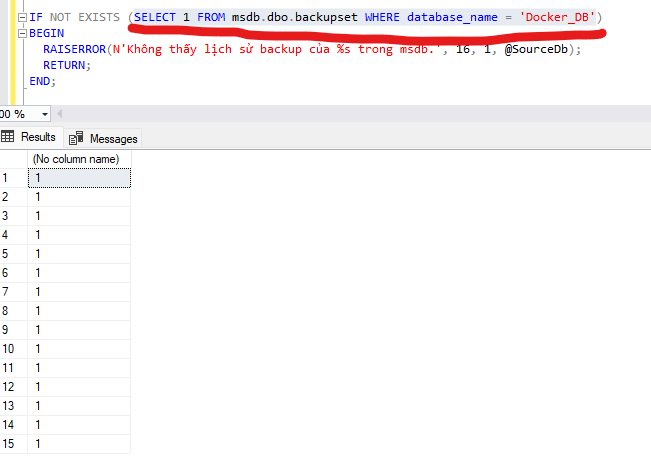

Ví dụ khi truy vấn lịch sử backup của CSDL `Docker_DB` thì có 15 lần thực hiện gọi lệnh backup bao gồm: `Full`, `Diff`, và `Log`.  

Tiếp theo tìm kiếm bản `Full backup` gần nhất so với thời điểm khôi phục (trước hoặc bằng so với thời điểm khôi phục) từ bảng `msdb..backupset` và lưu kết quả đấy vào bảng tạm `#base`  
```sql
IF OBJECT_ID('tempdb..#base') IS NOT NULL DROP TABLE #base;
SELECT TOP (1) *
INTO #base
FROM msdb.dbo.backupset
WHERE database_name = @SourceDb
    AND type = 'D'               -- FULL
    AND is_copy_only = 0
    AND backup_finish_date <= @StopAt
ORDER BY backup_finish_date DESC;
```

Nếu bảng tạm `#base` đã tồn tại từ lần chạy trước thì xóa nó đi, ta tạo lại vào câu lệnh bên dưới để tránh xung đột cấu trúc/ dữ liệu.  

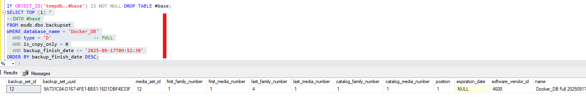

Ví dụ khi tìm kiếm bản `Full backup` gần nhất với thời gian khôi phục là `2025-09-17T09:52:30` thì kết quả trả về là bản backup thứ 12 là 1 bản `Full backup` gần nhất.  
Sau đấy kiểm tra xem có bản `Full backup` nào được lưu vào `#base` không. Nếu ko có thì dừng khôi phục và thông báo.  
```sql
IF NOT EXISTS (SELECT 1 FROM #base)
BEGIN
    RAISERROR(N'Không tìm thấy FULL (không COPY_ONLY) phù hợp trước/bằng @StopAt.', 16, 1);
    RETURN;
END;
```

Nếu tồn tại bản `Full backup` thì tiến hành lấy các đường dẫn chứa tệp `.bak` để sử dụng cho `Backup full`.  
```sql
SELECT bmf.physical_device_name, bmf.family_sequence_number
INTO #base_files
FROM msdb.dbo.backupmediafamily bmf
JOIN #base b ON bmf.media_set_id = b.media_set_id
ORDER BY bmf.family_sequence_number;
```
Trong đó bảng `backupmediafamily` chứa danh sách các đường dẫn file thuộc cùng 1 `media set (tức là cùng trong 1 lần backup)`.  Rồi lưu các đường dẫn này vào bảng `#base_files` để sau này ghép chuỗi `FROM DISK = '1.bak', DISK = '2.bak', ... , 'n.bak'`  

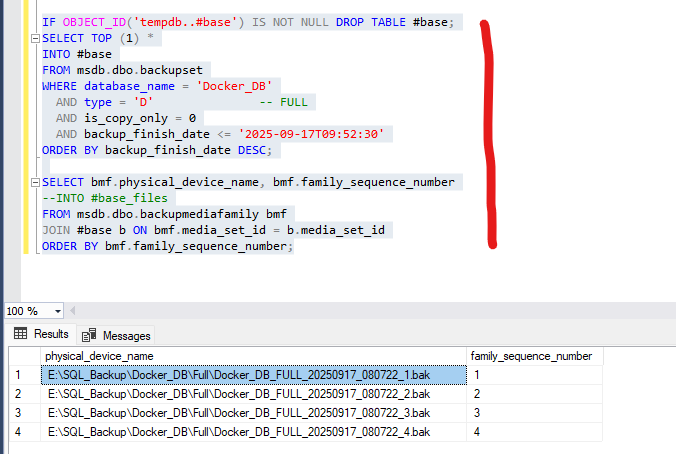
Ví dụ với `Docker_DB` thì lần `Full backup` gần nhất tạo ra 4 file, và đường dẫn tương ứng là `E:\SQL_Backup\Docker_DB\Full\Docker_DB_FULL_20250917_080722_1.bak`, `E:\SQL_Backup\Docker_DB\Full\Docker_DB_FULL_20250917_080722_2.bak`, `E:\SQL_Backup\Docker_DB\Full\Docker_DB_FULL_20250917_080722_3.bak`, `E:\SQL_Backup\Docker_DB\Full\Docker_DB_FULL_20250917_080722_4.bak`

Tiếp theo ta tìm `Diff backup` nếu nó tồn tại trong quá trình backup và lưu vào bảng tạm `#diff`.  
```sql
WITH d AS (
  SELECT TOP (1) *
  FROM msdb.dbo.backupset
  WHERE database_name = @SourceDb
    AND type = 'I'             -- DIFF
    AND backup_finish_date <= @StopAt
    AND database_backup_lsn = (SELECT first_lsn FROM #base)
  ORDER BY backup_finish_date DESC
)
SELECT * INTO #diff FROM d;
```
`Diff backup` luôn phải đi kèm cùng 1 với bản `Full backup`, ta có thể kiểm tra bằng cách `database_backup_lsn` của `Diff backup` phải bằng với `first_lns` của bản `Full backup` trước đó. Nếu kết quả trả về không có thì không tồn tại `Diff backup` tương ứng với `Full backup` và ta có thể bỏ qua `Diff backup`.  

Ví dụ kiểm tra bản `Diff backup` cho CSDL `Docker_DB` xem có tồn tại đi kèm với bản `Full backup` gần nhất hay không.  

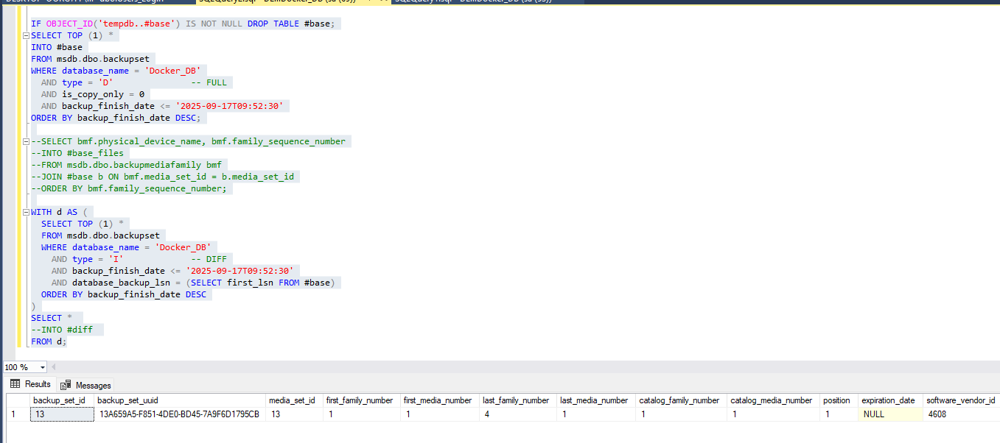

Ta có thể thấy 1 bản ghi `Diff backup` ở lượt backup thứ 13.  

Sau đó tiếp tục tìm kiếm các bản backup của `Diff backup` từ CSDL để sau này ghép chuỗi lại với nhau và ghi vào bảng tạm `#diff_files`.  
```sql
IF OBJECT_ID('tempdb..#diff_files') IS NOT NULL DROP TABLE #diff_files;
IF EXISTS (SELECT * FROM #diff)
BEGIN
    SELECT bmf.physical_device_name, bmf.family_sequence_number
    INTO #diff_files
    FROM msdb.dbo.backupmediafamily bmf
    JOIN #diff d ON bmf.media_set_id = d.media_set_id
    ORDER BY bmf.family_sequence_number;
END;
```

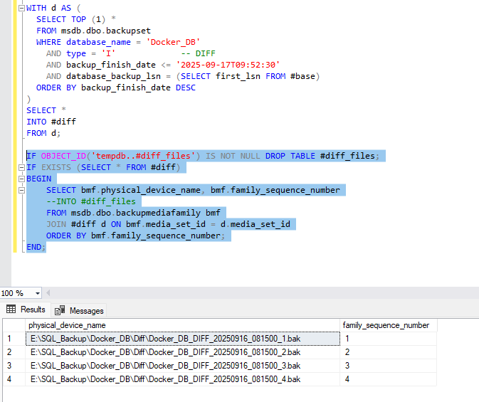

Ví dụ khi tìm kiếm các bản ghi của `Diff backup` gần nhất, ta có thể thấy bản Diff này được chia (strip) thành 4 tệp nhỏ. Ta cần đầy đủ 4 tệp để có thể khôi phục.  

Cuối cùng là xác định thời điểm bắt đầu cho các `Log backup`.  
```sql
DECLARE @StartLsn numeric(25,0) =
    COALESCE( (SELECT last_lsn FROM #diff), (SELECT last_lsn FROM #base) );
```
Nếu tồn tại `Diff backup` thì lấy mốc bắt đầu cho `Log backup` tại thời điểm giá trị `Last_lsn`, còn không thì sử dụng giá trị của `Full backup` thông qua bảng tạm `#base` đã lưu thông tin trước đó.  

Ta tạo 1 bảng tạm để chứa tất cả các bản `Log backup` và xử lý.  
```sql
IF OBJECT_ID('tempdb..#logs_all') IS NOT NULL DROP TABLE #logs_all;
CREATE TABLE #logs_all
(
    backup_set_id        int,
    media_set_id         int,
    database_name        sysname,
    [type]               char(1),
    is_copy_only         bit,
    backup_start_date    datetime,
    backup_finish_date   datetime,
    first_lsn            numeric(25,0),
    last_lsn             numeric(25,0),
    database_backup_lsn  numeric(25,0)
);
```
Sau đó lấy các bản ghi của `Log backup` và dhi vào bảng tạm `#logs_all`. Đảm bảo chỉ lấy các `Log backup` sau `Full/Diff` nối tiếp, không lấy các `Log backup` cũ.  
```sql
INSERT INTO #logs_all (backup_set_id, media_set_id, database_name, [type], is_copy_only,
                       backup_start_date, backup_finish_date, first_lsn, last_lsn, database_backup_lsn)
SELECT backup_set_id, media_set_id, database_name, [type], is_copy_only,
       backup_start_date, backup_finish_date, first_lsn, last_lsn, database_backup_lsn
FROM msdb.dbo.backupset
WHERE database_name = @SourceDb
    AND [type] = 'L'                          -- LOG
    AND last_lsn > @StartLsn                 -- sau FULL/DIFF
ORDER BY backup_finish_date ASC;
```
Tương tự tạo 1 bảng `#logs_sel` để chứa các bản `Log backup` trước thời điểm ta cần khôi phục lại.  

```sql
IF OBJECT_ID('tempdb..#logs_sel') IS NOT NULL DROP TABLE #logs_sel;
CREATE TABLE #logs_sel
(
    backup_set_id        int,
    media_set_id         int,
    database_name        sysname,
    [type]               char(1),
    is_copy_only         bit,
    backup_start_date    datetime,
    backup_finish_date   datetime,
    first_lsn            numeric(25,0),
    last_lsn             numeric(25,0),
    database_backup_lsn  numeric(25,0)
);

INSERT INTO #logs_sel (backup_set_id, media_set_id, database_name, [type], is_copy_only,
                       backup_start_date, backup_finish_date, first_lsn, last_lsn, database_backup_lsn)
SELECT backup_set_id, media_set_id, database_name, [type], is_copy_only,
       backup_start_date, backup_finish_date, first_lsn, last_lsn, database_backup_lsn
FROM #logs_all
WHERE backup_finish_date < @StopAt
ORDER BY backup_finish_date ASC;
```
Sau đó ta tìm 1 bản `Log backup` đầu tiên mà thời gian kết thúc sau thời điểm khôi phục `10:23:00 17/09/2025`, có nghĩa là `Log backup` này bao phủ thời điểm cần khôi phục gần nhất.  
Nếu tồn tại tệp đấy thì ta sử dụng nó cho mệnh đề `STOPAT` trên file `Log backup` cuối cùng.  

```sql
IF @finalLogId IS NOT NULL
BEGIN
    INSERT INTO #logs_sel (backup_set_id, media_set_id, database_name, [type], is_copy_only,
                            backup_start_date, backup_finish_date, first_lsn, last_lsn, database_backup_lsn)
    SELECT backup_set_id, media_set_id, database_name, [type], is_copy_only,
            backup_start_date, backup_finish_date, first_lsn, last_lsn, database_backup_lsn
    FROM #logs_all
    WHERE backup_set_id = @finalLogId;
END
```
Nếu có `@finalLogId` → chèn riêng bản log đó vào bảng `#logs_sel`  
Kết quả `#logs_sel` giờ chứa: Tất cả log hoàn toàn trước `StopAt` + 1 bản log đầu tiên bao phủ `StopAt (nếu có)`.  
Khi restore sẽ apply các log trong `#logs_sel` theo thứ tự; file cuối cùng có thể dùng `STOPAT = @StopAt` nếu nó là file có `backup_finish_date >= @StopAt`.  

Sau đó ta tiến hành lấy các đường dẫn `log`, `data` để phục vụ cho lệnh `MOVE`.

```sql
IF OBJECT_ID('tempdb..#bf') IS NOT NULL DROP TABLE #bf;
SELECT
    bf.logical_name,
    bf.physical_name,
    bf.file_type,        -- 'D' (data) / 'L' (log)
    bf.file_number       -- <-- dùng file_number để sắp thứ tự (FIX)
INTO #bf
FROM msdb.dbo.backupfile bf
JOIN #base b ON bf.backup_set_id = b.backup_set_id;
```
Bảng `backupfile` lưu danh sách file bên trong DB tại thời điểm backup FULL: mỗi dòng là một logical file (data/log), kèm physical_name cũ.  
Ta dùng nó để sinh `MOVE` tương ứng từng file khi restore.  

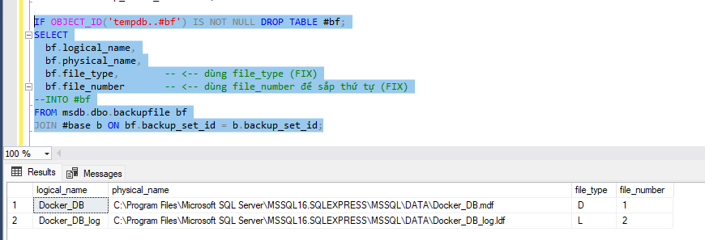  

Ta dùng 2 đường dẫn này phục vụ cho lệnh `MOVE` khi khôi phục dữ liệu sang 1 `Database mới`.  
Khi đã có đường dẫn để phục vụ lệnh `MOVE`, ta đánh số tệp theo từng loại và quyết định tên/ đích mới.  

```sql
IF OBJECT_ID('tempdb..#bf2') IS NOT NULL DROP TABLE #bf2;
;WITH x AS (
    SELECT *,
            ROW_NUMBER() OVER (PARTITION BY file_type ORDER BY file_number) AS rn
    FROM #bf
)
SELECT
    logical_name,
    file_type, rn,
    physical_name,
    CASE
        WHEN RIGHT(LOWER(physical_name), 4) IN ('.mdf', '.ndf', '.ldf')
        THEN RIGHT(physical_name, 4)
        ELSE CASE WHEN file_type='L' THEN '.ldf' ELSE CASE WHEN rn=1 THEN '.mdf' ELSE '.ndf' END END
    END AS ext,
    CASE WHEN @Relocate = 1 THEN
        CASE WHEN file_type='L'
            THEN @LogPath  + @TargetDb + CASE WHEN rn=1 THEN '_log' ELSE '_log' + CAST(rn AS varchar(10)) END
            ELSE @DataPath + @TargetDb + CASE WHEN rn=1 THEN ''     ELSE '_' + CAST(rn AS varchar(10)) END
        END
        ELSE physical_name
    END AS dest_base
INTO #bf2
FROM x;
```
`ROW_NUMBER() OVER (PARTITION BY file_type ORDER BY file_number)`: Đánh số `rn` bắt đầu từ 1 riêng cho data và riêng cho log. Giúp ta biết đâu là data đầu tiên (rn=1) để đặt đuôi .mdf, những data kế tiếp .ndf.  

Tiếp theo ta tính ext (đuôi file):  
Nếu `physical_name` đã có `.mdf/.ndf/.ldf` thì ta giữ nguyên. Nếu khác với 4 định dạng trên, gán mặc định: `data rn=1 → .mdf`, `data rn>1 → .ndf`, `log → .ldf`.  

Tính dest_base (đường dẫn + tên chưa có đuôi):  
Nếu `@Relocate = 1` → đưa file về thư mục mới (có nghĩa là khôi phục DB vào 1 bản Database mới):  
`Data: @DataPath + @TargetDb (file 1), @DataPath + @TargetDb_2 (file 2), …`  
`Log: @LogPath + @TargetDb_log (log 1), @TargetDb_log2 (log 2), …`  

Nếu `@Relocate = 0` → giữ nguyên physical_name (phục hồi đúng chỗ cũ).  
Ví dụ ta có bảng `#bf2` như sau (với `@Relocate = 1`, `@TargetDb = YourDB_Clone`):  
logical_name	file_type	rn	physical_name	ext	dest_base
YourDB	D	1	D:\SQL_Data\YourDB.mdf	.mdf	D:\SQL_Data\YourDB_Clone
FG_Sales_01	D	2	D:\SQL_Data\YourDB_Sales01.ndf	.ndf	D:\SQL_Data\YourDB_Clone_2
YourDB_log	L	1	E:\SQL_Log\YourDB_log.ldf	.ldf	E:\SQL_Log\YourDB_Clone_log

> Sau đó ta sẽ nối dest_base + ext thành đích cuối (ví dụ D:\SQL_Data\YourDB_Clone.mdf).  

Cuối cùng nối chuỗi vào lệnh `MOVE`:  
```sql
DECLARE @MoveClause nvarchar(max) =
    STUFF((
        SELECT
        N', MOVE N''' + logical_name + N''' TO N''' +
        REPLACE(dest_base, '''', '''''') + ext + N''''
        FROM #bf2
        ORDER BY (CASE WHEN file_type='D' THEN 0 ELSE 1 END), rn
        FOR XML PATH(''), TYPE).value('.', 'nvarchar(max)'), 1, 2, '');
```
Duyệt `#bf2` theo thứ tự: `data` trước, rồi `log (ORDER BY (file_type), rn)`. Mỗi dòng tạo một mảnh `MOVE N'<logical>' TO N'<đường_dẫn_mới>'`.  

`FOR XML PATH('') + STUFF(...)` là “mẹo” nối chuỗi thành một đoạn lớn. `FOR XML PATH('')` gộp mọi mảnh lại thành một chuỗi XML/text. `STUFF(..., 1, 2, '')` bỏ 2 ký tự mở đầu (, ) thừa. `REPLACE(..., '''', '''''')` nhân đôi dấu ' nếu đường dẫn có dấu nháy đơn—tránh lỗi cú pháp.  
Kết quả cuối cùng cho `@MoveClause` như sau:  
```sql
MOVE N'YourDB' TO N'D:\SQL_Data\YourDB_Clone.mdf',
MOVE N'FG_Sales_01' TO N'D:\SQL_Data\YourDB_Clone_2.ndf',
MOVE N'YourDB_log' TO N'E:\SQL_Log\YourDB_Clone_log.ldf'
```

Tiếp theo ta sẽ gom các lệnh cho `Full backup` từ các tệp ở bảng `#base_files`:  

```sql
DECLARE @FromBase nvarchar(max) =
    STUFF((
        SELECT N', DISK = N''' + REPLACE(physical_device_name, '''', '''''') + N''''
        FROM #base_files
        ORDER BY family_sequence_number
        FOR XML PATH(''), TYPE).value('.', 'nvarchar(max)'), 1, 2, '');
```
Để rồi ta có chuỗi `@FromBase` lần lượt chứa các tệp backup như sau:  
```sql
DISK = N'E:\...\FULL_xxx_1.bak',
DISK = N'F:\...\FULL_xxx_2.bak',
...
```
Tiếp tục tạo chuỗi cho Cá `Diff backup` nếu nó tồn tại, và đuọc lấy từ bảng `#diff_files`. Nếu bảng này trống thì `@fromDiff = Null`, sau này gọi lệnh nó sẽ bỏ qua  
```sql
DECLARE @FromDiff nvarchar(max) = NULL;
IF EXISTS (SELECT 1 FROM #diff)
BEGIN
    SET @FromDiff =
        STUFF((
        SELECT N', DISK = N''' + REPLACE(physical_device_name, '''', '''''') + N''''
        FROM #diff_files
        ORDER BY family_sequence_number
        FOR XML PATH(''), TYPE).value('.', 'nvarchar(max)'), 1, 2, '');
END;
```

Sau đó tạo chuỗi kết thúc chung cho mỗi câu lệnh `RESTORE`:  
```sql
DECLARE @sql nvarchar(max) = N'';
DECLARE @optsCommon nvarchar(200) =
    N'WITH ' +
    CASE WHEN @UseChecksum=1 THEN N'CHECKSUM, ' ELSE N'' END +
    N'STATS = ' + CAST(@UseStats AS nvarchar(10)) + N', ';
```
Kết hợp các tuỳ chọn dùng lại nhiều lần:  
- `WITH CHECKSUM` (nếu bật)
- `STATS = n` (báo tiến độ)

Sau này ghép thêm `REPLACE`, `NORECOVERY` hoặc `RECOVERY`, `STOPAT` tùy từng lệnh.  

Hoàn thành ghép nối cho câu lệnh `Full` và `Diff` thì ta chạy 2 lệnh này trước.  
Đối với lệnh `Full` thì luôn chạy là `NORECOVERY` để chạy thêm các tệp `Diff` và `Log`.  
```sql
SET @sql += N'-- RESTORE FULL' + CHAR(13) +
    N'RESTORE DATABASE ['+@TargetDb+'] FROM ' + @FromBase + CHAR(13) +
    @optsCommon +
    CASE WHEN @Overwrite=1 THEN N'REPLACE, ' ELSE N'' END +
    N'NORECOVERY' + @MoveClause + N';' + CHAR(13) + CHAR(13);
```
`REPLACE`: chỉ có khi `@Overwrite=1`, dùng khi bạn đè `DB đích đã tồn tại`.  

Câu lệnh tên sẽ sinh ra mẫu lệnh như sau:  
```sql
RESTORE DATABASE [TargetDb]
FROM DISK='...' , DISK='...' , ...
WITH CHECKSUM, STATS=5, [REPLACE,] NORECOVERY, 
    MOVE N'...' TO N'...', MOVE N'...' TO N'...';
```
Ví dụ cho 1 câu lệnh hoàn chỉnh cần phải sinh ra khi chạy lệnh trên như sau:  
```sql
RESTORE DATABASE [YourDB_Clone] FROM
    DISK = N'E:\...\FULL_..._1.bak', DISK = N'F:\...\FULL_..._2.bak', ...
WITH CHECKSUM, STATS = 5, NORECOVERY,
    MOVE N'YourDB' TO N'D:\SQL_Data\YourDB_Clone.mdf',
    MOVE N'FG_Sales_01' TO N'D:\SQL_Data\YourDB_Clone_2.ndf',
    MOVE N'YourDB_log' TO N'E:\SQL_Log\YourDB_Clone_log.ldf';
```
Tương tự ta chạy bản `Diff` với tham số `NORECOVERY`.  
```sql
IF @FromDiff IS NOT NULL
    SET @sql += N'-- RESTORE DIFF' + CHAR(13) +
        N'RESTORE DATABASE ['+@TargetDb+'] FROM ' + @FromDiff + CHAR(13) +
        @optsCommon + N'NORECOVERY;' + CHAR(13) + CHAR(13);
```
Câu lệnh mẫu sẽ như sau:  
```sql
RESTORE DATABASE [YourDB_Clone]
FROM DISK = N'E:\...\DIFF_..._1.bak', DISK = N'F:\...\DIFF_..._2.bak', ...
WITH CHECKSUM, STATS = 5, NORECOVERY;
``` 

Cuối cùng là các bản `Log`.  

```sql
DECLARE @n int = (SELECT COUNT(*) FROM #logs_sel);
IF @n > 0
BEGIN
    DECLARE @i int = 0;
    DECLARE @media_set_id int, @fromLog nvarchar(max);
    DECLARE @thisIsFinal bit;
    DECLARE @finalLogId_local int = @finalLogId;

    DECLARE cur CURSOR LOCAL FAST_FORWARD FOR
        SELECT media_set_id,
            CASE WHEN backup_set_id = ISNULL(@finalLogId_local, -1) THEN 1 ELSE 0 END AS is_final
        FROM #logs_sel
        ORDER BY backup_finish_date ASC;

    OPEN cur; FETCH NEXT FROM cur INTO @media_set_id, @thisIsFinal;
    WHILE @@FETCH_STATUS = 0
    BEGIN
        SET @fromLog =
        STUFF((
            SELECT N', DISK = N''' + REPLACE(physical_device_name, '''', '''''') + N''''
            FROM msdb.dbo.backupmediafamily
            WHERE media_set_id = @media_set_id
            ORDER BY family_sequence_number
            FOR XML PATH(''), TYPE).value('.', 'nvarchar(max)'), 1, 2, '');

        IF @thisIsFinal = 1
        SET @sql += N'RESTORE LOG ['+@TargetDb+'] FROM ' + @fromLog + CHAR(13) +
                    N'WITH ' +
                    CASE WHEN @UseChecksum=1 THEN N'CHECKSUM, ' ELSE N'' END +
                    N'STATS = ' + CAST(@UseStats AS nvarchar(10)) +
                    CASE WHEN @finalLogId IS NOT NULL
                        THEN N', STOPAT = ''' + CONVERT(nvarchar(23), @StopAt, 121) + N''', RECOVERY'
                        ELSE N', RECOVERY' END +
                    N';' + CHAR(13) + CHAR(13);
        ELSE
        SET @sql += N'RESTORE LOG ['+@TargetDb+'] FROM ' + @fromLog + CHAR(13) +
                    @optsCommon + N'NORECOVERY;' + CHAR(13) + CHAR(13);

        FETCH NEXT FROM cur INTO @media_set_id, @thisIsFinal;
    END
    CLOSE cur; DEALLOCATE cur;
END
ELSE
BEGIN
    SET @sql += N'-- No LOG backup covers @StopAt → recover database at last applied set' + CHAR(13) +
                N'RESTORE DATABASE ['+@TargetDb+'] WITH RECOVERY;' + CHAR(13) + CHAR(13);
END
```

`#logs_sel` là danh sách LOG cần áp theo logic “10:25” (đã chọn ở bước trước script):

Lấy mọi LOG kết thúc trước `@StopAt` → áp với `NORECOVERY`. Nếu có một `LOG` có `backup_finish_date >= @StopAt` → chèn thêm `LOG` đầu tiên đó làm file cuối, lệnh cuối sẽ có `STOPAT = @StopAt + RECOVERY`. Vì mỗi `LOG backup` cũng có thể `striped`, nên ta phải gom list `DISK = '...'` theo media_set_id từng LOG (đúng thứ tự `family_sequence_number`).  

`@thisIsFinal` báo LOG cuối trong chuỗi (bao trùm` @StopAt`) chỉ `LOG` cuối có `RECOVERY (và có STOPAT nếu cần)`. Nếu không có LOG nào bao trùm được `@StopAt` → khôi phục tới bản cuối cùng trước `@StopAt` và `RECOVERY` luôn (không `STOPAT`).  

Ví dụ 1 (có LOG 10:30 → dừng 10:25):  
`Log backups: 10:00–10:15, 10:15–10:30, 10:30–10:45 …`

`@StopAt = 10:25` ⇒ `#logs_sel = {log 10:00–10:15, log 10:15–10:30}`.

`10:00–10:15: RESTORE LOG ... WITH NORECOVERY`

`10:15–10:30: RESTORE LOG ... WITH STOPAT='2025-09-16T10:25:00', RECOVERY`

Ví dụ 2 (không có LOG ≥ 10:25 → dừng 10:15):  

Log backups chỉ đến 10:15.  
`#logs_sel = {log 10:00–10:15}.` 10:00–10:15 là cuối và không có` @finalLogId` ⇒` RESTORE LOG ... WITH RECOVERY (không STOPAT)`, chấp nhận mất 10’.  

Câu lệnh hoàn chỉnh tự động hóa khôi phục dữ liệu như sau.  
```sql
/* ================================================================
   AUTO RESTORE 
   - FULL base (non COPY_ONLY) → DIFF khớp → LOGs tới/bao trùm @StopAt
   - Nếu KHÔNG có log finish >= @StopAt: áp các log trước @StopAt,
     và log cuối RECOVERY (không STOPAT)
   - @TailLogFile: nếu đặt và ghi đè DB gốc, chèn RESTORE LOG từ tail
     ở cuối chuỗi (các bước trước đó NORECOVERY)
   - Tùy chọn SINGLE_USER/MULTI_USER & KILL session khi ghi đè DB gốc
   - Full backup vào 0:00:00 chủ nhật hằng tuần
   - Diff backup vào 0:30 hằng ngày (trừ chủ nhật)
   - Log backup vào 0:45 hằng ngày và mỗi 15 phút
   ================================================================ */

SET NOCOUNT ON;

------------------------ CẤU HÌNH ------------------------
DECLARE @SourceDb       sysname       = N'Docker_DB';              -- DB nguồn, có các bản sao lưu
DECLARE @TargetDb       sysname       = N'Docker_DB';      -- DB đích cần khôi phục, nếu để trùng tên thì ghi đè DB, khác tên thì tạo DB mới
DECLARE @StopAt         datetime      = '2025-09-18T08:06:00';     -- Mốc thời gian khôi phục dữ liệu (NULL = mới nhất)
DECLARE @Overwrite      bit           = 1;                         -- 1 = WITH REPLACE (ghi đè DB đích khi đặt DB đích cùng tên DB cũ)
DECLARE @DryRun         bit           = 1;                         -- 1 = chỉ IN CÂU LỆNH; 0 = THỰC THI LUÔN CÂU LỆNH
DECLARE @UseChecksum    bit           = 1;                         -- RESTORE WITH CHECKSUM
DECLARE @UseStats       int           = 5;                         -- STATS = n
DECLARE @Relocate       bit           = 0;                         -- 1 = MOVE sang thư mục mới (khi khôi phục dữ liệu sang DB có tên mới)
DECLARE @DataPath       nvarchar(260) = N'D:\SQL_Data\';           -- Đích .mdf/.ndf (khi @Relocate=1)
DECLARE @LogPath        nvarchar(260) = N'E:\SQL_Log\';            -- Đích .ldf (khi @Relocate=1)

-- Tính năng bổ sung:
DECLARE @TailLogFile    nvarchar(4000)= NULL;                      -- Ví dụ: N'E:\SQL_Backup\YourDB\tail\YourDB_TAIL_20250916_230000.trn'
DECLARE @ManageSingleUser bit         = 1;                         -- 1 = tự SINGLE_USER/MULTI_USER + KILL khi ghi đè DB gốc
---------------------------------------------------------

IF @StopAt IS NULL SET @StopAt = '9999-12-31';

-- Kiểm tra msdb có lịch sử backup cho @SourceDb
IF NOT EXISTS (SELECT 1 FROM msdb.dbo.backupset WHERE database_name = @SourceDb)
BEGIN
    RAISERROR(N'Không thấy lịch sử backup của %s trong msdb.', 16, 1, @SourceDb);
    RETURN;
END;

-- 1)Tìm  FULL backup (non COPY_ONLY) trước/bằng Thời điểm khôi phục dữ liệu
IF OBJECT_ID('tempdb..#base') IS NOT NULL DROP TABLE #base;
SELECT TOP (1) *
INTO #base
FROM msdb.dbo.backupset
WHERE database_name = @SourceDb
    AND type = 'D'               -- FULL
    AND is_copy_only = 0
    AND backup_finish_date <= @StopAt
ORDER BY backup_finish_date DESC;

IF NOT EXISTS (SELECT 1 FROM #base)
BEGIN
    RAISERROR(N'Không tìm thấy FULL backup (không COPY_ONLY) trước/bằng @StopAt.', 16, 1);
    RETURN;
END;

-- 2) Lấy đường dẫn tới tệp Full backup (nếu stripping thì lấy toàn bộ tệp)
IF OBJECT_ID('tempdb..#base_files') IS NOT NULL DROP TABLE #base_files;
SELECT bmf.physical_device_name, bmf.family_sequence_number
INTO #base_files
FROM msdb.dbo.backupmediafamily bmf
JOIN #base b ON bmf.media_set_id = b.media_set_id
ORDER BY bmf.family_sequence_number;

-- 3) DIFF khớp base (trước/bằng @StopAt), chỉ cần 1 diff gần nhất với thời gian khôi phục, vì diff là sự khác nhau so với Full trước đó
IF OBJECT_ID('tempdb..#diff') IS NOT NULL DROP TABLE #diff;
WITH d AS (
    SELECT TOP (1) *
    FROM msdb.dbo.backupset
    WHERE database_name = @SourceDb
        AND type = 'I'             -- DIFF
        AND backup_finish_date <= @StopAt   
        AND backup_start_date > (SELECT backup_start_date FROM #base)
        AND differential_base_lsn = (SELECT first_lsn FROM #base)
    ORDER BY backup_finish_date DESC
)
SELECT * 
INTO #diff 
FROM d;

-- Lấy đường dẫn tới tệp tin Diff
IF OBJECT_ID('tempdb..#diff_files') IS NOT NULL DROP TABLE #diff_files;
IF EXISTS (SELECT 1 FROM #diff)
BEGIN
    SELECT bmf.physical_device_name, bmf.family_sequence_number
    INTO #diff_files
    FROM msdb.dbo.backupmediafamily bmf
    JOIN #diff d ON bmf.media_set_id = d.media_set_id
    ORDER BY bmf.family_sequence_number;
END;

-- 4) LOGs nối tiếp sau Diff gần nhất (nếu tồn tại diff), hoặc lấy Log sau bản Full gần nhất (khi ko tồn tại bản Diff)
-- Chuỗi số đánh dấu kết thúc của 1 Diff hoặc Full
DECLARE @StartLsn numeric(25,0) =
    COALESCE( (SELECT TOP(1) last_lsn FROM #diff ORDER BY last_lsn DESC), (SELECT last_lsn FROM #base) );

-- Print @StartLsn  -- 40000000269900001

-- Tạo 1 bảng chứa danh sách toàn bộ log backup
IF OBJECT_ID('tempdb..#logs_all') IS NOT NULL DROP TABLE #logs_all;
CREATE TABLE #logs_all
(
    backup_set_id        int,
    media_set_id         int,
    database_name        sysname,
    [type]               char(1),
    is_copy_only         bit,
    backup_start_date    datetime,
    backup_finish_date   datetime,
    first_lsn            numeric(25,0),
    last_lsn             numeric(25,0),
    database_backup_lsn  numeric(25,0)
);

-- Lấy tất cả Log backup sau thời điểm bản Diff hoặc Full gần nhất và đưa vào bảng này
INSERT INTO #logs_all (backup_set_id, media_set_id, database_name, [type], is_copy_only,
                       backup_start_date, backup_finish_date, first_lsn, last_lsn, database_backup_lsn)
SELECT backup_set_id, media_set_id, database_name, [type], is_copy_only,
       backup_start_date, backup_finish_date, first_lsn, last_lsn, database_backup_lsn
FROM msdb.dbo.backupset
WHERE database_name = 'Docker_DB'
    AND [type] = 'L'
    AND last_lsn > @StartLsn          -- sau FULL/DIFF
ORDER BY backup_finish_date ASC;

-- Chọn các LOG cần áp theo logic @StopAt:
--  Tạo 1 bảng chứa các log backup trước thời điểm khôi phục dữ liệu
IF OBJECT_ID('tempdb..#logs_sel') IS NOT NULL DROP TABLE #logs_sel;
CREATE TABLE #logs_sel
(
    backup_set_id        int,
    media_set_id         int,
    database_name        sysname,
    [type]               char(1),
    is_copy_only         bit,
    backup_start_date    datetime,
    backup_finish_date   datetime,
    first_lsn            numeric(25,0),
    last_lsn             numeric(25,0),
    database_backup_lsn  numeric(25,0)
);

-- Lấy danh sách các bản log backup trước thời điểm khôi phục dữ liệu từ bảng logs_all
INSERT INTO #logs_sel (backup_set_id, media_set_id, database_name, [type], is_copy_only,
                       backup_start_date, backup_finish_date, first_lsn, last_lsn, database_backup_lsn)
SELECT backup_set_id, media_set_id, database_name, [type], is_copy_only,
       backup_start_date, backup_finish_date, first_lsn, last_lsn, database_backup_lsn
FROM #logs_all
WHERE backup_finish_date < @StopAt
ORDER BY backup_finish_date ASC;

-- Tiến hành lấy thêm 1 bản log nữa, sau thời điểm khôi phục, nhưng phải ở cùng 1 ngày
-- Xác định ranh giới ngày của khôi phục
DECLARE @DayStart      datetime = DATEADD(day, DATEDIFF(day, 0, @StopAt ), 0); -- 00:00:00 ngày đó  @StopAt  
DECLARE @NextDayStart  datetime = DATEADD(day, 1, @DayStart);                 -- 00:00:00 ngày hôm sau

-- Chọn LOG đầu tiên có thời điểm kết thúc >= @StopAt nhưng PHẢI thuộc NGÀY @StopAt, vì ngày sau đã có bản diff mới rồi
-- (start >= DayStart và finish < NextDayStart)
DECLARE @finalLogId int =
(
    SELECT TOP (1) backup_set_id
    FROM #logs_all
    WHERE backup_finish_date >= @StopAt  --@StopAt
        AND backup_start_date   >= @DayStart
        AND backup_finish_date  <  @NextDayStart
    ORDER BY backup_finish_date ASC
);

-- print @finalLogId  --NULL

-- Nếu tồn tại bản log mà chứa thời gian cần khôi phục, thêm nó bảng log_sel
IF @finalLogId IS NOT NULL
BEGIN
    INSERT INTO #logs_sel (backup_set_id, media_set_id, database_name, [type], is_copy_only,
                            backup_start_date, backup_finish_date, first_lsn, last_lsn, database_backup_lsn)
    SELECT backup_set_id, media_set_id, database_name, [type], is_copy_only,
            backup_start_date, backup_finish_date, first_lsn, last_lsn, database_backup_lsn
    FROM #logs_all
    WHERE backup_set_id = @finalLogId;
END

-- Xác định "log cuối" để đặt tham số RECOVERY:
-- Đếm số lượng LOG backup tìm được
DECLARE @hasLogs int = (SELECT COUNT(*) FROM #logs_sel);

-- Lây id của bản Log backup cuối cùng (sắp xếp theo thời gian)
DECLARE @lastLogId int =
(
    SELECT TOP (1) backup_set_id
    FROM #logs_sel
    ORDER BY backup_finish_date DESC
);

-- Nếu có @finalLogId ⇒ final là @finalLogId (RECOVERY + STOPAT)
-- Nếu KHÔNG có @finalLogId nhưng có log trước @StopAt ⇒ final là @lastLogId (RECOVERY không STOPAT)

-- 5) MOVE list từ msdb.dbo.backupfile (của FULL base)
IF OBJECT_ID('tempdb..#bf') IS NOT NULL DROP TABLE #bf;
SELECT
    bf.logical_name,
    bf.physical_name,
    bf.file_type,        -- 'D' (data) / 'L' (log)
    bf.file_number
INTO #bf
FROM msdb.dbo.backupfile bf
JOIN #base b ON bf.backup_set_id = b.backup_set_id;

-- Tạo đường dẫn để dùng cho lệnh MOVE
IF OBJECT_ID('tempdb..#bf2') IS NOT NULL DROP TABLE #bf2;
;WITH x AS (
    SELECT *,
            ROW_NUMBER() OVER (PARTITION BY file_type ORDER BY file_number) AS rn
    FROM #bf
)
SELECT
    logical_name,
    file_type, rn,
    physical_name,
    CASE
        WHEN RIGHT(LOWER(physical_name), 4) IN ('.mdf', '.ndf', '.ldf')
        THEN RIGHT(physical_name, 4)
        ELSE CASE WHEN file_type='L' THEN '.ldf' ELSE CASE WHEN rn=1 THEN '.mdf' ELSE '.ndf' END END
    END AS ext,
    CASE WHEN 1 = 1 THEN
        CASE WHEN file_type='L'
            THEN @LogPath  + @TargetDb + CASE WHEN rn=1 THEN '_log' ELSE '_log' + CAST(rn AS varchar(10)) END
            ELSE  @DataPath + @TargetDb + CASE WHEN rn=1 THEN ''     ELSE '_' + CAST(rn AS varchar(10)) END
        END
        ELSE physical_name
    END AS dest_base
INTO #bf2
FROM x;

-- Tạo lệnh MOVE
DECLARE @MoveClause nvarchar(max) =
    STUFF((
        SELECT
        N', MOVE N''' + logical_name + N''' TO N''' +
        REPLACE(dest_base, '''', '''''') + ext + N''''
        FROM #bf2
        ORDER BY (CASE WHEN file_type='D' THEN 0 ELSE 1 END), rn
        FOR XML PATH(''), TYPE).value('.', 'nvarchar(max)'), 1, 2, '');

--print @MoveClause

-- 6) FROM DISK cho FULL/DIFF
DECLARE @FromBase nvarchar(max) =
    STUFF((
        SELECT N', DISK = N''' + REPLACE(physical_device_name, '''', '''''') + N''''
        FROM #base_files
        ORDER BY family_sequence_number
        FOR XML PATH(''), TYPE).value('.', 'nvarchar(max)'), 1, 2, '');

--print @FromBase


DECLARE @FromDiff nvarchar(max) = NULL;
IF EXISTS (SELECT 1 FROM #diff)
BEGIN
    SET @FromDiff =
        STUFF((
        SELECT N', DISK = N''' + REPLACE(physical_device_name, '''', '''''') + N''''
        FROM #diff_files
        ORDER BY family_sequence_number
        FOR XML PATH(''), TYPE).value('.', 'nvarchar(max)'), 1, 2, '');
END;

--print @FromDiff


-- 7) Lắp chuỗi RESTORE + (option) SINGLE_USER + TAIL

-- Khởi tạo chuỗi RESTORE chứa toàn bộ câu lệnh
DECLARE @sql nvarchar(max) = N'';

-- Tạo chuỗi WITH CHECKSUM, STATS = n dùng lặp lại cho nhiều lần RESTORE 
DECLARE @optsCommon nvarchar(200) =
    N'WITH ' +
    CASE WHEN @UseChecksum=1 THEN N'CHECKSUM, ' ELSE N'' END +
    N'STATS = ' + CAST(@UseStats AS nvarchar(10)) + N', ';

-- Biến xác nhận dụng tệp Tail log(true/false)
DECLARE @WillUseTail bit =
    CASE WHEN @TailLogFile IS NOT NULL AND @TargetDb = @SourceDb THEN 1 ELSE 0 END; -- Sử dụng Tail khi TailogFile được set và DB Đích trùng với DB gốc (xác nhận ghi đè dữ liệu vào DB gốc)

DECLARE @qTargetDb sysname = QUOTENAME(@TargetDb);  -- QUOTENAME() sinh tên như [Docker_DB_Restore], an toàn khi DB có các ký tự đặc biệt, dấu cách, từ khóa (User sẽ thành [User]), ....

-- Escape mọi dấu ' trong đường dẫn tail (O'Brien.trn → O''Brien.trn). Bắt buộc khi ghép chuỗi T-SQL có '...'.
DECLARE @TailFileEsc nvarchar(4000) = REPLACE(COALESCE(@TailLogFile,N''), '''', '''''');

-- (A) Độc chiếm quyền kết nối tới DB khi ghi đè DB gốc (Chỉ chạy khi đè DB gốc và bật @ManageSingleUser)
IF @ManageSingleUser = 1 AND @TargetDb = @SourceDb
BEGIN
-- Tạo câu lệnh kill tất cả session đang dùng DB gốc
-- Sau đó đưa DB vào trạng thái chỉ cho phép 1 kết nối tới DB
    SET @sql += N'-- Ensure exclusive access (single-user) when overwriting source' + CHAR(13) +
                N'IF DB_ID(N''' + REPLACE(@TargetDb, '''', '''''') + N''') IS NOT NULL' + CHAR(13) +
                N'BEGIN' + CHAR(13) +
                N'  IF (SELECT state_desc FROM sys.databases WHERE name = N''' + REPLACE(@TargetDb, '''', '''''') + N''') = ''ONLINE''' + CHAR(13) +
                N'  BEGIN' + CHAR(13) +
                N'    DECLARE @sid int;' + CHAR(13) +
                N'    DECLARE @sql NVARCHAR(100);' + CHAR(13) +
                N'    DECLARE kill_c CURSOR LOCAL FOR ' + CHAR(13) +
                N'      SELECT session_id FROM sys.dm_exec_sessions ' + CHAR(13) +
                N'      WHERE database_id = DB_ID(N''' + REPLACE(@TargetDb, '''', '''''') + N''') AND session_id <> @@SPID;' + CHAR(13) +
                N'    OPEN kill_c; FETCH NEXT FROM kill_c INTO @sid;' + CHAR(13) +
                N'    WHILE @@FETCH_STATUS = 0 BEGIN Set @sql = (''KILL '' + CONVERT(NVARCHAR(20), @sid)); EXEC (@sql); FETCH NEXT FROM kill_c INTO @sid; END' + CHAR(13) +
                N'    CLOSE kill_c; DEALLOCATE kill_c;' + CHAR(13) +
                N'    ALTER DATABASE ' + @qTargetDb + N' SET SINGLE_USER WITH ROLLBACK IMMEDIATE;' + CHAR(13) +
                N'  END' + CHAR(13) +
                N'END' + CHAR(13) + CHAR(13);
END

-- (B) Tiến hành tạo lệnh RESTORE bản Full backup đầu tiên
IF @TargetDb = @SourceDb
	BEGIN
		SET @sql += N'-- RESTORE FULL' + CHAR(13) +
            N'RESTORE DATABASE ' + @qTargetDb + N' FROM ' + @FromBase + CHAR(13) +
            @optsCommon +
            CASE WHEN @Overwrite=1 THEN N'REPLACE, ' ELSE N'' END +
            N'NORECOVERY;' + CHAR(13) + CHAR(13);
	END
ELSE
	BEGIN
		SET @sql += N'-- RESTORE FULL' + CHAR(13) +
            N'RESTORE DATABASE ' + @qTargetDb + N' FROM ' + @FromBase + CHAR(13) +
            @optsCommon +
            CASE WHEN @Overwrite=1 THEN N'REPLACE, ' ELSE N'' END +
            N'NORECOVERY ' + @MoveClause + N';' + CHAR(13) + CHAR(13);
	END
-- (C) RESTORE DIFF (nếu có)
IF @FromDiff IS NOT NULL
    SET @sql += N'-- RESTORE DIFF' + CHAR(13) +
        N'RESTORE DATABASE ' + @qTargetDb + N' FROM ' + @FromDiff + CHAR(13) +
        @optsCommon + N'NORECOVERY;' + CHAR(13) + CHAR(13);

-- (D) RESTORE LOGs
IF @hasLogs > 0  -- Nếu có log backup 
BEGIN
    DECLARE @media_set_id int, @fromLog nvarchar(max), @isFinal bit;
    DECLARE cur CURSOR LOCAL FAST_FORWARD FOR
        SELECT media_set_id,
            CASE 
                WHEN @finalLogId IS NOT NULL AND backup_set_id = @finalLogId THEN 1
                WHEN @finalLogId IS NULL AND backup_set_id = @lastLogId THEN 1
                ELSE 0
            END AS is_final
        FROM #logs_sel
        ORDER BY backup_finish_date ASC;

    OPEN cur; FETCH NEXT FROM cur INTO @media_set_id, @isFinal;
    WHILE @@FETCH_STATUS = 0
    BEGIN
        SET @fromLog =
        STUFF((
            SELECT N', DISK = N''' + REPLACE(physical_device_name, '''', '''''') + N''''
            FROM msdb.dbo.backupmediafamily
            WHERE media_set_id = @media_set_id
            ORDER BY family_sequence_number
            FOR XML PATH(''), TYPE).value('.', 'nvarchar(max)'), 1, 2, '');

        -- Nếu sẽ dùng TAIL cuối chuỗi → tất cả LOG đều NORECOVERY
        IF @WillUseTail = 1
        SET @sql += N'RESTORE LOG ' + @qTargetDb + N' FROM ' + @fromLog + CHAR(13) +
                    @optsCommon + N'NORECOVERY;' + CHAR(13) + CHAR(13);
        ELSE
        BEGIN
        -- Đây là LOG cuối & có @finalLogId (tức là có log bao trùm @StopAt trong NGÀY đó) → STOPAT + RECOVERY
        IF @isFinal = 1 AND @finalLogId IS NOT NULL
            SET @sql += N'RESTORE LOG ' + @qTargetDb + N' FROM ' + @fromLog + CHAR(13) +
                        N'WITH ' +
                        CASE WHEN @UseChecksum=1 THEN N'CHECKSUM, ' ELSE N'' END +
                        N'STATS = ' + CAST(@UseStats AS nvarchar(10)) +
                        N', STOPAT = ''' + CONVERT(nvarchar(23), @StopAt, 121) + N''', RECOVERY;' + CHAR(13) + CHAR(13);

        -- Đây là LOG cuối nhưng KHÔNG có @finalLogId (tức là không có log bao trùm @StopAt) → RECOVERY
        ELSE IF @isFinal = 1 AND @finalLogId IS NULL
            SET @sql += N'RESTORE LOG ' + @qTargetDb + N' FROM ' + @fromLog + CHAR(13) +
                        N'WITH ' +
                        CASE WHEN @UseChecksum=1 THEN N'CHECKSUM, ' ELSE N'' END +
                        N'STATS = ' + CAST(@UseStats AS nvarchar(10)) +
                        N', RECOVERY;' + CHAR(13) + CHAR(13);
        -- Các LOG giữa chừng → NORECOVERY
        ELSE
            SET @sql += N'RESTORE LOG ' + @qTargetDb + N' FROM ' + @fromLog + CHAR(13) +
                        @optsCommon + N'NORECOVERY;' + CHAR(13) + CHAR(13);
        END

        FETCH NEXT FROM cur INTO @media_set_id, @isFinal;
    END
    CLOSE cur; DEALLOCATE cur;
END
ELSE
BEGIN
    -- Không có bất kỳ LOG nào được chọn → RECOVERY tại FULL/DIFF
    IF @WillUseTail = 0
        SET @sql += N'-- No LOG backups selected → recover at FULL/DIFF' + CHAR(13) +
                    N'RESTORE DATABASE ' + @qTargetDb + N' WITH RECOVERY;' + CHAR(13) + CHAR(13);
    -- Nếu sẽ dùng tail: để tail làm bước RECOVERY cuối
END

-- (E) TAIL (nếu bật & ghi đè DB gốc)
IF @WillUseTail = 1
BEGIN
    SET @sql += N'-- FINAL: apply TAIL log' + CHAR(13) +
                N'RESTORE LOG ' + @qTargetDb + N' FROM DISK = N''' + @TailFileEsc + N''' ' + CHAR(13) +
                N'WITH ' +
                CASE WHEN @UseChecksum=1 THEN N'CHECKSUM, ' ELSE N'' END +
                N'STATS = ' + CAST(@UseStats AS nvarchar(10)) +
                CASE WHEN @StopAt >= '9999-12-31'
                    THEN N', RECOVERY'
                    ELSE N', STOPAT = ''' + CONVERT(nvarchar(23), @StopAt, 121) + N''', RECOVERY' END +
                N';' + CHAR(13) + CHAR(13);
END

-- (F) Mở lại MULTI_USER (nếu đã SINGLE_USER)
IF @ManageSingleUser = 1 AND @TargetDb = @SourceDb
BEGIN
    SET @sql += N'-- Back to MULTI_USER' + CHAR(13) +
                N'IF DB_ID(N''' + REPLACE(@TargetDb, '''', '''''') + N''') IS NOT NULL' + CHAR(13) +
                N'  ALTER DATABASE ' + @qTargetDb + N' SET MULTI_USER;' + CHAR(13) + CHAR(13);
END

-- TÓM TẮT
DECLARE @BaseFinish nvarchar(30), @DiffFinish nvarchar(30) = NULL, @LogCount int;
SELECT @BaseFinish = CONVERT(nvarchar(30), backup_finish_date, 121) FROM #base;
IF EXISTS (SELECT 1 FROM #diff)
    SELECT @DiffFinish = CONVERT(nvarchar(30), backup_finish_date, 121) FROM #diff;
SELECT @LogCount = COUNT(*) FROM #logs_sel;

PRINT '--- SUMMARY -------------------------------------------';
PRINT 'Time Restore: ' + CAST(@StopAt AS nvarchar(20));
PRINT 'Base FULL   : ' + ISNULL(@BaseFinish,'(none)');
PRINT 'DIFF        : ' + ISNULL(@DiffFinish,'(none)');
PRINT 'LOG count   : ' + CAST(@LogCount AS nvarchar(10));
PRINT 'Target DB   : ' + @TargetDb;
PRINT 'Relocate    : ' + CAST(@Relocate AS nvarchar(10));
PRINT 'Overwrite   : ' + CAST(@Overwrite AS nvarchar(10));
PRINT 'Tail file   : ' + ISNULL(@TailLogFile, '(none)');
PRINT 'DryRun      : ' + CAST(@DryRun   AS nvarchar(10));
PRINT '-------------------------------------------------------';

IF @DryRun = 1
BEGIN
    PRINT @sql;              -- kiểm tra trước
END
ELSE
BEGIN
    EXEC sp_executesql @sql; -- thực thi
END
```

### 5.3 Di chuyển các tệp sao lưu tới ổ đĩa khác

Để tránh để các bản backup `chỉ nằm ở 1 vị trí`, sau khi có bản backup, ta sẽ copy các bản vừa tạo vào một nơi lưu trữ khác bằng đoạn script.  

Tạo tệp `Push-Backups.ps1`, lưu nó vào ổ C với đường dẫn: `C:\Scripts\Push-Backups.ps1` như sau:  
```powershell
param(
    [Parameter(Mandatory=$true)] [string]$SourceBase = "E:\SQL_Backup",
    [Parameter(Mandatory=$true)] [string]$DestBase   = "\\FILESERV\SQL_Backup",
    [Parameter(Mandatory=$false)][string[]]$Types    = @("Full","Diff","Log"),
    [Parameter(Mandatory=$false)][string]$Database,           # optional: push 1 DB
    [int]$Threads = 8,
    [int]$Retries = 3,
    [int]$RetryWaitSec = 5,
    [int]$PerCopyTimeoutSec = 300,
    [string]$LogFile = "C:\Scripts\push-backups.log"
)

# --- Normalize $Types: accept "Full,Diff,Log" or array ---
if ($null -ne $Types -and $Types.Count -eq 1 -and $Types[0] -match ',') {
    $Types = $Types[0].Split(',') | ForEach-Object { $_.Trim() } | Where-Object { $_ -ne "" }
}
# (tùy chọn) ép về các giá trị hợp lệ, phòng case sai:
$valid = @('full','diff','log')
$Types = $Types | ForEach-Object { $_.Trim() } | Where-Object { $valid -contains $_.ToLower() }
if (-not $Types -or $Types.Count -eq 0) {
    Write-Host "No valid -Types provided. Defaulting to Full,Diff,Log."
    $Types = @('Full','Diff','Log')
}

function Write-Log {
    param([string]$msg)
    $line = "$(Get-Date -Format 'yyyy-MM-dd HH:mm:ss')  $msg"
    Write-Host $line
    if ($LogFile) {
        $dir = Split-Path -Parent $LogFile
        if ($dir -and -not (Test-Path $dir)) { New-Item -ItemType Directory -Force -Path $dir | Out-Null }
        Add-Content -Path $LogFile -Value $line
    }
}

function Test-DestinationReady {
    param([string]$path)
    try {
        if (-not (Test-Path -LiteralPath $path -PathType Container)) {
        New-Item -ItemType Directory -Force -Path $path | Out-Null
        }
        $probe = Join-Path $path (".probe_{0}.tmp" -f [guid]::NewGuid())
        Set-Content -LiteralPath $probe -Value "probe" -ErrorAction Stop
        Remove-Item -LiteralPath $probe -Force -ErrorAction Stop
        return $true
    } catch {
        Write-Log ("Destination NOT ready or write denied: {0} -> {1}" -f $path, $_.Exception.Message)
        return $false
    }
}

function Invoke-RoboCopy {
    <#
        Chạy robocopy có kiểm soát timeout; trả về $true nếu coi là thành công
        Exit code robocopy: 0–7 = OK/Cảnh báo, >=8 = lỗi
    #>
    param(
        [string]$srcDir,
        [string]$dstDir,
        [string]$fileMask,      # *.bak | *.dif | *.trn | *.*
        [int]$timeoutSec = 300  # 0 hoặc âm = không giới hạn
    )

    if (-not (Test-Path -LiteralPath $srcDir -PathType Container)) {
        Write-Log ("Source folder not found: {0} (skip)" -f $srcDir)
        return $true
    }
    if (-not (Test-Path -LiteralPath $dstDir -PathType Container)) {
        try {
        New-Item -ItemType Directory -Force -Path $dstDir | Out-Null
        } catch {
        Write-Log ("Cannot create destination: {0} -> {1}" -f $dstDir, $_.Exception.Message)
        return $false
        }
    }

    $args = @(
        "`"$srcDir`"", "`"$dstDir`"", $fileMask,
        "/Z", "/FFT", "/XO",
        "/R:$Retries", "/W:$RetryWaitSec",
        "/MT:$Threads",
        "/NP", "/NFL", "/NDL",
        "/TEE"
    )
    $logTmp = Join-Path $env:TEMP ("robocopy_{0:yyyyMMdd_HHmmss}.log" -f (Get-Date))
    $args += "/LOG:$logTmp"

    Write-Log ("ROBO: ""{0}"" -> ""{1}"" ({2})" -f $srcDir, $dstDir, $fileMask)

    # Khởi chạy và chờ đúng kiểu .NET
    $p = Start-Process -FilePath "robocopy.exe" -ArgumentList $args -PassThru -WindowStyle Hidden

    try {
        if ($timeoutSec -le 0) {
        # Không giới hạn: chờ đến khi kết thúc
        $null = $p.WaitForExit()
        } else {
        $exited = $p.WaitForExit([int]($timeoutSec * 1000))
        if (-not $exited) {
            Write-Log ("Timeout {0}s. Killing robocopy PID {1}" -f $timeoutSec, $p.Id)
            Stop-Process -Id $p.Id -Force -ErrorAction SilentlyContinue
            return $false
        }
        }

        $exit = $p.ExitCode
        if ($exit -ge 8) {
        Write-Log ("Robocopy failed (exit {0}). See {1}" -f $exit, $logTmp)
        return $false
        } else {
        # 0: nothing to copy; 1: copied; 2–7: warnings but usually acceptable
        Write-Log ("Robocopy done (exit {0})." -f $exit)
        return $true
        }
    } catch {
        Write-Log ("Robocopy exception: {0}" -f $_.Exception.Message)
        return $false
    }
}

# ---------------- Main ----------------
Write-Log ("=== PUSH START: {0} -> {1} | Types: {2} ===" -f $SourceBase, $DestBase, ($Types -join ","))

# Check destination root
if (-not (Test-DestinationReady -path $DestBase)) {
    Write-Log "Destination not ready. Skip this run."
    exit 0
}

# Check source base
if (-not (Test-Path -LiteralPath $SourceBase -PathType Container)) {
    Write-Log ("SourceBase not found: {0}" -f $SourceBase)
    exit 0
}

# Collect DB dirs
$dbDirs = @()
if ([string]::IsNullOrWhiteSpace($Database)) {
    $dbDirs = Get-ChildItem -LiteralPath $SourceBase -Directory -ErrorAction SilentlyContinue
    if (-not $dbDirs -or $dbDirs.Count -eq 0) {
        Write-Log "No database subfolders under SourceBase. Nothing to push."
        Write-Log "Tip: expected structure is <SourceBase>\<DB>\<Full|Diff|Log>\<YYYYMMDD>\files"
        Write-Log "=== PUSH END ==="
        exit 0
    }
} else {
    $one = Join-Path $SourceBase $Database
    if (Test-Path -LiteralPath $one -PathType Container) {
        $dbDirs = ,(Get-Item -LiteralPath $one)
    } else {
        Write-Log ("Database folder not found: {0}" -f $one)
        Write-Log "=== PUSH END ==="
        exit 0
    }
}

Write-Log ("DBs found: {0}" -f (($dbDirs | Select-Object -ExpandProperty Name) -join ", "))

foreach ($db in $dbDirs) {
    Write-Log ("-- DB: {0}" -f $db.Name)
    foreach ($t in $Types) {
        $srcType = Join-Path $db.FullName $t
        if (-not (Test-Path -LiteralPath $srcType -PathType Container)) {
            Write-Log ("  Type folder not found: {0} (skip)" -f $srcType)
            continue
        }

        # Map extension by type
        switch ($t.ToLower()) {
            "full" { $mask = "*.bak" }
            "diff" { $mask = "*.dif" }
            "log"  { $mask = "*.trn" }
            default { $mask = "*.*" }
        }

        # Prefer day subfolders
        $dayDirs = Get-ChildItem -LiteralPath $srcType -Directory -ErrorAction SilentlyContinue | Sort-Object Name
        if ($dayDirs -and $dayDirs.Count -gt 0) {
            Write-Log ("  Type={0} days: {1}" -f $t, (($dayDirs | Select-Object -ExpandProperty Name) -join ", "))
            foreach ($dayDir in $dayDirs) {
                $dstDay = Join-Path (Join-Path (Join-Path $DestBase $db.Name) $t) $dayDir.Name
                if (-not (Test-DestinationReady -path $dstDay)) {
                    Write-Log ("  Destination subfolder not ready: {0} (skip this day)" -f $dstDay)
                    continue
                }
                [void](Invoke-RoboCopy -srcDir $dayDir.FullName -dstDir $dstDay -fileMask $mask -timeoutSec $PerCopyTimeoutSec)
            }
        } else {
            # Fallback: no day folders -> push files directly from type folder
            Write-Log ("  Type={0} has no day folders. Fallback: push files in {1}" -f $t, $srcType)
            $dstType = Join-Path (Join-Path $DestBase $db.Name) $t
            if (-not (Test-DestinationReady -path $dstType)) {
                Write-Log ("  Destination type folder not ready: {0} (skip)" -f $dstType)
                continue
            }
            [void](Invoke-RoboCopy -srcDir $srcType -dstDir $dstType -fileMask $mask -timeoutSec $PerCopyTimeoutSec)
        }
    }
}

Write-Log "=== PUSH END ==="
```

Tệp này tự động tìm các bản backup tồn tại trong thư mục gốc và copy nó đến các thư mục đích. Nó sẽ tự tạo các thư mục con nếu chưa tồn tại ở thư mục đích.   
Nếu thư mục đích `là thư mục share` mà không sẵn sàng, bỏ qua lần copy này để không treo, và đi kèm `timeout` để tránh quá thời gian thực thi lệnh thì ko bị kẹt.  

Có thể thử nghiệm với mẫu lệnh sau. Mở `Windows PowerShells` với quyền `Administrator` và chạy lệnh sau để test.  

```powershell
powershell.exe -NoProfile -ExecutionPolicy Bypass -File "C:\Scripts\Push-Backups.ps1" `
    -SourceBase "E:\SQL_Backup" -DestBase "D:\Backup" `
    -Database "Docker_DB" `
    -Types Full,Diff,Log `
    -Threads 8 -Retries 3 -RetryWaitSec 5 -PerCopyTimeoutSec 300 `
    -LogFile "C:\Scripts\push-backups.log"
```
`Types Full,Diff,Log` không có dấu cách giữa các lần nhập.  

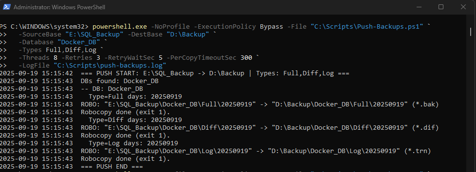

Khi chạy thử mà hiển thị như thông báo trên ảnh thì đã thành công. Ta tiến hành đưa nó vào `Task Scheduler` với thời gian tự động chạy là hằng ngày, mỗi `16 phút` để nó tự động copy các tệp tin nhanh nhất có thể.  

Ta có thể xem nhanh một số trạng thái như sau:  

```
2025-09-19 15:36:10  === PUSH START: E:\SQL_Backup -> D:\Backup | Types: Full,Diff,Log ===
2025-09-19 15:36:10  DBs found: Docker_DB
2025-09-19 15:36:10  -- DB: Docker_DB
2025-09-19 15:36:10    Type=Full days: 20250919
2025-09-19 15:36:10  ROBO: "E:\SQL_Backup\Docker_DB\Full\20250919" -> "D:\Backup\Docker_DB\Full\20250919" (*.bak)
2025-09-19 15:36:10  Robocopy done (exit 0).
2025-09-19 15:36:10    Type=Diff days: 20250919
2025-09-19 15:36:10  ROBO: "E:\SQL_Backup\Docker_DB\Diff\20250919" -> "D:\Backup\Docker_DB\Diff\20250919" (*.dif)
2025-09-19 15:36:10  Robocopy done (exit 0).
2025-09-19 15:36:10    Type=Log days: 20250919
2025-09-19 15:36:10  ROBO: "E:\SQL_Backup\Docker_DB\Log\20250919" -> "D:\Backup\Docker_DB\Log\20250919" (*.trn)
2025-09-19 15:36:10  Robocopy done (exit 1).
2025-09-19 15:36:10  === PUSH END ===
```

| Exit    | Ý nghĩa |
| -------- | ------- |
| 0  | Không có file nào copy (Tệp đã tồn tại)|
| 1 | Có file được copy     |
| 2-7    | Cảnh báo (extra/mismatch/skip…)|
| >8   | Lỗi    |

Có thể thêm vào `Task Scheduler` với đoạn mã sau chạy bằng `Command Prompt` với quyền `Administrator`.  

``` cmd
schtasks /Create /TN "Push_Backups_15min" /SC DAILY /ST 00:00 /RI 16 /DU 24:00 ^
  /TR "powershell.exe -NoProfile -ExecutionPolicy Bypass -File \"C:\Scripts\Push-Backups.ps1\" -SourceBase \"E:\SQL_Backup\" -DestBase \"\\FILESERV\SQL_Backup\" -Types Full,Diff,Log -Threads 8 -Retries 3 -RetryWaitSec 5 -PerCopyTimeoutSec 300 -LogFile \"C:\Scripts\push-backups.log\"" ^
  /RL HIGHEST /F
```

### 5.4 Tự động xóa các bản backup cũ

Sau khi tạo các bản backup, nếu để lâu ngày hoặc CSDL lơn thì việc tốn dung lượng ổ đĩa là không tránh khỏi. Ta nên chủ độn xóa các bản backup cũ, không còn sử dụng đến.  
- Full: Xóa sau 21 ngày lưu trữ  
- Diff: Xóa sau 14 ngày lưu trữ  
- Log: Xóa sau 7 ngày lưu trữ  

Ta tạo tệp script tự động hóa việc này: `C:\Scripts\Cleanup-Old-Backups.ps1`.  

```powershell
param(
  [Parameter(Mandatory=$true)]  [string]$BasePath = "E:\SQL_Backup",
  [Parameter(Mandatory=$false)] [string]$Database,                  # nếu bỏ trống: xử lý tất cả DB trong $BasePath
  [Parameter(Mandatory=$false)] [int]$FullDays = 21,
  [Parameter(Mandatory=$false)] [int]$DiffDays = 14,
  [Parameter(Mandatory=$false)] [int]$LogDays  = 7,
  [Parameter(Mandatory=$false)] [string]$LogFile = "C:\Scripts\cleanup-backups.log",
  [switch]$WhatIf                                                  # dry-run (không xóa thực sự)
)

# --- tiện ích log ---
function Write-Log {
    param([string]$msg)
    $line = "$(Get-Date -Format 'yyyy-MM-dd HH:mm:ss')  $msg"
    Write-Host $line
    if ($LogFile) { Add-Content -Path $LogFile -Value $line }
}

# --- kiểm tra & chuẩn bị ---
if (-not (Test-Path $BasePath)) {
    throw "BasePath '$BasePath' not exis."
}
# đảm bảo thư mục log tồn tại
if ($LogFile) {
    $lp = Split-Path -Parent $LogFile
    if ($lp -and -not (Test-Path $lp)) { New-Item -ItemType Directory -Force -Path $lp | Out-Null }
}

Write-Log "=== CLEANUP START: BasePath=$BasePath, DB=$Database, Full=$FullDays d, Diff=$DiffDays d, Log=$LogDays d, WhatIf=$WhatIf ==="

# bản đồ loại → (subfolder, extension, days)
$rules = @(
    @{ Type='Full'; Sub='Full'; Ext='.bak'; Days=$FullDays },
    @{ Type='Diff'; Sub='Diff'; Ext='.dif'; Days=$DiffDays },
    @{ Type='Log' ; Sub='Log' ; Ext='.trn'; Days=$LogDays  }
)

# Lấy danh sách DB folder
$dbFolders = @()
if ([string]::IsNullOrWhiteSpace($Database)) {
    $dbFolders = Get-ChildItem -LiteralPath $BasePath -Directory -ErrorAction SilentlyContinue
} else {
    $p = Join-Path $BasePath $Database
    if (-not (Test-Path $p)) {
        Write-Log "DB '$Database' No folder $p to Next."
        exit 0
    }
    $dbFolders = ,(Get-Item -LiteralPath $p)
}

foreach ($db in $dbFolders) {
    Write-Log "-- DB: $($db.Name) --"

    foreach ($r in $rules) {
        $type   = $r.Type
        $sub    = $r.Sub
        $ext    = $r.Ext
        $days   = [int]$r.Days
        $cutoff = (Get-Date).AddDays(-$days)

        $typePath = Join-Path $db.FullName $sub
        if (-not (Test-Path $typePath)) {
            Write-Log "  [$type] No folder: $typePath to next."
            continue
        }

        Write-Log "  [$type] Keep file $days days to delete file *$ext have LastWriteTime < $($cutoff.ToString('yyyy-MM-dd HH:mm:ss'))"

        # Tìm file cần xoá (trong mọi thư mục con YYYYMMDD)
        $toDelete = Get-ChildItem -LiteralPath $typePath -Recurse -File -ErrorAction SilentlyContinue |
                    Where-Object { $_.Extension -ieq $ext -and $_.LastWriteTime -lt $cutoff }

        if (-not $toDelete -or $toDelete.Count -eq 0) {
            Write-Log "    None one files to delete."
        } else {
            foreach ($f in $toDelete) {
                if ($WhatIf) {
                Write-Log "    [DRY-RUN] Would remove: $($f.FullName)"
                } else {
                try {
                    Remove-Item -LiteralPath $f.FullName -Force -ErrorAction Stop
                    Write-Log "    Removed: $($f.FullName)"
                } catch {
                    Write-Log "    Delete file error: $($f.FullName) to $($_.Exception.Message)"
                }
                }
            }
        }

        # Xoá thư mục rỗng (YYYYMMDD) rồi thư mục loại (Full/Diff/Log) nếu rỗng
        # (chỉ nếu không WhatIf)
        if (-not $WhatIf) {
        # Xoá từ dưới lên để dễ rỗng dần
        $emptyDirs = Get-ChildItem -LiteralPath $typePath -Recurse -Directory -ErrorAction SilentlyContinue |
                    Sort-Object FullName -Descending
        foreach ($d in $emptyDirs) {
            try {
                if (-not (Get-ChildItem -LiteralPath $d.FullName -Force -ErrorAction SilentlyContinue)) {
                    Remove-Item -LiteralPath $d.FullName -Force -Recurse -ErrorAction Stop
                    Write-Log "    Removed empty folder: $($d.FullName)"
                }
            } catch {
                Write-Log "    Delete Folder Error: $($d.FullName) to $($_.Exception.Message)"
            }
        }

        # Nếu thư mục loại (Full/Diff/Log) rỗng to xoá
        try {
            if (-not (Get-ChildItem -LiteralPath $typePath -Force -ErrorAction SilentlyContinue)) {
                Remove-Item -LiteralPath $typePath -Force -Recurse -ErrorAction Stop
                Write-Log "    Removed empty type folder: $typePath"
            }
        } catch {
            Write-Log "    Error Dlete fordel: $typePath to $($_.Exception.Message)"
            }
        } else {
            Write-Log "    [DRY-RUN] Escape delete folder."
        }
    }
}

Write-Log "=== CLEANUP END ==="

```
Các tùy chọn:  
- Database: nếu không truyền vào thì tập lệnh quét toàn bộ DB tồn tại trong thư mục `BasePath`.  
- WhatIf: để thử in ra trước các câu lệnh  

Tập tin sẽ xóa các file cũ trước, sau đó xóa các thư mục rỗng (YYYYMMDD và Full|Diff|Log) để cây gọn gàng.  

Ta có thể chạy thử xem tập lệnh sẽ hiển thị gì bằng cách mở `Windows Powershell` với quyền `Administrator`:  

```cmd
# chạy thử không xoá, xem log & console
powershell.exe -NoProfile -ExecutionPolicy Bypass -File "C:\Scripts\Cleanup-Old-Backups.ps1" `
  -BasePath "E:\SQL_Backup" -Database "Docker_DB" -FullDays 21 -DiffDays 14 -LogDays 7 -WhatIf
```

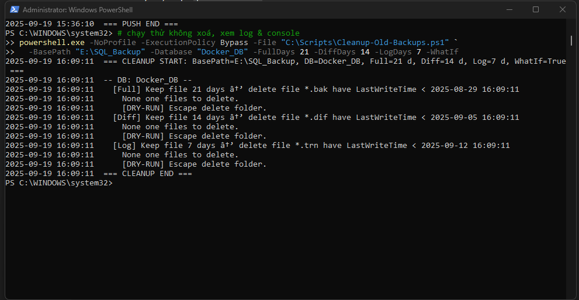

### 5.5 Tích hợp python  
Không khuyến khích Python trực tiếp thực thi BACKUP làm “primary path”.  

Python phù hợp để gọi sp_start_job (kích job Agent), đẩy file lên Object Storage, giám sát checksum/kích thước, gửi cảnh báo.  


