# SQL-Server-With-Python

# I. SQL Server

## 1. Cài đặt SQL Server và SQL Server Manager Studio
Tải SQL Server từ trang chủ Microsoft [tại đây](https://www.microsoft.com/en-us/sql-server/sql-server-downloads). Mình đang dùng với phiên bản `Express`. Tải về và cài đặt theo mục `Basic`.  

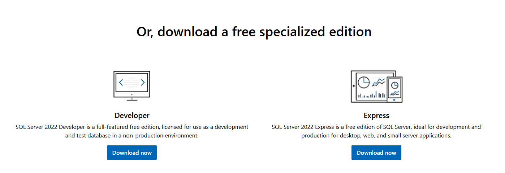

Sau khi cài xong `SQL Server` thì tiếp tục tải và cài đặt `SQL Server Management Studio (SSMS)`.  

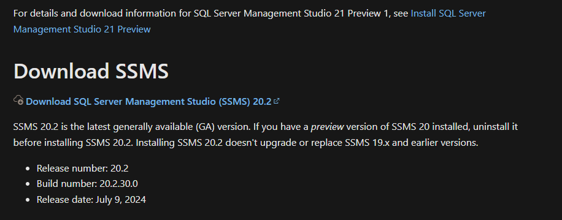

Sau đó mở `SSMS` lên và kích hoạt một số chức năng bằng cách sau:  
Bước 1: Mở `Server Properties` bằng cách click chuột phải vào tên server và chọn `Properties`  

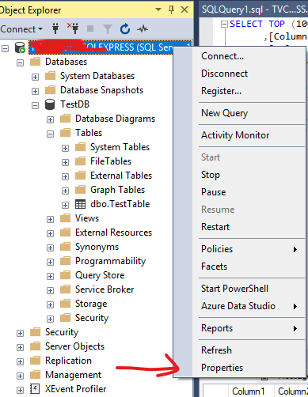

Bước 2: Cho phép đăng nhập SQL Server bằng tài khoản:  

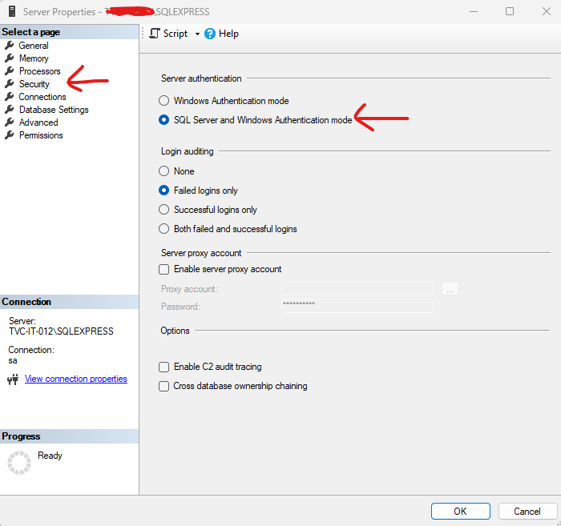

Bước 3: Kích hoạt tài khoản `sa` để đăng nhập.  

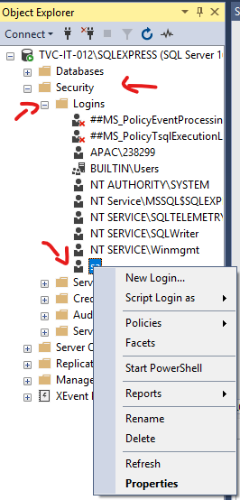

Sau đó chọn `Properties` để cấu hình tài khoản.  
Bước 4: Kích hoạt tài khoản sa và đặt mật khẩu  

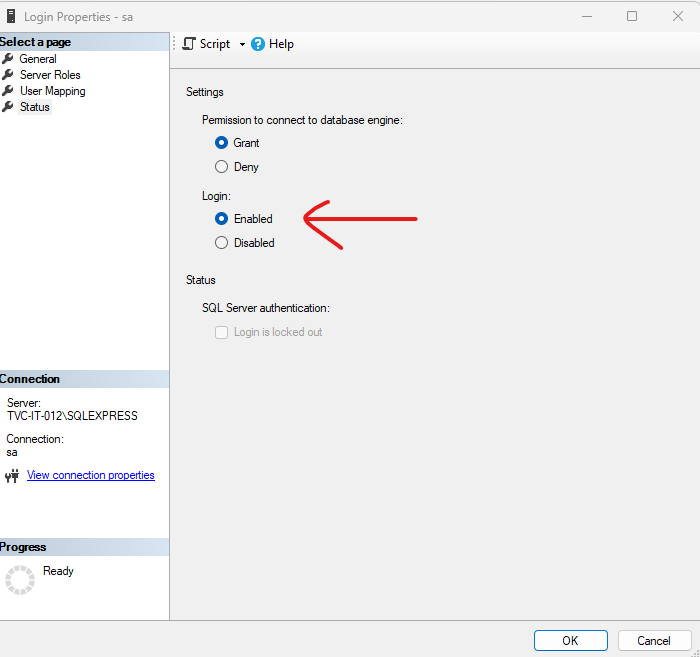


Khởi động lại SQL Server là đã hoàn tất cài đặt SQL Server

## 2. Cấu hình SQL Server bằng SQL Server Configuration Manager

Mở `SQL Server Configuration Manager` lên và vào các mục bên dưới theo hướng dẫn.  

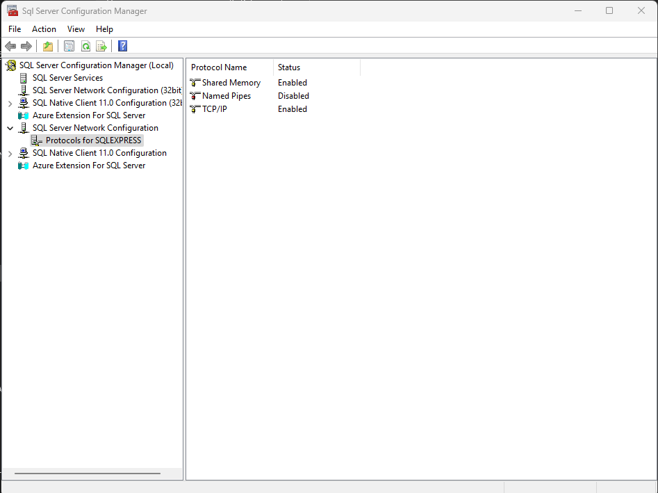

Bước 1: Mở kết nối phương thức `TCP/IP`.  

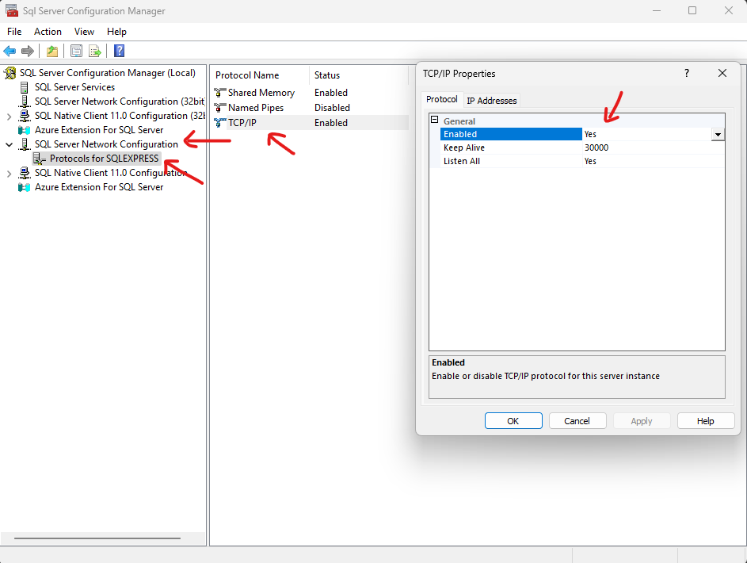

Và cấu hình địa chỉ để có thể kết nối bằng cách vào tab `IP Addresses --> IPAll` và cấu hình 2 thông số `TCP Dynamic Ports` và `TCP Port` như ảnh bên dưới.    

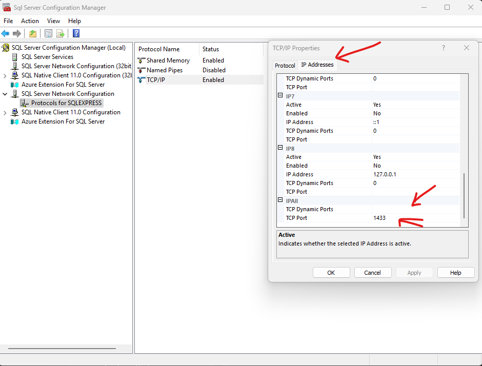

Để hoàn tất cài đặt thì bạn cần `khởi động lại SQL Server` bằng cách như hướng dẫn bên dưới:  

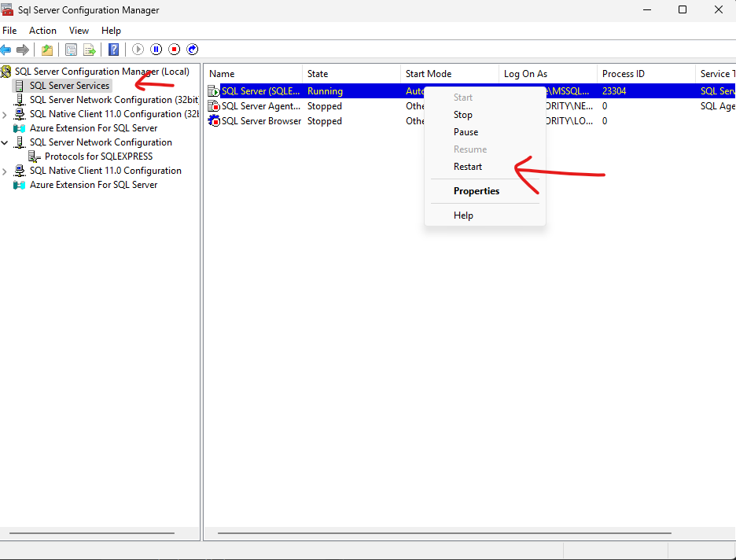

Để kiểm tra xem đã thành công chưa thì các bạn thử đăng nhập lại với tài khoản `sa` xem kết quả.  

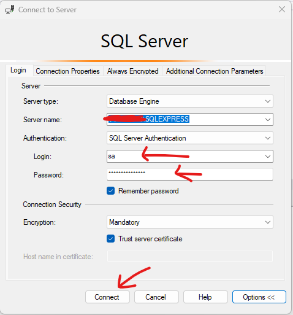

Nếu bạn đăng nhập thành công thì đã hoàn tất các bước cấu hình SQL Server.  

# II. Kết nối SQL Server bằng Python

## 1. Cài đặt driver và thư viện

Để sử dụng `SQL Server` với `Python` thì chúng ta cần có driver chính thức từ Microsoft có tên là `ODBC Driver` và thư viện `pyodbc`.  
Đầu tiên cài đặt `ODBC Driver` ta cần lưu ý như sau. Ta phải biết được phiên bản driver mà ta vừa cài đặt là bao nhiêu để khi kết nối ta phải thông báo rõ với python là ta sử dụng phiên bản đó. Ta có thể tải về từ trang chủ chính thức đến từ Microsof [tại đây](https://learn.microsoft.com/en-us/sql/connect/odbc/download-odbc-driver-for-sql-server?view=sql-server-ver16).  

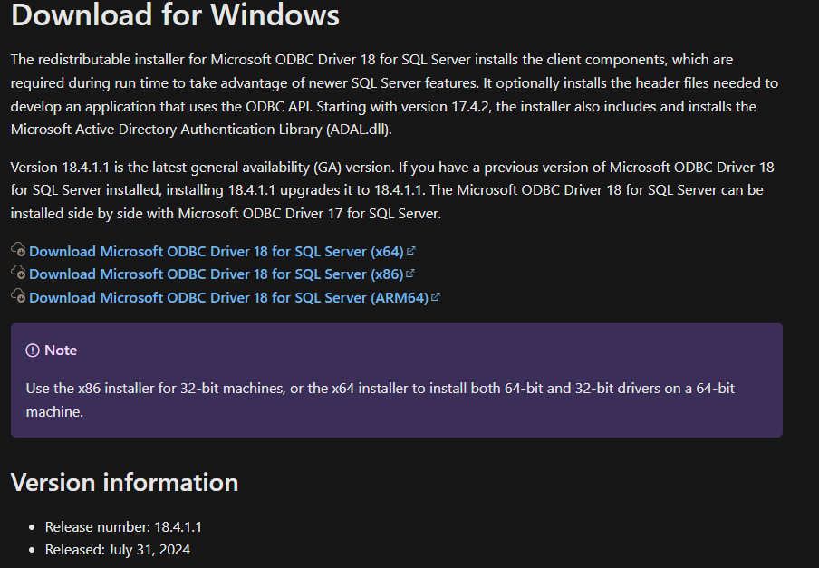

Có thể thấy phiên bản driver mà mình vửa tải về là `18`. Hoặc có thể cài đặt phiên bản mình đã tai về [tại đây](Setup/msodbcsql.msi). Sau đó cài đặt `ODBC Driver` là hoàn tất.  
Thư viện `pyodbc` sẽ giúp chúng ta kết nối `Python` cùng với `SQL Server` thông qua `ODBC Driver`. Ta cần cài đặt thư viện này cho dự án của chúng ta bằng câu lệnh sau:  

```python
pip install pyodbc
```
Cài đặt thư viện nên cài trong môi trường ảo để có môi trường làm việc chuyên nghiệp và sạch sẽ hơn. Chi tiết về môi trường ảo trong Python xem [tại đây](https://github.com/NguyenDucQuan12/virtual_environment_python)


Tham khảo chi tiết thư viện `pyodbc` [tại đây](https://pypi.org/project/pyodbc/)

## 2. Kết nối CSDL

Để kết nối tới CSDL trong SQL Server thì ta cần một `chuỗi kết nối` có cú pháp như sau:  

```python 
connection_string = (
        "DRIVER={ODBC Driver 18 for SQL Server};"
        "SERVER=localhost;"
        "DATABASE=TestDB;"
        "UID=sa;"
        "PWD=123456789;"
        "TrustServerCertificate=yes;"
    )
```
Có một số chú ý như sau:  

> `DRIVER={ODBC Driver 18 for SQL Server};` ta thay thế nó bằng phiên bản mà ta đã cài `ODBC Driver` trước đó. Đây mình phiên bản `18`  
> `SERVER=localhost;` sẽ là địa chỉ IP của máy tính chứa DB `ví dụ: "192.168.10.13"` hoặc để `localhost` cho chính máy đang chạy phần mềm  
> `DATABASE=TestDB;` sẽ là tên CSDL cần truy cập  
> `UID PWD` sẽ là thông tin đăng nhập  
> `TrustServerCertificate=yes;` thiếu chuỗi này sẽ không được đăng nhập  

Sau đó ta truyền chuối kết nối để có thể thao tác với `Database`. Ví dụ như sau:  

```python
import pyodbc
from contextlib import contextmanager

# Kết nối tới CSDL trước khi làm gì đó
@contextmanager
def open_db_connection(self, commit=False):
    try:
        self.connection = pyodbc.connect(self.connection_string)
        self.cursor = self.connection.cursor()
        yield self.cursor # tương tự return nhưng nó sẽ lưu trữ các trạng thái của biến cục bộ
        # Thường đi kèm với hàm with, trả về cursor và tạm dừng ở đây để thực hiện các lệnh trong with trước
        # Sau khi kết thúc các lệnh trong with sẽ tiếp tục thực hiện các dòng mã bên dưới
        # Nếu không có lỗi thì sẽ commit (xác nhận các giao dịch thêm, sửa, xóa là hợp lệ và lưu vào CSDL)
        # Hoặc tự động rollback nếu không cài tham số commit = True
        if commit:
            self.cursor.execute("COMMIT")
        else:
            self.cursor.execute("ROLLBACK")

    except pyodbc.DatabaseError as err:
        
        # Nếu có ngoại lệ, lỗi, ... xảy ra trong khối lệnh with ngay lập tức rollback (quay trở lại) trước khi lệnh with chạy
        error= err.args[0]
        sys.stderr.write(str(error))
        error_cannot_connect(cannot_write_db)
        self.cursor.execute("ROLLBACK") 
        raise err

    finally:
        # Cuối cùng luôn đóng kết nối với CSDL
        self.cursor.close()
        self.connection.close()

# Hàm gọi lệnh truy vấn đến SQL Server
def get_number_vehicle(self):
    get_number_vehicle_query = "SELECT COUNT(License_Plate_Number)\
                                    FROM License_Plate\
                                    WHERE Status = 'IN' AND Result = 'OK';"
    with self.open_db_connection(commit = False) as cursor:
        cursor.execute(get_number_vehicle_query)
        number_vehicle = cursor.fetchone() # lấy 1 hàng dữ liệu, gọi thêm 1 lần nữa là lấy hàng tiếp theo, fetchall là lấy hết các hàng dữ liệu
        number_vehicle = number_vehicle[0]
        return number_vehicle
```

## 3. Truy vấn CSDL

Khi chúng ta nhận dữ liệu liên tục từ nhiều nguồn (3-4 tín hiệu truyền đến). Để tránh xung đột khi ghi dữ liệu vào SQL Server thì ta chỉ nên `sử dụng một số ít luồng` thực hiện ghi xuống CSDL. Vì thế phương pháp tốt nhất là ta sử dụng `Queue và Thread` cho việc này.  

Cụ thể như sau:  

- Các nguồn dữ liệu (3 - 4 nguồn) sẽ cung cấp dữ liệu để ghi vào CSDL  
- Các dữ liệu này sẽ được đưa lần lượt vào hàng đợi  
- Ta mở một luồng riêng chuyên chịu trách nhiệm ghi dữ liệu vào SQL Server  
- Luồng này sẽ lấy dữ liệu lần lượt từ hàng đợi và ghi nó vào SQL Server  

### 1. Sử dụng 1 luồng chuyên ghi dữ liệu

Việc này giúp ta dễ dàng quản lý luồng ghi, ít khả năng xung đột, sai sót. Số lượng kết nối đến CSDL chỉ là 1 luồng (hoặc có thể thêm 2, 3 luồng nữa). Tuy nhiên ta cần có thêm cơ chế quản lý luồng `(Thread)` để dừng luồng, xử lý khi luồng xảy ra lỗi một cách an toàn, và việc ghi dữ liệu sẽ có độ trễ bởi vì chỉ có 1 luồng ghi dữ liệu mà tận 3,4 nguồn dữ liệu đẩy dữ liệu vào hàng đợi.  

Ví dụ về một luồng ghi dữ liệu, 3-4 nguồn cung cấp thông tin có thể xem [tại đây](Code/insert_data_to_SQL_Server_using_thread_and_queue.py).  

Để sử dụng được code mẫu trên bạn cần tạo CSDL mẫu như hình bên dưới:  

> Database Name: `TestDB`  
> Table: `TestTable`  

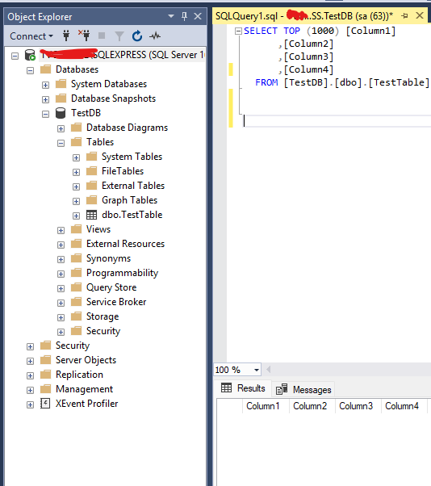

Và `TestTable` có cấu trúc như sau:  

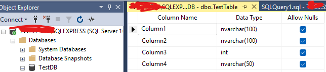

>  Tuy nhiên việc xử lý luồng ghi dữ liệu vẫn đang còn đơn giản, chưa xử lý tốt, vì vậy cần chỉnh sửa thêm, không thể sử dụng code trực tiếp được cho các dự án lớn

### 2. Sử dụng 2 luồng ghi dữ liệu

Nếu việc chỉ sử dụng 1 luồng ghi dữ liệu chưa đáp ứng được tốc độ thì bạn có thể tăng lên 2 luồng cùng ghi dữ liệu