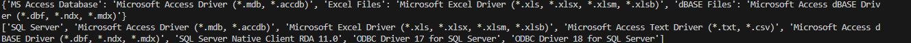
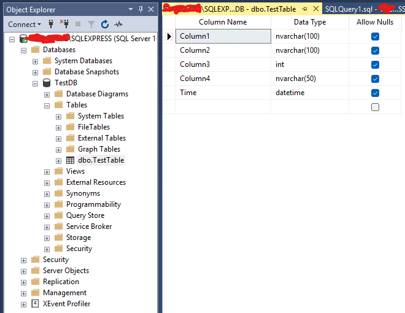
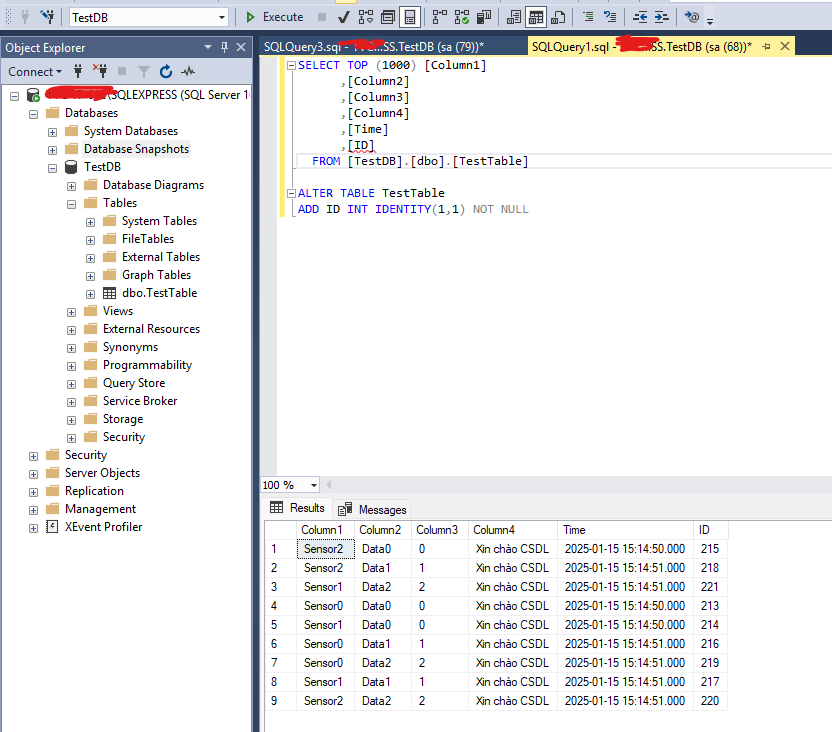

# SQL-Server-With-Python

# I. SQL Server

## 1. Cài đặt SQL Server và SQL Server Manager Studio
Tải SQL Server từ trang chủ Microsoft [tại đây](https://www.microsoft.com/en-us/sql-server/sql-server-downloads). Mình đang dùng với phiên bản `Express`. Tải về và cài đặt theo mục `Basic`.  


Sau khi cài xong `SQL Server` thì tiếp tục tải và cài đặt `SQL Server Management Studio (SSMS)`.  


Sau đó mở `SSMS` lên và kích hoạt một số chức năng bằng cách sau:  
Bước 1: Mở `Server Properties` bằng cách click chuột phải vào tên server và chọn `Properties`  


Bước 2: Cho phép đăng nhập SQL Server bằng tài khoản:  


Bước 3: Kích hoạt tài khoản `sa` để đăng nhập.  


Sau đó chọn `Properties` để cấu hình tài khoản.  
Bước 4: Kích hoạt tài khoản sa và đặt mật khẩu  


Khởi động lại SQL Server là đã hoàn tất cài đặt SQL Server

## 2. Cấu hình SQL Server bằng SQL Server Configuration Manager

Mở `SQL Server Configuration Manager` lên và vào các mục bên dưới theo hướng dẫn.  


Bước 1: Mở kết nối phương thức `TCP/IP`.  


Và cấu hình địa chỉ để có thể kết nối bằng cách vào tab `IP Addresses --> IPAll` và cấu hình 2 thông số `TCP Dynamic Ports` và `TCP Port` như ảnh bên dưới.    


Để hoàn tất cài đặt thì bạn cần `khởi động lại SQL Server` bằng cách như hướng dẫn bên dưới:  


Để kiểm tra xem đã thành công chưa thì các bạn thử đăng nhập lại với tài khoản `sa` xem kết quả.  


Nếu bạn đăng nhập thành công thì đã hoàn tất các bước cấu hình SQL Server.  

# II. Kết nối SQL Server bằng Python

## 1. Cài đặt driver và thư viện

Để sử dụng `SQL Server` với `Python` thì chúng ta cần có driver chính thức từ Microsoft có tên là `ODBC Driver` và thư viện `pyodbc`.  
Đầu tiên cài đặt `ODBC Driver` ta cần lưu ý như sau. Ta phải biết được phiên bản driver mà ta vừa cài đặt là bao nhiêu để khi kết nối ta phải thông báo rõ với python là ta sử dụng phiên bản đó. Ta có thể tải về từ trang chủ chính thức đến từ Microsof [tại đây](https://learn.microsoft.com/en-us/sql/connect/odbc/download-odbc-driver-for-sql-server?view=sql-server-ver16).  


Có thể thấy phiên bản driver mà mình vửa tải về là `18`. Hoặc có thể cài đặt phiên bản mình đã tai về [tại đây](Setup/msodbcsql.msi). Sau đó cài đặt `ODBC Driver` là hoàn tất.  
Thư viện `pyodbc` sẽ giúp chúng ta kết nối `Python` cùng với `SQL Server` thông qua `ODBC Driver`. Ta cần cài đặt thư viện này cho dự án của chúng ta bằng câu lệnh sau:  

```python
pip install pyodbc
```
Cài đặt thư viện nên cài trong môi trường ảo để có môi trường làm việc chuyên nghiệp và sạch sẽ hơn. Chi tiết về môi trường ảo trong Python xem [tại đây](https://github.com/NguyenDucQuan12/virtual_environment_python)


Tham khảo chi tiết thư viện `pyodbc` [tại đây](https://pypi.org/project/pyodbc/)  

Sau khi có thư viện `pyodbc`. Có thể kiểm tra phiên bản `ODBC Driver` đã cài trên máy bằng câu lệnh sau:  
```python
import pyodbc
# LIST OF INSTALLED DATA SOURCES (DSNs)
print(pyodbc.dataSources())

# LIST OF INSTALLED DRIVERS
print(pyodbc.drivers())
```



## 2. Kết nối CSDL

Để kết nối tới CSDL trong SQL Server thì ta cần một `chuỗi kết nối` có cú pháp như sau:  

```python 
connection_string = (
        "DRIVER={ODBC Driver 18 for SQL Server};"
        "SERVER=localhost;"
        "DATABASE=TestDB;"
        "UID=sa;"
        "PWD=123456789;"
        "TrustServerCertificate=yes;"
    )
```
Có một số chú ý như sau:  

> `DRIVER={ODBC Driver 18 for SQL Server};` ta thay thế nó bằng phiên bản mà ta đã cài `ODBC Driver` trước đó. Đây mình phiên bản `18`  
> `SERVER=localhost;` sẽ là địa chỉ IP của máy tính chứa DB `ví dụ: "192.168.10.13"` hoặc để `localhost` cho chính máy đang chạy phần mềm  
> `DATABASE=TestDB;` sẽ là tên CSDL cần truy cập  
> `UID PWD` sẽ là thông tin đăng nhập  
> `TrustServerCertificate=yes;` thiếu chuỗi này sẽ không được đăng nhập  

Sau đó ta truyền chuối kết nối để có thể thao tác với `Database`. Ví dụ như sau:  

```python
import pyodbc
from contextlib import contextmanager

# Kết nối tới CSDL trước khi làm gì đó
@contextmanager
def open_db_connection(self, commit=False):
    try:
        self.connection = pyodbc.connect(self.connection_string)
        self.cursor = self.connection.cursor()
        yield self.cursor # tương tự return nhưng nó sẽ lưu trữ các trạng thái của biến cục bộ
        # Thường đi kèm với hàm with, trả về cursor và tạm dừng ở đây để thực hiện các lệnh trong with trước
        # Sau khi kết thúc các lệnh trong with sẽ tiếp tục thực hiện các dòng mã bên dưới
        # Nếu không có lỗi thì sẽ commit (xác nhận các giao dịch thêm, sửa, xóa là hợp lệ và lưu vào CSDL)
        # Hoặc tự động rollback nếu không cài tham số commit = True
        if commit:
            self.cursor.execute("COMMIT")
        else:
            self.cursor.execute("ROLLBACK")

    except pyodbc.DatabaseError as err:
        
        # Nếu có ngoại lệ, lỗi, ... xảy ra trong khối lệnh with ngay lập tức rollback (quay trở lại) trước khi lệnh with chạy
        error= err.args[0]
        sys.stderr.write(str(error))
        error_cannot_connect(cannot_write_db)
        self.cursor.execute("ROLLBACK") 
        raise err

    finally:
        # Cuối cùng luôn đóng kết nối với CSDL
        self.cursor.close()
        self.connection.close()

# Hàm gọi lệnh truy vấn đến SQL Server
def get_number_vehicle(self):
    get_number_vehicle_query = "SELECT COUNT(License_Plate_Number)\
                                    FROM License_Plate\
                                    WHERE Status = 'IN' AND Result = 'OK';"
    with self.open_db_connection(commit = False) as cursor:
        cursor.execute(get_number_vehicle_query)
        number_vehicle = cursor.fetchone() # lấy 1 hàng dữ liệu, gọi thêm 1 lần nữa là lấy hàng tiếp theo, fetchall là lấy hết các hàng dữ liệu
        number_vehicle = number_vehicle[0]
        return number_vehicle
```

## 3. Truy vấn CSDL

Khi chúng ta nhận dữ liệu liên tục từ nhiều nguồn (3-4 tín hiệu truyền đến). Để tránh xung đột khi ghi dữ liệu vào SQL Server thì ta chỉ nên `sử dụng một số ít luồng` thực hiện ghi xuống CSDL. Vì thế phương pháp tốt nhất là ta sử dụng `Queue và Thread` cho việc này.  

Cụ thể như sau:  

- Các nguồn dữ liệu (3 - 4 nguồn) sẽ cung cấp dữ liệu để ghi vào CSDL  
- Các dữ liệu này sẽ được đưa lần lượt vào hàng đợi  
- Ta mở một luồng riêng chuyên chịu trách nhiệm ghi dữ liệu vào SQL Server  
- Luồng này sẽ lấy dữ liệu lần lượt từ hàng đợi và ghi nó vào SQL Server  

### 1. Sử dụng 1 luồng chuyên ghi dữ liệu

Việc này giúp ta dễ dàng quản lý luồng ghi, ít khả năng xung đột, sai sót. Số lượng kết nối đến CSDL chỉ là 1 luồng (hoặc có thể thêm 2, 3 luồng nữa). Tuy nhiên ta cần có thêm cơ chế quản lý luồng `(Thread)` để dừng luồng, xử lý khi luồng xảy ra lỗi một cách an toàn, và việc ghi dữ liệu sẽ có độ trễ bởi vì chỉ có 1 luồng ghi dữ liệu mà tận 3,4 nguồn dữ liệu đẩy dữ liệu vào hàng đợi.  

Ví dụ về một luồng ghi dữ liệu, 3-4 nguồn cung cấp thông tin có thể xem [tại đây](Code/insert_data_to_SQL_Server_using_thread_and_queue.py).  

Để sử dụng được code mẫu trên bạn cần tạo CSDL mẫu như hình bên dưới:  

> Database Name: `TestDB`  
> Table: `TestTable`  


Và `TestTable` có cấu trúc như sau:  


>  Tuy nhiên việc xử lý luồng ghi dữ liệu vẫn đang còn đơn giản, chưa xử lý tốt, vì vậy cần chỉnh sửa thêm, không thể sử dụng code trực tiếp được cho các dự án lớn

### 2. Sử dụng 2 luồng ghi dữ liệu

Nếu việc chỉ sử dụng 1 luồng ghi dữ liệu chưa đáp ứng được tốc độ thì bạn có thể tăng lên 2 luồng cùng ghi dữ liệu đồng thời. Hoặc Khi tốc độ ghi 1 thread là không đủ (queue tích lũy quá nhiều dữ liệu, 1 thread ghi xử lý không kịp) thì lúc đó ta sử dụng đồng thời 2 luồng ghi dữ liệu.  

`Queue` trong Python là `thread-safe`. Hai luồng cùng `get()` từ một queue không gây xung đột.

Thông thường, `INSERT` vào một bảng khác hàng (những dòng mới) thì hiếm khi gây xung đột, nhưng nếu cùng `UPDATE/DELETE` các dòng giống nhau, có thể xảy ra tranh chấp khóa hoặc thậm chí deadlock. Nếu hai luồng chỉ `INSERT` những dòng mới (mỗi insert có dữ liệu mới không trùng nhau, ví dụ key tăng tự động), thì SQL Server sẽ xử lý đồng thời tốt và không gây ảnh hưởng gì nhiều, chỉ có chút cạnh tranh lock ở cấp tài nguyên “nhỏ” hơn (thường là page/extent)..  

Vì vậy ta cần chú ý khi sử dụng nhiều luồng  

> Hai luồng cùng `UPDATE/DELETE` trên những row `“trùng”`: Có thể gây `lock` hoặc `deadlock` nếu code transaction phức tạp.  
> Mỗi `INSERT/UPDATE` nên gọn, `commit sớm`, tránh giữ khóa lâu  

Có thể tham khảo ví dụ sử dụng đồng thời 2 luồng để ghi vào CSDL [tại đây](Code/insert_to_sql_use_queue_and_2_thread_write.py)

Tuy nhiên có thay đổi 1 chút, thêm một cột `Time` cho CSDL ban đầu.  



### 3. Vừa ghi dữ liệu vào CSDL vừa đọc dữ liệu ra từ CSDL

Trong một số trường hợp, ta không thể chỉ dành tất cả các luồng cho việc ghi dữ liệu, mà trong lúc đó ta cũng truy vấn để lấy dữ liệu ra `SELECT`. Ta có thể sử dụng các cách sau:  

> Việc ghi dữ liệu `(INSERT/UPDATE/DELETE)` và việc lấy dữ liệu `(SELECT)` không thực hiện trên cùng 1 hàng dữ liệu  

Có nghĩa là mình sẽ `SELECT` dữ liệu `A`, còn `INSERT/UPDATE/DELETE` thao tác với dữ liệu `B`. Hai câu lệnh `ghi` và `đọc` không thực hiện trên cùng 1 dữ liệu  

Tất cả thao tác `“ghi” (INSERT, UPDATE, DELETE)` được đưa vào `Queue` cùng với một (hoặc vài) thread chuyên xử lý ghi (write thread) như [sử dụng hai luồng ghi dữ liệu](#2-sử-dụng-2-luồng-ghi-dữ-liệu).  
Thao tác `“đọc”` trong ứng dụng không cần xếp hàng chờ vì `SELECT không làm thay đổi dữ liệu`. Thay vào đó, ta mở kết nối, chạy `SELECT trực tiếp (hoặc sử dụng connection pooling)`.  

Có thể xem ví dụ sử dụng `python` thao tác với CSDL [tại đây](Code/use_CUD_in_one_thread.py).  

Lưu ý để sử dụng code này ta cần thêm 1 cột `ID` có giá trị tự tăng lên để định danh cho các hàng trong dữ liệu, tránh trường hợp các hàng có giá trị trùng nhau. Ta sử dụng lệnh sau để thêm cột này vào CSDL.  



```SQL Server
ALTER TABLE TestTable
ADD ID INT IDENTITY(1,1) NOT NULL
```
Sau đó chạy file code ví dụ để kiểm tra.  

### 4. Tìm kiếm với từ khóa

Để sử dụng phương pháp tìm kiếm hỗ trợ không dấu, có từ ngữ liên quan đến từ tìm kiếm thì có thể sử dụng phương pháp `Full-Text Search (Tìm kiếm toàn văn bản)`. Phương pháp này tối ưu hóa cho việc tìm kiếm văn bản phức tạp, cung cấp kết quả nhanh chóng. Và đặc biệt phương pháp này tối ưu hóa cho việc tùm kiếm văn bản không phân biệt dấu.  

`Full-Text Search` cho phép tìm kiếm văn bản phức tạp như tìm kiếm `từ đồng nghĩa`, tìm kiếm theo `cụm từ (phrase search)`, tìm kiếm các `từ gần nhau` trong văn bản, hoặc sử dụng các bộ lọc chuyên sâu (điều này không thể thực hiện bằng `LIKE` hoặc `COLLATE`).  

`Full-Text Search` yêu cầu cài đặt chỉ mục trước và có thể tốn tài nguyên khi tạo chỉ mục ban đầu, nhưng sau khi chỉ mục được xây dựng, việc tìm kiếm sẽ rất nhanh chóng và hiệu quả.  

Bây giờ sẽ tiến hành thửu nghiệm với bảng `Employee` gồm các cột như sau:  

```
Employee_Code
Employee_Name
Department
Section
Position
Rank
Start_Rank
Privilege
Email
Status_Work
Status
```

#### 4.1 Cài dặt Full-Text Search
Để có thể sử dụng `Full-Text Search` ta cần kiểm tra xem tính năng này đã được cài đặt hay chưa (Mặc định nó được cài đặt treen các phiên bản SQL Server `Enterprise` và `Standar`).  

```SQL Server
SELECT FULLTEXTSERVICEPROPERTY('IsFullTextInstalled');
```

> Nếu trả về 1 thì Full-Text Search đã được cài đặt  
> Nếu trả về 0 thì cần cài đặt Full-Text Search  

Nếu bạn sử dụng phiên bản SQL Server không có sẵn tính năng `Full-Text Search`, bạn cần cài đặt nó từ `SQL Server Installation Center`.  

#### 4.2 Tạo Full-Text Catalog và Full-Text Index

Để bắt đầu sử dụng `Full-Text Search`, bạn cần tạo một `Full-Text Catalog` và `Full-Text Index` trên bảng mà bạn muốn tìm kiếm.  

`Full-Text Catalog` là nơi lưu trữ các chỉ mục `Full-Text`. Bạn có thể tạo một `Full-Text Catalog` như sau:  

```SQL Server
CREATE FULLTEXT CATALOG EmployeeFTCatalog AS DEFAULT;
```
Trong đó:
- `EmployeeFTCatalog` là tên của `Full-Text Catalog`. Bạn có thể đặt tên khác tùy ý.  

Sau khi tạo `Full-Text Catalog`, ta sẽ tạo `Full-Text Index` trên cột mà bạn muốn tìm kiếm, ví dụ như cột `Employee_Name`.  

```SQL Server
CREATE FULLTEXT INDEX ON Employee(Employee_Name) 
KEY INDEX PK_Employee;
``` 
Trong đó:  
- `Employee_Name`: Là cột chứa dữ liệu mà bạn muốn tìm kiếm (tên nhân viên).  
- `PK_Employee`: Là chỉ mục khóa chính (primary key) của bảng `Employee`. SQL Server yêu cầu bạn chỉ định một chỉ mục khóa chính để tạo `Full-Text Index`.  

Chú ý: `Full-Text Index` chỉ có thể được tạo trên các cột có kiểu dữ liệu văn bản (như VARCHAR, TEXT, NVARCHAR, v.v.).  

#### 4.3 Cập nhật chỉ mục Full-Text

SQL Server `tự động duy trì chỉ mục Full-Text` khi có thay đổi trong dữ liệu (thêm, sửa, xóa). Tuy nhiên, để đảm bảo chỉ mục `Full-Text` luôn được tối ưu, bạn có thể thực hiện các bước sau để duy trì và cập nhật chỉ mục:  

Khi có sự thay đổi lớn trong bảng, hoặc khi chỉ mục `Full-Text` bị phân mảnh, bạn có thể `rebuild` chỉ mục `Full-Text`. Điều này giúp làm mới chỉ mục và cải thiện hiệu suất tìm kiếm.  

```SQL Server
ALTER FULLTEXT INDEX ON Employee REBUILD;
```
Câu lệnh này sẽ tái xây dựng chỉ mục Full-Text, giúp tối ưu hóa quá trình tìm kiếm.  

Nếu chỉ mục bị phân mảnh nhẹ, bạn có thể reorganize chỉ mục thay vì rebuild toàn bộ chỉ mục. Điều này giúp cải thiện hiệu suất mà không tốn quá nhiều tài nguyên.  

```SQL Server
ALTER FULLTEXT INDEX ON Employee REORGANIZE;
```
Câu lệnh này giúp giảm thiểu sự phân mảnh chỉ mục mà không làm gián đoạn quá trình tìm kiếm.  

Để kiểm tra trạng thái chỉ mục và mức độ phân mảnh của nó, bạn có thể truy vấn các bảng hệ thống của SQL Server như sau:  

```SQL Server
SELECT * FROM sys.dm_fts_index_population WHERE table_name = 'Employee';
``` 
#### 4.4 Thực hiện truy vấn Full-Text Search

Sau khi đã tạo chỉ mục `Full-Text` và tối ưu hóa, bạn có thể sử dụng các câu lệnh `CONTAINS` hoặc `FREETEXT` để thực hiện tìm kiếm Full-Text.  

Sử dụng `CONTAINS` để tìm kiếm từ hoặc cụm từ chính xác:  

```SQL Server
SELECT 
    Employee_Code, 
    Employee_Name, 
    Section, 
    Position
FROM 
    Employee
WHERE 
    CONTAINS(Employee_Name, 'thuy');
```

> Câu lệnh này sẽ tìm tất cả các nhân viên có tên chứa từ thuy, bao gồm các từ có dấu và không có dấu.  

Sử dụng `FREETEXT` để tìm kiếm từ có nghĩa tương tự:  

```SQL Server
SELECT 
    Employee_Code, 
    Employee_Name, 
    Section, 
    Position
FROM 
    Employee
WHERE 
    FREETEXT(Employee_Name, 'thuy');
```

> Câu lệnh này sẽ tìm kiếm những tên có nghĩa gần giống với từ khóa thuy.  

#### 4.5 Cập nhật chỉ mục khi có sự thay đổi trong dữ liệu

Khi có thay đổi trong bảng (thêm, sửa, xóa), SQL Server sẽ tự động cập nhật chỉ mục Full-Text. Tuy nhiên, bạn vẫn có thể thực hiện các bước sau để tối ưu hóa chỉ mục:  

Các thao tác cụ thể:  
- `Thêm nhân viên mới`: Khi thêm mới nhân viên vào bảng, chỉ mục Full-Text sẽ tự động cập nhật để bao gồm các từ khóa mới.  
- `Cập nhật thông tin nhân viên`: Nếu bạn cập nhật tên của nhân viên (hoặc bất kỳ dữ liệu nào trong cột Employee_Name), chỉ mục Full-Text cũng sẽ tự động cập nhật.  
- `Xóa nhân viên`: Khi xóa một nhân viên, chỉ mục Full-Text sẽ loại bỏ dữ liệu liên quan đến nhân viên đó.  

- Cập nhật chỉ mục sau khi thêm hoặc cập nhật dữ liệu:  
Mặc dù SQL Server tự động cập nhật chỉ mục `Full-Text`, bạn có thể gọi lại `REBUILD` hoặc `REORGANIZE` sau mỗi lần cập nhật lớn dữ liệu.  

Việc tái xây dựng chỉ mục `Full-Text (rebuild)` là một cách hiệu quả để làm mới chỉ mục và giúp hệ thống hoạt động tốt hơn. Điều này nên thực hiện định kỳ, đặc biệt là khi có nhiều thay đổi trong bảng. Bạn có thể thực hiện `rebuild` chỉ mục như sau:  

```SQL Server
-- Sau khi thêm hoặc cập nhật dữ liệu lớn, thực hiện tái xây dựng chỉ mục
ALTER FULLTEXT INDEX ON Employee REBUILD;
```
Tuy nhiên, việc tái xây dựng chỉ mục có thể tốn một chút thời gian và tài nguyên hệ thống, nên bạn nên lên lịch cho tác vụ này vào thời gian thấp điểm hoặc sau khi có nhiều thay đổi lớn.  

- Quản lý tần suất cập nhật  

Nếu bảng `Employee` thay đổi thường xuyên (nhiều bản ghi mới, sửa đổi, xóa), bạn có thể lên lịch các tác vụ bảo trì cho chỉ mục `Full-Text`, ví dụ như `mỗi đêm hoặc cuối tuần`.  
Bạn có thể lên lịch tái xây dựng chỉ mục `Full-Text` bằng cách sử dụng `SQL Server Agent` hoặc các công cụ lập lịch công việc `(`như Task Scheduler của Windows)`.  

#### 4.6 Quản lý Full-Text Search

Bạn có thể kiểm tra trạng thái của các chỉ mục Full-Text đã tạo trên cơ sở dữ liệu bằng cách truy vấn các bảng hệ thống của SQL Server:  

```SQL Server
SELECT * 
FROM sys.fulltext_indexes 
WHERE object_id = OBJECT_ID('Employee');
```

Nếu bạn muốn xóa Full-Text Index và Full-Text Catalog, bạn có thể sử dụng câu lệnh sau:  

```SQL Server
-- Xóa chỉ mục Full-Text
DROP FULLTEXT INDEX ON Employee;

-- Xóa Catalog nếu không sử dụng nữa
DROP FULLTEXT CATALOG EmployeeFTCatalog;
```