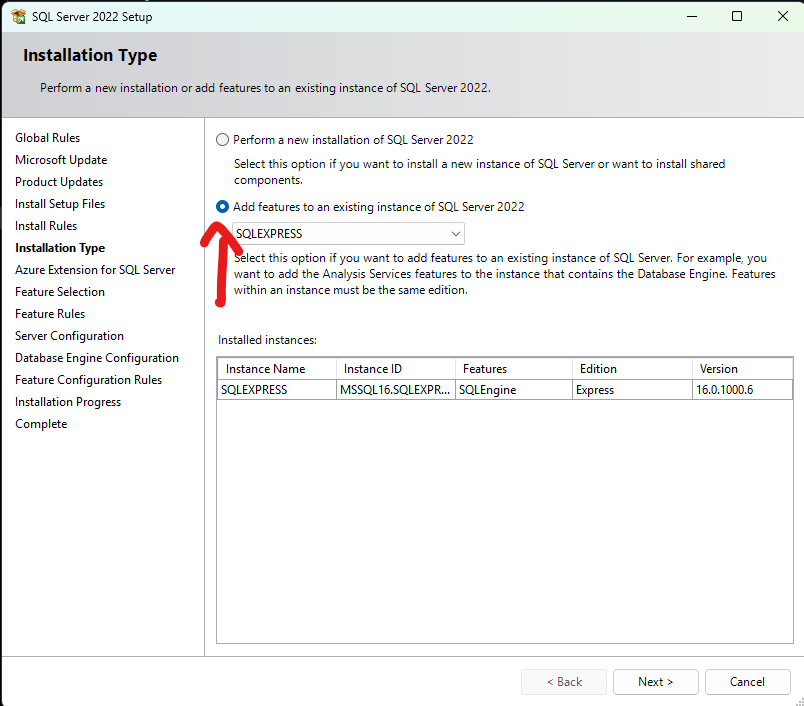

# SQL-Server-With-Python

# I. SQL Server

## 1. Cài đặt SQL Server và SQL Server Manager Studio
Tải SQL Server từ trang chủ Microsoft [tại đây](https://www.microsoft.com/en-us/sql-server/sql-server-downloads). Mình đang dùng với phiên bản `Express`. Tải về và cài đặt theo mục `Basic`.  


Sau khi cài xong `SQL Server` thì tiếp tục tải và cài đặt `SQL Server Management Studio (SSMS)`.  


Sau đó mở `SSMS` lên và kích hoạt một số chức năng bằng cách sau:  
Bước 1: Mở `Server Properties` bằng cách click chuột phải vào tên server và chọn `Properties`  


Bước 2: Cho phép đăng nhập SQL Server bằng tài khoản:  


Bước 3: Kích hoạt tài khoản `sa` để đăng nhập.  


Sau đó chọn `Properties` để cấu hình tài khoản.  
Bước 4: Kích hoạt tài khoản sa và đặt mật khẩu  


Khởi động lại SQL Server là đã hoàn tất cài đặt SQL Server

## 2. Cấu hình SQL Server bằng SQL Server Configuration Manager

Mở `SQL Server Configuration Manager` lên và vào các mục bên dưới theo hướng dẫn.  


Bước 1: Mở kết nối phương thức `TCP/IP`.  


Và cấu hình địa chỉ để có thể kết nối bằng cách vào tab `IP Addresses --> IPAll` và cấu hình 2 thông số `TCP Dynamic Ports` và `TCP Port` như ảnh bên dưới.    


Để hoàn tất cài đặt thì bạn cần `khởi động lại SQL Server` bằng cách như hướng dẫn bên dưới:  


Để kiểm tra xem đã thành công chưa thì các bạn thử đăng nhập lại với tài khoản `sa` xem kết quả.  


Nếu bạn đăng nhập thành công thì đã hoàn tất các bước cấu hình SQL Server.  

# II. Kết nối SQL Server bằng Python

## 1. Cài đặt driver và thư viện

Để sử dụng `SQL Server` với `Python` thì chúng ta cần có driver chính thức từ Microsoft có tên là `ODBC Driver` và thư viện `pyodbc`.  
Đầu tiên cài đặt `ODBC Driver` ta cần lưu ý như sau. Ta phải biết được phiên bản driver mà ta vừa cài đặt là bao nhiêu để khi kết nối ta phải thông báo rõ với python là ta sử dụng phiên bản đó. Ta có thể tải về từ trang chủ chính thức đến từ Microsof [tại đây](https://learn.microsoft.com/en-us/sql/connect/odbc/download-odbc-driver-for-sql-server?view=sql-server-ver16).  


Có thể thấy phiên bản driver mà mình vửa tải về là `18`. Hoặc có thể cài đặt phiên bản mình đã tai về [tại đây](Setup/msodbcsql.msi). Sau đó cài đặt `ODBC Driver` là hoàn tất.  
Thư viện `pyodbc` sẽ giúp chúng ta kết nối `Python` cùng với `SQL Server` thông qua `ODBC Driver`. Ta cần cài đặt thư viện này cho dự án của chúng ta bằng câu lệnh sau:  

```python
pip install pyodbc
```
Cài đặt thư viện nên cài trong môi trường ảo để có môi trường làm việc chuyên nghiệp và sạch sẽ hơn. Chi tiết về môi trường ảo trong Python xem [tại đây](https://github.com/NguyenDucQuan12/virtual_environment_python)


Tham khảo chi tiết thư viện `pyodbc` [tại đây](https://pypi.org/project/pyodbc/)  

Sau khi có thư viện `pyodbc`. Có thể kiểm tra phiên bản `ODBC Driver` đã cài trên máy bằng câu lệnh sau:  
```python
import pyodbc
# LIST OF INSTALLED DATA SOURCES (DSNs)
print(pyodbc.dataSources())

# LIST OF INSTALLED DRIVERS
print(pyodbc.drivers())
```


## 2. Kết nối CSDL

Để kết nối tới CSDL trong SQL Server thì ta cần một `chuỗi kết nối` có cú pháp như sau:  

```python 
connection_string = (
        "DRIVER={ODBC Driver 18 for SQL Server};"
        "SERVER=localhost;"
        "DATABASE=TestDB;"
        "UID=sa;"
        "PWD=123456789;"
        "TrustServerCertificate=yes;"
    )
```
Có một số chú ý như sau:  

> `DRIVER={ODBC Driver 18 for SQL Server};` ta thay thế nó bằng phiên bản mà ta đã cài `ODBC Driver` trước đó. Đây mình phiên bản `18`  
> `SERVER=localhost;` sẽ là địa chỉ IP của máy tính chứa DB `ví dụ: "192.168.10.13"` hoặc để `localhost` cho chính máy đang chạy phần mềm  
> `DATABASE=TestDB;` sẽ là tên CSDL cần truy cập  
> `UID PWD` sẽ là thông tin đăng nhập  
> `TrustServerCertificate=yes;` thiếu chuỗi này sẽ không được đăng nhập  

Sau đó ta truyền chuối kết nối để có thể thao tác với `Database`. Ví dụ như sau:  

```python
import pyodbc
from contextlib import contextmanager

# Kết nối tới CSDL trước khi làm gì đó
@contextmanager
def open_db_connection(self, commit=False):
    try:
        self.connection = pyodbc.connect(self.connection_string)
        self.cursor = self.connection.cursor()
        yield self.cursor # tương tự return nhưng nó sẽ lưu trữ các trạng thái của biến cục bộ
        # Thường đi kèm với hàm with, trả về cursor và tạm dừng ở đây để thực hiện các lệnh trong with trước
        # Sau khi kết thúc các lệnh trong with sẽ tiếp tục thực hiện các dòng mã bên dưới
        # Nếu không có lỗi thì sẽ commit (xác nhận các giao dịch thêm, sửa, xóa là hợp lệ và lưu vào CSDL)
        # Hoặc tự động rollback nếu không cài tham số commit = True
        if commit:
            self.cursor.execute("COMMIT")
        else:
            self.cursor.execute("ROLLBACK")

    except pyodbc.DatabaseError as err:
        
        # Nếu có ngoại lệ, lỗi, ... xảy ra trong khối lệnh with ngay lập tức rollback (quay trở lại) trước khi lệnh with chạy
        error= err.args[0]
        sys.stderr.write(str(error))
        error_cannot_connect(cannot_write_db)
        self.cursor.execute("ROLLBACK") 
        raise err

    finally:
        # Cuối cùng luôn đóng kết nối với CSDL
        self.cursor.close()
        self.connection.close()

# Hàm gọi lệnh truy vấn đến SQL Server
def get_number_vehicle(self):
    get_number_vehicle_query = "SELECT COUNT(License_Plate_Number)\
                                    FROM License_Plate\
                                    WHERE Status = 'IN' AND Result = 'OK';"
    with self.open_db_connection(commit = False) as cursor:
        cursor.execute(get_number_vehicle_query)
        number_vehicle = cursor.fetchone() # lấy 1 hàng dữ liệu, gọi thêm 1 lần nữa là lấy hàng tiếp theo, fetchall là lấy hết các hàng dữ liệu
        number_vehicle = number_vehicle[0]
        return number_vehicle
```

## 3. Truy vấn CSDL

Khi chúng ta nhận dữ liệu liên tục từ nhiều nguồn (3-4 tín hiệu truyền đến). Để tránh xung đột khi ghi dữ liệu vào SQL Server thì ta chỉ nên `sử dụng một số ít luồng` thực hiện ghi xuống CSDL. Vì thế phương pháp tốt nhất là ta sử dụng `Queue và Thread` cho việc này.  

Cụ thể như sau:  

- Các nguồn dữ liệu (3 - 4 nguồn) sẽ cung cấp dữ liệu để ghi vào CSDL  
- Các dữ liệu này sẽ được đưa lần lượt vào hàng đợi  
- Ta mở một luồng riêng chuyên chịu trách nhiệm ghi dữ liệu vào SQL Server  
- Luồng này sẽ lấy dữ liệu lần lượt từ hàng đợi và ghi nó vào SQL Server  

### 1. Sử dụng 1 luồng chuyên ghi dữ liệu

Việc này giúp ta dễ dàng quản lý luồng ghi, ít khả năng xung đột, sai sót. Số lượng kết nối đến CSDL chỉ là 1 luồng (hoặc có thể thêm 2, 3 luồng nữa). Tuy nhiên ta cần có thêm cơ chế quản lý luồng `(Thread)` để dừng luồng, xử lý khi luồng xảy ra lỗi một cách an toàn, và việc ghi dữ liệu sẽ có độ trễ bởi vì chỉ có 1 luồng ghi dữ liệu mà tận 3,4 nguồn dữ liệu đẩy dữ liệu vào hàng đợi.  

Ví dụ về một luồng ghi dữ liệu, 3-4 nguồn cung cấp thông tin có thể xem [tại đây](Code/insert_data_to_SQL_Server_using_thread_and_queue.py).  

Để sử dụng được code mẫu trên bạn cần tạo CSDL mẫu như hình bên dưới:  

> Database Name: `TestDB`  
> Table: `TestTable`  


Và `TestTable` có cấu trúc như sau:  


>  Tuy nhiên việc xử lý luồng ghi dữ liệu vẫn đang còn đơn giản, chưa xử lý tốt, vì vậy cần chỉnh sửa thêm, không thể sử dụng code trực tiếp được cho các dự án lớn

### 2. Sử dụng 2 luồng ghi dữ liệu

Nếu việc chỉ sử dụng 1 luồng ghi dữ liệu chưa đáp ứng được tốc độ thì bạn có thể tăng lên 2 luồng cùng ghi dữ liệu đồng thời. Hoặc Khi tốc độ ghi 1 thread là không đủ (queue tích lũy quá nhiều dữ liệu, 1 thread ghi xử lý không kịp) thì lúc đó ta sử dụng đồng thời 2 luồng ghi dữ liệu.  

`Queue` trong Python là `thread-safe`. Hai luồng cùng `get()` từ một queue không gây xung đột.

Thông thường, `INSERT` vào một bảng khác hàng (những dòng mới) thì hiếm khi gây xung đột, nhưng nếu cùng `UPDATE/DELETE` các dòng giống nhau, có thể xảy ra tranh chấp khóa hoặc thậm chí deadlock. Nếu hai luồng chỉ `INSERT` những dòng mới (mỗi insert có dữ liệu mới không trùng nhau, ví dụ key tăng tự động), thì SQL Server sẽ xử lý đồng thời tốt và không gây ảnh hưởng gì nhiều, chỉ có chút cạnh tranh lock ở cấp tài nguyên “nhỏ” hơn (thường là page/extent)..  

Vì vậy ta cần chú ý khi sử dụng nhiều luồng  

> Hai luồng cùng `UPDATE/DELETE` trên những row `“trùng”`: Có thể gây `lock` hoặc `deadlock` nếu code transaction phức tạp.  
> Mỗi `INSERT/UPDATE` nên gọn, `commit sớm`, tránh giữ khóa lâu  

Có thể tham khảo ví dụ sử dụng đồng thời 2 luồng để ghi vào CSDL [tại đây](Code/insert_to_sql_use_queue_and_2_thread_write.py)

Tuy nhiên có thay đổi 1 chút, thêm một cột `Time` cho CSDL ban đầu.  


### 3. Vừa ghi dữ liệu vào CSDL vừa đọc dữ liệu ra từ CSDL

Trong một số trường hợp, ta không thể chỉ dành tất cả các luồng cho việc ghi dữ liệu, mà trong lúc đó ta cũng truy vấn để lấy dữ liệu ra `SELECT`. Ta có thể sử dụng các cách sau:  

> Việc ghi dữ liệu `(INSERT/UPDATE/DELETE)` và việc lấy dữ liệu `(SELECT)` không thực hiện trên cùng 1 hàng dữ liệu  

Có nghĩa là mình sẽ `SELECT` dữ liệu `A`, còn `INSERT/UPDATE/DELETE` thao tác với dữ liệu `B`. Hai câu lệnh `ghi` và `đọc` không thực hiện trên cùng 1 dữ liệu  

Tất cả thao tác `“ghi” (INSERT, UPDATE, DELETE)` được đưa vào `Queue` cùng với một (hoặc vài) thread chuyên xử lý ghi (write thread) như [sử dụng hai luồng ghi dữ liệu](#2-sử-dụng-2-luồng-ghi-dữ-liệu).  
Thao tác `“đọc”` trong ứng dụng không cần xếp hàng chờ vì `SELECT không làm thay đổi dữ liệu`. Thay vào đó, ta mở kết nối, chạy `SELECT trực tiếp (hoặc sử dụng connection pooling)`.  

Có thể xem ví dụ sử dụng `python` thao tác với CSDL [tại đây](Code/use_CUD_in_one_thread.py).  

Lưu ý để sử dụng code này ta cần thêm 1 cột `ID` có giá trị tự tăng lên để định danh cho các hàng trong dữ liệu, tránh trường hợp các hàng có giá trị trùng nhau. Ta sử dụng lệnh sau để thêm cột này vào CSDL.  


```SQL Server
ALTER TABLE TestTable
ADD ID INT IDENTITY(1,1) NOT NULL
```
Sau đó chạy file code ví dụ để kiểm tra.  

### 4. Tìm kiếm với từ khóa

Để sử dụng phương pháp tìm kiếm hỗ trợ không dấu, có từ ngữ liên quan đến từ tìm kiếm thì có thể sử dụng phương pháp `Full-Text Search (Tìm kiếm toàn văn bản)`. Phương pháp này tối ưu hóa cho việc tìm kiếm văn bản phức tạp, cung cấp kết quả nhanh chóng. Và đặc biệt phương pháp này tối ưu hóa cho việc tùm kiếm văn bản không phân biệt dấu.  

`Full-Text Search` cho phép tìm kiếm văn bản phức tạp như tìm kiếm `từ đồng nghĩa`, tìm kiếm theo `cụm từ (phrase search)`, tìm kiếm các `từ gần nhau` trong văn bản, hoặc sử dụng các bộ lọc chuyên sâu (điều này không thể thực hiện bằng `LIKE` hoặc `COLLATE`).  

`Full-Text Search` yêu cầu cài đặt chỉ mục trước và có thể tốn tài nguyên khi tạo chỉ mục ban đầu, nhưng sau khi chỉ mục được xây dựng, việc tìm kiếm sẽ rất nhanh chóng và hiệu quả.  

Bây giờ sẽ tiến hành thử nghiệm với bảng `Employee` gồm các cột như sau:  

```
Employee_Code
Employee_Name
Department
Section
Position
Rank
Start_Rank
Privilege
Email
Status_Work
Status
```

#### 4.1 Cài dặt Full-Text Search
Để có thể sử dụng `Full-Text Search` ta cần kiểm tra xem tính năng này đã được cài đặt hay chưa (Mặc định nó được cài đặt trên các phiên bản SQL Server `Enterprise` và `Standar`).  

```SQL Server
SELECT FULLTEXTSERVICEPROPERTY('IsFullTextInstalled');
```
  

> Nếu trả về 1 thì Full-Text Search đã được cài đặt  
> Nếu trả về 0 thì cần cài đặt Full-Text Search  

Nếu bạn sử dụng phiên bản SQL Server không có sẵn tính năng `Full-Text Search`, bạn cần cài đặt nó từ `SQL Server Installation Center`.  

`Cài đặt Full-Text Search từ SQL Server Installation Center`  

Cách 1: Cài mới SQL Server  
Để cài đặt `Full-Text Search`, bạn sẽ phải thực hiện lại quá trình cài đặt SQL Server và chọn cài đặt tính năng Full-Text Search.  
- `Chạy SQL Server Installation Center`:  
    - Mở `SQL Server Installation Center` từ menu Start hoặc từ đường dẫn cài đặt SQL Server.  
    - Chọn `"New SQL Server stand-alone installation or add feature to an existing installation"`.  

- Chọn tính năng cài đặt:  
    - Trong `Feature Selection`, chọn `Full-Text and Semantic Extractions for Search`.  

- Tiếp tục các bước cài đặt bình thường. SQL Server sẽ yêu cầu bạn cài đặt một số tính năng bổ sung nếu cần thiết.  

- Hoàn tất cài đặt:  

- Sau khi cài đặt xong, khởi động lại SQL Server (nếu cần thiết) để kích hoạt tính năng Full-Text Search.  

Cách 2: Cài thêm tính năng nếu đã có SQL Server  
Nếu bạn đã cài đặt SQL Server nhưng không chọn `Full-Text Search`, bạn có thể thêm tính năng này mà không cần cài đặt lại toàn bộ SQL Server. Dưới đây là các bước:  
- Mở SQL Server Setup:  

    - Chạy SQL Server Setup từ nơi bạn đã tải SQL Server với quyền admin `(run as administrator)`.  

    - Chọn `"Add feature to an existing instance"`:  

  

  

Ấn `next` cho đến mục `Installion Type`  

  

- Khi cửa sổ SQL Server Setup mở ra, chọn `"Add feature to an existing instance"`.  

    - Chọn `instance SQL Server` mà bạn muốn cài đặt `Full-Text Search` cho nó.  

  

Bỏ tick mục tài khoản azura và ấn next  

  

- Chọn `Full-Text Search`:  

    - Trong phần `Instance Feature`, chọn `Full-Text and Semantic Extractions for Search`.  

  

- Tiếp tục cài đặt và hoàn tất quá trình.  

Nếu bước chọn tính năng `Full-Text Search` mà không có `Full-Text and Semantic Extractions for Search` thì trong quá trình cài đặt bạn đã cài thiếu chức năng, cần tải thêm chức năng này. Mình đang dùng SQL Server 2022 nên lên trang chủ tải về file cài đặt tương ứng.  

  

Chạy tệp cài đặt 2022 Express [tại đây](Setup/SQL2022-SSEI-Expr.rar)  

  

Sau đó chọn mục `Download Media`  

  

Rồi chọn mục `Full-Text Search` như hình dưới rồi nhấn download.  

  

Sau khi cài thành công thì nó hiển thị như bên dưới và ấn close.  

  

Sau khi cài thành công quay trở lại thư mục download sẽ có 1 tệp mới là `SQLEXPRADV_x64_ENU`  

  

Mở thư mục này lên để extract ra 1 thư mục của nó.  

  

Sau đó nó sẽ khởi động lại từ bước 1 và thao tác tương tự.  

  

Ấn `Next` để nó downlaod về.  

  

Ấn `close` để hoàn thành. Và quay lại kiểm tra bằng lệnh `SELECT FULLTEXTSERVICEPROPERTY('IsFullTextInstalled');`  

#### 4.2 Tạo Full-Text Catalog và Full-Text Index

Để bắt đầu sử dụng `Full-Text Search`, bạn cần tạo một `Full-Text Catalog` và `Full-Text Index` trên bảng mà bạn muốn tìm kiếm.  

`Full-Text Catalog` là nơi lưu trữ các chỉ mục `Full-Text`. Bạn có thể tạo một `Full-Text Catalog` như sau:  

```SQL Server
CREATE FULLTEXT CATALOG EmployeeFTCatalog AS DEFAULT;
```
Trong đó:
- `EmployeeFTCatalog` là tên của `Full-Text Catalog`. Bạn có thể đặt tên khác tùy ý.  

Sau khi tạo `Full-Text Catalog`, ta sẽ tạo `Full-Text Index` trên cột mà bạn muốn tìm kiếm, ví dụ như cột `Employee_Name`. Yêu cầu phải có khóa chính.  

Nếu chưa có khóa chính ta có thể cài đặt khóa chính cho bảng `Employee` với cột khóa chính là `Employee_Code` như sau:  
```SQL Server
ALTER TABLE Employee
ADD CONSTRAINT PK_Employee_Code PRIMARY KEY (Employee_Code);
```

Sau đó mới thực hiện câu lệnh tạo FullText Index bên dưới.  

```SQL Server
CREATE FULLTEXT INDEX ON Employee(Employee_Name) 
KEY INDEX PK_Employee;
``` 
Trong đó:  
- `Employee_Name`: Là cột chứa dữ liệu mà bạn muốn tìm kiếm (tên nhân viên).  
- `PK_Employee`: Là chỉ mục khóa chính (primary key) của bảng `Employee`. SQL Server yêu cầu bạn chỉ định một chỉ mục khóa chính để tạo `Full-Text Index`.  

Nếu gặp lỗi:  
> Msg 7653, Level 16, State 1, Line 17  
> 'PK_Employee' is not a valid index to enforce a full-text search key. A full-text search key must be a unique, non-nullable, single-column index which is not offline, is not defined on a non-deterministic or imprecise nonpersisted computed column, does not have a filter, and has maximum size of 900 bytes. Choose another index for the full-text key.  

Có nghĩa là bảng này chưa có khóa chính hoặc ko có cột nào là duy nhất (Cột khóa chính yêu cầu không được phép null).  

Bạn cần tạo một chỉ mục duy nhất (Unique Index) trên cột khóa chính hoặc cột không phải là khóa chính mà bạn muốn tạo Full-Text Index. Ví dụ, bạn có thể tạo một chỉ mục UNIQUE trên cột `Employee_Code` nếu cột này là duy nhất.  

Sử dụng cột `Employee_Code` làm khóa duy nhất để làm chỉ mục cho `Full-Text Index` như sau:  

```SQL Server
CREATE UNIQUE NONCLUSTERED INDEX IX_Employee_Code ON Employee(Employee_Code);
```
Sau đó chạy lại lệnh tạo `Full-Text Search` trên cột `Employee_Name` như sau:  

```SQL Server
CREATE FULLTEXT INDEX ON Employee(Employee_Name)
KEY INDEX IX_Employee_Code;
```

Trong đó:  
- `Employee_Name` là cột bạn muốn tạo `Full-Text Index` để tìm kiếm.  
- `IX_Employee_Code` là chỉ mục duy nhất mà bạn vừa tạo để làm chỉ mục khóa cho `Full-Text Index`.  

Chú ý: `Full-Text Index` chỉ có thể được tạo trên các cột có kiểu dữ liệu văn bản (như VARCHAR, TEXT, NVARCHAR, v.v.).  

#### 4.3 Cập nhật chỉ mục Full-Text

SQL Server `tự động duy trì chỉ mục Full-Text` khi có thay đổi trong dữ liệu (thêm, sửa, xóa). Tuy nhiên, để đảm bảo chỉ mục `Full-Text` luôn được tối ưu, bạn có thể thực hiện các bước sau để duy trì và cập nhật chỉ mục:  

Khi có sự thay đổi lớn trong bảng, hoặc khi chỉ mục `Full-Text` bị phân mảnh, bạn có thể `rebuild` chỉ mục `Full-Text`. Điều này giúp làm mới chỉ mục và cải thiện hiệu suất tìm kiếm.  

```SQL Server
ALTER FULLTEXT INDEX ON Employee REBUILD;
```
Câu lệnh này sẽ tái xây dựng chỉ mục Full-Text, giúp tối ưu hóa quá trình tìm kiếm.  

Nếu chỉ mục bị phân mảnh nhẹ, bạn có thể reorganize chỉ mục thay vì rebuild toàn bộ chỉ mục. Điều này giúp cải thiện hiệu suất mà không tốn quá nhiều tài nguyên.  

```SQL Server
ALTER FULLTEXT INDEX ON Employee REORGANIZE;
```
Câu lệnh này giúp giảm thiểu sự phân mảnh chỉ mục mà không làm gián đoạn quá trình tìm kiếm.  

Để kiểm tra trạng thái chỉ mục và mức độ phân mảnh của nó, bạn có thể truy vấn các bảng hệ thống của SQL Server như sau:  

```SQL Server
SELECT * FROM sys.dm_fts_index_population WHERE table_name = 'Employee';
``` 
#### 4.4 Thực hiện truy vấn Full-Text Search

Sau khi đã tạo chỉ mục `Full-Text` và tối ưu hóa, bạn có thể sử dụng các câu lệnh `CONTAINS` hoặc `FREETEXT` để thực hiện tìm kiếm Full-Text.  

Sử dụng `CONTAINS` để tìm kiếm từ hoặc cụm từ chính xác:  

```SQL Server
SELECT 
    Employee_Code, 
    Employee_Name, 
    Section, 
    Position
FROM 
    Employee
WHERE 
    CONTAINS(Employee_Name, 'thuy');
```

> Câu lệnh này sẽ tìm tất cả các nhân viên có tên chứa từ thuy, bao gồm các từ có dấu và không có dấu.  

Sử dụng `FREETEXT` để tìm kiếm từ có nghĩa tương tự:  

```SQL Server
SELECT 
    Employee_Code, 
    Employee_Name, 
    Section, 
    Position
FROM 
    Employee
WHERE 
    FREETEXT(Employee_Name, 'thuy');
```

> Câu lệnh này sẽ tìm kiếm những tên có nghĩa gần giống với từ khóa thuy.  

#### 4.5 Cập nhật chỉ mục khi có sự thay đổi trong dữ liệu

Khi có thay đổi trong bảng (thêm, sửa, xóa), SQL Server sẽ tự động cập nhật chỉ mục Full-Text. Tuy nhiên, bạn vẫn có thể thực hiện các bước sau để tối ưu hóa chỉ mục:  

Các thao tác cụ thể:  
- `Thêm nhân viên mới`: Khi thêm mới nhân viên vào bảng, chỉ mục Full-Text sẽ tự động cập nhật để bao gồm các từ khóa mới.  
- `Cập nhật thông tin nhân viên`: Nếu bạn cập nhật tên của nhân viên (hoặc bất kỳ dữ liệu nào trong cột Employee_Name), chỉ mục Full-Text cũng sẽ tự động cập nhật.  
- `Xóa nhân viên`: Khi xóa một nhân viên, chỉ mục Full-Text sẽ loại bỏ dữ liệu liên quan đến nhân viên đó.  

- Cập nhật chỉ mục sau khi thêm hoặc cập nhật dữ liệu:  
Mặc dù SQL Server tự động cập nhật chỉ mục `Full-Text`, bạn có thể gọi lại `REBUILD` hoặc `REORGANIZE` sau mỗi lần cập nhật lớn dữ liệu.  

Việc tái xây dựng chỉ mục `Full-Text (rebuild)` là một cách hiệu quả để làm mới chỉ mục và giúp hệ thống hoạt động tốt hơn. Điều này nên thực hiện định kỳ, đặc biệt là khi có nhiều thay đổi trong bảng. Bạn có thể thực hiện `rebuild` chỉ mục như sau:  

```SQL Server
-- Sau khi thêm hoặc cập nhật dữ liệu lớn, thực hiện tái xây dựng chỉ mục
ALTER FULLTEXT INDEX ON Employee REBUILD;
```
Tuy nhiên, việc tái xây dựng chỉ mục có thể tốn một chút thời gian và tài nguyên hệ thống, nên bạn nên lên lịch cho tác vụ này vào thời gian thấp điểm hoặc sau khi có nhiều thay đổi lớn.  

- Quản lý tần suất cập nhật  

Nếu bảng `Employee` thay đổi thường xuyên (nhiều bản ghi mới, sửa đổi, xóa), bạn có thể lên lịch các tác vụ bảo trì cho chỉ mục `Full-Text`, ví dụ như `mỗi đêm hoặc cuối tuần`.  
Bạn có thể lên lịch tái xây dựng chỉ mục `Full-Text` bằng cách sử dụng `SQL Server Agent` hoặc các công cụ lập lịch công việc `(`như Task Scheduler của Windows)`.  

#### 4.6 Quản lý Full-Text Search

Bạn có thể kiểm tra trạng thái của các chỉ mục Full-Text đã tạo trên cơ sở dữ liệu bằng cách truy vấn các bảng hệ thống của SQL Server:  

```SQL Server
SELECT * 
FROM sys.fulltext_indexes 
WHERE object_id = OBJECT_ID('Employee');
```

Nếu bạn muốn xóa Full-Text Index và Full-Text Catalog, bạn có thể sử dụng câu lệnh sau:  

```SQL Server
-- Xóa chỉ mục Full-Text
DROP FULLTEXT INDEX ON Employee;

-- Xóa Catalog nếu không sử dụng nữa
DROP FULLTEXT CATALOG EmployeeFTCatalog;
```

# III. Sao lưu dữ liệu

Để tránh sai sót trong quá trình vận hành, hay hạn chế rủi ro khi thao tác với CSDL, ta cần sao lưu dữ liệu thường xuyên. Cần lưu ý các điểm sau:  

> Mất dữ liệu tối đa cho phép (RPO): thường được khuyến cáo là 15 phút  
> Thời gian khôi phục (RTO): Tùy vào quy mô của CSDL thì thường là 30-120 phút  
> Chế độ sao lưu: full, day, transaction  
> 3–2–1 + “immutability”: 3 bản sao lưu, 2 loại phương tiện và 1 bản offsite (đám mây, không cho hép sửa xóa)  
> Hệ thống backup: Sử dụng backup gốc của SQL Server là lựa chọn tốt nhất, tránh sao lưu ở tầng ứng dụng (xuất csv, ...) làm phương án chính  
> Tách biệt hạ tầng: Các nơi lưu trữ backup nên là các nơi khác nhau để tránh rủi ro **mất mát tập trung**  
> Tự động hóa: Tự động hóa các quy trình, có cảnh báo/theo dõi, thử nghiệp khôi phục dữ liệu định kỳ để đảm bảo hệ thống hoạt động trơn tru  

## 1. Thời gian sao lưu
Với hệ thống vận hành 24/7 thì lịch sao lưu được khuyến cáo như sau:  
Với sao lưu full: `Mỗi chủ nhật 00:00 (tần suất 1 lần/1 tuần)`  
Với sao lưu differential: Sao lưu mỗi ngày `0:30 hằng ngày` và không trùng vào ngày sao lưu full vì nó chứa luôn cả ngày rồi  
Với sao lưu transaction log: Sao lưu mỗi 15 phút, bắt đầu từ `0:45` sau khi sao lưu hằng ngày  

## 2. Thiết lập SQL Server

### 2.1 Bật backup compression và tạo chứng chỉ

Khi backup sử dụng chế độ `Compression` là nén khi backup, giúp việc sao lưu tốt hơn, tuy nhiên sẽ tốn dung lượng CPU một chút.  
Tuy nhiên ở các phiên bản `SQL Server Express` hay `Local` thì không thể sử dụng chức năng này được. Nếu máy bạn sử dụng 2 loại trên thì loại bỏ tham số `COMPRESSION` trong các câu truy vấn ở mục dưới.  
Hoặc có một mẹo nhỏ là bật chế độ `Compression` làm mặc định như bên dưới đây, câu lệnh này chỉ khả dụng với các phiên bản SQL khác ngoài `Express và local`.  

```sql
EXEC sp_configure 'show advanced options', 1; RECONFIGURE;
EXEC sp_configure 'backup compression default', 1; RECONFIGURE;
```

### 2.1 Thư mục lưu trữ
Dùng UNC share (ví dụ: \\backup-svr\sql\...) hoặc Object Storage (S3/MinIO/Azure Blob) qua gateway/mount.  

Không lưu chung đĩa với file dữ liệu/transaction log của DB.  

## 3. Lệnh T-SQL

Các lệnh dưới đây được chạy ở Script trong phần mềm `SSMS: SQL Server Managerman Studio`.  

> [!IMPORTANT]  
> Thay đổi You_DB, My_DB bằng các tên Database thật sự    

### 3.1 Full backup
`Full Backup` thường được sao lưu vào cuối tuần, nơi bắt đầu cho 1 tuần mới, có thể sao lưu lúc 0h00.  
Việc tạo `full backup` là điều kiện tiên quyết cho các bản backup còn lại. Vì các bản backup còn lại sẽ so sánh sự khác nhau tại thời điểm `full backup` gần nhất.  
Tạo 1 `full backup` như sau:  
```sql
BACKUP DATABASE [YourDB]
TO DISK = N'E:\SQL_Backup\YourDB\Full\YourDB_FULL_20250916_000000.bak'
WITH            
    CHECKSUM,             -- kiểm tra toàn vẹn khi backup
    COMPRESSION,          -- thường giảm kích thước đáng kể
    STATS = 5;            -- báo tiến độ
```
Trong đó:  
- **[YourDB]**:  Là tên CSDL muốn tạo bản backup full
- **N'E:\SQL_Backup\YourDB\Full\YourDB_FULL_20250916_000000.bak'**: Là đường dẫn đến tệp backup full được lưu  
- **CHECKSUM**: Tính và ghi checksum vào file backup; khi restore/verify, SQL Server sẽ so–khớp checksum để phát hiện lỗi đọc/ghi/corruption  
- **COMPRESSIOM**: Nén file backup (thường giảm 30–70% dung lượng). Tuy nhiên tốn CPU khi backup và restore  
- **STATS**: Hiển thị tiến độ mỗi 5% (Theo dõi tiến độ khi chạy job Agent)  

> [!NOTE]  
> #### Thư mục đích lưu trữ tệp backup

Đường dẫn thư mục chứa các tệp đích phải là thư mục nằm trên máy `đang chạy SQL Server` hoặc 1 thư mục được chi sẻ qua network.  
SQL Server phải có quyền thao tác với thư mục đó, nếu không khi backup thì vẫn tạo được các thư mục con, nhưng đến tệp `.bak` thì không có quyền tạo.  
Khi backup mà gặp lỗi `Operating system error 5(Access is denied.)` có nghĩa là thư mục không có quyền tạo tệp backup, ta sửa như sau.  
Chạy lệnh sau để lấy tên tài khoản SQL Server:  
```sql
SELECT servicename, service_account
FROM sys.dm_server_services
WHERE servicename LIKE 'SQL Server (%';
```
  

Sau đó vào thư mục muốn lưu trữ các tệp backup chọn `Properties --> Security`  

  

Chọn `Edit` mục `Group or user names` sau đó chọn `Add` và điền tên `service_account` và sử dụng `Check Names` kiểm tra xem nó có ra tên người dùng không.  

 

Sau đó nhấn `OK` và tiến hành chọn quyền hạn cho người dùng vừa thêm. Có thể chọn `Full Control` cho tài khoản vừa thêm.  

  

Như vậy là đã sửa được lỗi `Acess Denied`.  

Với các CSDL lớn có thể ảnh hưởng đến hiệu suất, sử dùng striping (nhiều file .bak) cho DB rất lớn để tăng throughput; cân nhắc MAXTRANSFERSIZE, BUFFERCOUNT nếu cần tối ưu hiệu năng. Việc này giúp tăng thông lượng I/O và rút ngắn thời gian backup/restore. Tất cả các “stripe” đều bắt buộc phải có mặt khi restore.  

```sql
BACKUP DATABASE [YourDB]
TO  DISK = N'E:\SQL_Backup\YourDB\Full\YourDB_FULL_20250916_000000_1.bak',
    DISK = N'F:\SQL_Backup\YourDB\Full\YourDB_FULL_20250916_000000_2.bak',
    DISK = N'G:\SQL_Backup\YourDB\Full\YourDB_FULL_20250916_000000_3.bak',
    DISK = N'H:\SQL_Backup\YourDB\Full\YourDB_FULL_20250916_000000_4.bak'
WITH NAME = N'YourDB Full 20250916_000000',
    CHECKSUM, COMPRESSION, STATS = 5,
    MAXTRANSFERSIZE = 4194304,    -- 4 MB
    BUFFERCOUNT = 64;             -- điều chỉnh theo I/O thực tế
```

Ta có thể sử dụng `Dynamic SQL` để tự động tạo ngày giờ như sau:  
```SQL
DECLARE @stamp sysname =
    CONVERT(varchar(8), GETDATE(), 112) + '_' +
    REPLACE(CONVERT(varchar(8), GETDATE(), 108), ':', '');

DECLARE @cmd nvarchar(max);

SET @cmd = N'BACKUP DATABASE [Docker_DB]
TO ' +
N'DISK = N''E:\SQL_Backup\Docker_DB\Full\Docker_DB_FULL_' + @stamp + '_1.bak'',' +
N' DISK = N''E:\SQL_Backup\Docker_DB\Full\Docker_DB_FULL_' + @stamp + '_2.bak'',' +
N' DISK = N''E:\SQL_Backup\Docker_DB\Full\Docker_DB_FULL_' + @stamp + '_3.bak'',' +
N' DISK = N''E:\SQL_Backup\Docker_DB\Full\Docker_DB_FULL_' + @stamp + '_4.bak'''
+ N'NAME = N''Docker_DB Full ' + @stamp + ''',
    CHECKSUM, COMPRESSION, STATS = 5,
    MAXTRANSFERSIZE = 4194304,
    BUFFERCOUNT = 64;';

PRINT @cmd;  -- kiểm tra chuỗi trước khi chạy
EXEC sp_executesql @cmd;  -- Thực hiện lệnh
```

Trong đó:  
- Số file tạo ra: 3–8 stripes là khoảng hay dùng (tuỳ số volume/đĩa và băng thông).  
- MAXTRANSFERSIZE: 1–4–8MB là giá trị hay thử  
- BUFFERCOUNT tăng dần đến khi không còn thêm lợi ích.  

Khi cần tạo 1 bản `Full backup` mới để gửi cho người khác hoặc thao tác khác, ta có thể tạo 1 bản copy bằng lệnh `COPY_ONLY`:  
```sql
BACKUP DATABASE [YourDB]
TO DISK = N'E:\SQL_Backup\YourDB\YourDB_FULL_20250916_000000.bak'
WITH COPY_ONLY, CHECKSUM, COMPRESSION, STATS = 5;
```
Bản copy này là độc lập, ko ảnh hưởng đến việc sao lưu cho differentical hay log vì 2 bản backup ấy sẽ sử dụng những bản full mà ko có thuộc tính `COPY_ONLY`.  

### 3.2 Differential
Đối với `Differential` được sao lưu hằng ngày, nó chỉ sao lưu những dữ liệu mà có sự thay đổi so với bản `Full backup` gần nhất (không có thuộc tính `COPY_ONLY`).  
Vì vậy ta luôn phải tạo 1 `Backup full` trước khi backup các kiểu còn lại  

```sql
BACKUP DATABASE [YourDB]
TO DISK = N'E:\SQL_Backup\MyYourDBDB\YourDB_DIFF_20250916_060000.bak'
WITH DIFFERENTIAL,
    CHECKSUM, COMPRESSION, STATS = 5;
```

Ta cũng có thể strip cho các `Differencetial backup` như sau.  
```sql
BACKUP DATABASE [YourDB]
TO  DISK = N'E:\SQL_Backup\YourDB\Diff\YourDB_DIFF_20250916_060000_1.bak',
    DISK = N'E:\SQL_Backup\YourDB\Diff\YourDB_DIFF_20250916_060000_2.bak',
    DISK = N'E:\SQL_Backup\YourDB\Diff\YourDB_DIFF_20250916_060000_3.bak',
    DISK = N'E:\SQL_Backup\YourDB\Diff\YourDB_DIFF_20250916_060000_4.bak'
WITH DIFFERENTIAL, NAME = N'YourDB Diff 20250916_060000',
    CHECKSUM, COMPRESSION, STATS = 5,  -- Compression chỉ dùng được với SQL Server ko phải là express
    MAXTRANSFERSIZE = 4194304, BUFFERCOUNT = 64;
```

### 3.2 Transaction Log
`Log Backup` được thực hiện khi CSDL ở chế độ `FULL` hoặc `BULK_LOGGED` (mặc định CSDL sẽ ở chế độ `SIMPLE`), và cần ít nhất một bản `FULL Backup (không phụ thuộc vào Log Diferential)` tồn tại **Sau khi CSDL chuyển sang chế độ FULL hoặc BULK_LOGGED**.  
Sau đó thì có thể thực hiện `Log backup` mà không cần chuyển sang `FULL hoặc FULL_LOGGED`.  
Đối với `Transaction Log` được sao lưu 15 phút 1 lần.  

Có thể kiểm tra chế độ hiện tại của CSDL bằng lệnh sau:  
```sql
SELECT name, recovery_model_desc
FROM sys.databases
WHERE name = N'You_DB_Name';
```
Nếu CSDL đang ở chế độ `SIMPLE` thì chuyển nó sang chế độ `FULL`.  
```sql
-- Chỉ làm 1 lần trước khi bắt đầu chuỗi log:
ALTER DATABASE [YourDB] SET RECOVERY FULL;
```

Tiến hành tạo 1 bản `Full Backup` mới.  
```sql
BACKUP DATABASE [YourDB]
TO  DISK = N'E:\SQL_Backup\YourDB\Full\YourDB_FULL_20250916_000000_1.bak',
    DISK = N'F:\SQL_Backup\YourDB\Full\YourDB_FULL_20250916_000000_2.bak',
    DISK = N'G:\SQL_Backup\YourDB\Full\YourDB_FULL_20250916_000000_3.bak',
    DISK = N'H:\SQL_Backup\YourDB\Full\YourDB_FULL_20250916_000000_4.bak'
WITH NAME = N'YourDB Full 20250916_000000',
    CHECKSUM, COMPRESSION, STATS = 5,  -- Compression chỉ dùng được với SQL Server ko phải là express
    MAXTRANSFERSIZE = 4194304,    -- 4 MB
    BUFFERCOUNT = 64;             -- điều chỉnh theo I/O thực tế
```

Sau đó thực hiện `Log backup` mà ko cần chuyển hay gọi `Full backup` trước mỗi lần gọi cho các lần sau.  
```sql
BACKUP LOG [YourDB]
TO DISK = N'\\backup-svr\sql\YourDB\log\YourDB_LOG_$(ESCAPE_SQUOTE(DATETIME)).trn'
WITH COMPRESSION, CHECKSUM, STATS = 10,
    ENCRYPTION (ALGORITHM = AES_256, SERVER CERTIFICATE = MyBackupCert);
```

Hoặc có thể sử dụng strip file cho `Log backup` nếu số lượng dữ liệu lớn để tăng tốc backup.  
```sql
BACKUP LOG [MyDB]
TO  DISK = N'E:\SQL_Backup\YourDB\log\YourDB_LOG_'+@stamp+'_1.trn',
    DISK = N'F:\SQL_Backup\YourDB\log\YourDB_LOG_'+@stamp+'_2.trn',
    DISK = N'G:\SQL_Backup\YourDB\log\YourDB_LOG_'+@stamp+'_3.trn',
    DISK = N'H:\SQL_Backup\YourDB\log\YourDB_LOG_'+@stamp+'_4.trn'
WITH NAME = N'YourDB Log '+@stamp,
    CHECKSUM, COMPRESSION, STATS = 5,
    MAXTRANSFERSIZE = 4194304, BUFFERCOUNT = 64;
```

### 3.3 Xem danh sách lịch sử ghi log
Có thể truy vấn các lần ghi log của 1 CSDL như sau:  
```sql
SELECT TOP (200)
       database_name, backup_start_date, backup_finish_date,
       type, -- D=Full, I=Diff, L=Log
       first_lsn, last_lsn, checkpoint_lsn, database_backup_lsn
FROM msdb.dbo.backupset
WHERE database_name = 'MyDB'
ORDER BY backup_finish_date DESC
```

Thay `database_name` đúng với tên DB cần kiểm tra. Các trạng thái log được quy định như sau, `D: Full backup`, `I: Differential backup` và `L: Log backup`.  

## 4. Khôi phục dữ liệu

Khi ta có các bản backup dữ liệu từ trước thì ta có thể khôi phục lại dữ liệu tại từng thời điểm tương ứng với các bản backup.  
> Lưu ý nếu khi sao lưu dữ liệu sử dụng striping để tách nhỏ các file thì khi khôi phục phải có đầy đủ các file đã tách nhỏ ra.  

### 4.1 Xác minh các file backup
Trước khi khôi phục dữ liệu ta cần tiến hành xác minh các file backup, có 3 mức độ phổ biến như sau:  
Đọc siêu dữ liệu của 1 tệp backup.  

```sql
RESTORE HEADERONLY
FROM DISK = N'E:\SQL_Backup\Docker_DB\Log\Docker_DB_20250916_071500.trn';
```
Câu lệnh này trả về các thông tin của tệp backup tại đường dẫn trên có chứa: tên DB, phiên bản, thời gian tạo backup, thời gian hoàn thành tạo backup, ...  

```sql
RESTORE FILELISTONLY
FROM DISK = N'E:\SQL_Backup\Docker_DB\Log\Docker_DB_20250916_071500.trn';
```
Câu lệnh này trả về mối quan hệ của tệp log này được tạo từ tệp full nào gần nhất.  

```sql
RESTORE VERIFYONLY
FROM DISK = N'E:\SQL_Backup\Docker_DB\Log\Docker_DB_20250916_071500.trn'
WITH CHECKSUM;
```
Câu lệnh này kiểm tra tính toàn vẹn ở mức backup (không tạo DB mới) dựa trên checksum được tạo ở tệp backup khi backup ban đầu.
Lưu ý: VERIFYONLY không phát hiện mọi dạng lỗi logic trong dữ liệu. Kiểm tra triệt để nhất vẫn là test restore lên môi trường khác rồi chạy DBCC CHECKDB.  
Lệnh này cũng được gọi sau mỗi lần backup, kiểm tra xem tệp backup có hỏng hay không.  

### 4.2 Kịch bản thực hiện khôi phục dữ liệu
Để khôi phục được CSDL thì ta cần có ít nhất 1 bản `Full backup` tại thời điểm mới nhất (gần thời gian ta muốn dữ liệu trở về như cũ)  
Các bản `Differential backup` hoặc `Log backup` nếu có thì việc khôi phục dữ liệu càng chi tiết, càng đầy đủ hơn tại thời điểm ta muốn.  
Đầu tiên ta cần khôi phục bản `Full backup`  
Tiếp theo nếu có bản `Differential backup` thì ta khôi phục tiếp bản này  
Cuối cùng là những bản `Log backup` nếu tồn tại thì thực hiện khôi phục từng bản `Log backup` cho đến thời điểm ta muốn.  
Chi tiết như sau.  

Ví dụ muốn khôi phục CSDL về thời điểm : `10:23:00 16/09/2025`.  
Ta có 2 lựa chọn, 1 là khôi phục dữ liệu vào 1 Database mới, hoặc có thể khôi phục dữ liệu cũ về Database gốc.  
Ta cần phải thực hiện theo thứ tự từng bước từ `Full --> Diff --> Log` cho đến khi đến thời điểm cần khôi phục hoặc gần với thời điểm đấy nhất.  

Trước khi restore ta cần chuyển context sang master để thao tác.  
```sql
USE master;
GO
```

#### 4.1 Khôi phục bản full gần nhất
Bản `Full backup` mới nhất, gần nhất với thời điểm cần khôi phục là `00:00:00 14/09/2025` là ngày sao lưu vào chủ nhật của tuần trước đó.  

`Khôi phục vào Database gốc`  
Trước khi ghi đè dữ liệu vào database gốc, ta **nên backup thêm 1 tệp Log backup lần nữa** cho các giao dịch cuối cùng.  

```sql
BACKUP LOG [YourDB]
TO DISK = N'E:\SQL_Backup\YourDB\tail\YourDB_TAIL_20250916_104500.trn'
WITH NORECOVERY, CHECKSUM, STATS = 5;
-- DB sẽ vào trạng thái RESTORING (không còn kết nối mới)
```

Nếu không thể thao tác đưa DB đang hoạt động vào trạng thái `RESTORE` thì ta thực hiện các bước sau:  
- Cô lập kết nối tới DB.  
```sql
ALTER DATABASE [YourDB] SET SINGLE_USER WITH ROLLBACK IMMEDIATE;
```
- Mở lại kết nối cho các user khác sau khi hoàn tất quá trình khôi phục DB (Sau bước WITH RECOVERY).  
```sql
ALTER DATABASE [YourDB] SET MULTI_USER;
```
Sau khi cô lập kết nối thì mới bắt đầu tiến hành khôi phục DB bằng việc khôi phục từ bản Full.  

```sql
RESTORE DATABASE [YourDB]
FROM DISK = N'E:\SQL_Backup\YourDB\Full\YourDB_FULL_20250914_020000.bak' -- FULL Chủ nhật
WITH NORECOVERY, REPLACE, CHECKSUM, STATS = 5;
```

`Khôi phục vào 1 database mới`  
Việc khôi phục vào 1 DB mới không cần chuyển DB sang trạng thái `RESTORE` hay `Cô lập kết nối DB`  
Tuy nhiên trong các bản backup luôn có 2 thông tin chứa đường dẫn tệp `Log` và `Data` của mỗi Database. Khi ta chuyển sang 1 Database mới thì cần chỉ định chỗ lưu trữ mới cho 2 tệp này tương ứng với Database mới.  

Hai đường dẫn này có thể đặt tùy ý, miễn thư mục đấy tồn tại và tài khoản SQL Server có quyền thêm file. Hoặc có thể sử dụng đường dẫn mặc định của SQL Server bằng câu lệnh sau:  
```sql
SELECT
    SERVERPROPERTY('InstanceDefaultDataPath') AS DefaultDataPath,
    SERVERPROPERTY('InstanceDefaultLogPath')  AS DefaultLogPath;
```
Tuy nhiên nên đặt 2 tệp này vào 2 thư mục khác nhau để tránh chen nhau ghi dữ liệu vào cùng 1 thư mục, cũng như 2 tệp này có thể nặng nếu dữ liệu lớn.  
Sau đó tiến hành bắt đầu ghi dữ liệu vào DB bằng bản Full gần nhất như dưới đây.

```sql
-- Restore FULL (đến DB mới)
RESTORE DATABASE [YourDB_Clone]
FROM DISK = N'E:\SQL_Backup\YourDB\Full\YourDB_FULL_20250914_020000_1.bak',
    DISK = N'E:\SQL_Backup\YourDB\Full\YourDB_FULL_20250914_020000_2.bak',
    DISK = N'E:\SQL_Backup\YourDB\Full\YourDB_FULL_20250914_020000_3.bak',
    DISK = N'E:\SQL_Backup\YourDB\Full\YourDB_FULL_20250914_020000_4.bak'
WITH NORECOVERY, REPLACE, CHECKSUM, STATS = 5,
    MOVE N'YourDB'     TO N'X:\SQL_Data\YourDB_Clone.mdf',
    MOVE N'YourDB_log' TO N'Y:\SQL_Log\YourDB_Clone.ldf';
```

> Nếu thời điểm cần khôi phục trùng với bản full backup hay chỉ muốn dừng ở bản full backup thì thay tham số `NORECOVERY` thành `RECOVERY`  

#### 4.2 Khôi phục bản Diff gần nhất
Các `Diffferential backup` được sao lưu hằng ngày (trừ ngày chủ nhật trùng với `Full backup`) thì bản Diff gần nhất là `00:30:00 16/09/2025`.  
Ta tiến hành khôi phục tiếp theo (tham số `NORECOVERY` là có ý nghĩa chưa hoàn thành khôi phục) từ bản Diff gần nhất.  

`Khôi phục tiếp phần Diff Log nếu có các bản backup này vào Databse gốc`  
```sql
RESTORE DATABASE [MyDB]
FROM DISK = N'E:\SQL_Backup\YourDB\Diff\YourDB_DIFF_20250916_090000.bak' -- DIFF 9h sáng
WITH NORECOVERY, CHECKSUM, STATS = 5;
```

`Khôi phục tiếp phần Diff Log nếu có các bản backup này vào Databse mới`  

```sql
RESTORE DATABASE [MyDB_Clone]
FROM DISK = N'E:\SQL_Backup\YourDB\Diff\YourDB_DIFF_20250916_090000_1.bak',
    DISK = N'E:\SQL_Backup\YourDB\Diff\YourDB_DIFF_20250916_090000_2.bak',
    DISK = N'E:\SQL_Backup\YourDB\Diff\YourDB_DIFF_20250916_090000_3.bak',
    DISK = N'E:\SQL_Backup\YourDB\Diff\YourDB_DIFF_20250916_090000_4.bak'
WITH NORECOVERY, CHECKSUM, STATS = 5;
```

> Nếu thời điểm cần khôi phục trùng với bản Diff backup hay chỉ muốn dừng ở bản Diff backup thì thay tham số `NORECOVERY` thành `RECOVERY`  
> Nếu không có các Diff backup thì có thể bỏ qua, nhảy luôn xuống Log backup (sẽ lâu hơn, nhiều file hơn)  

#### 4.3 Khôi phục các bản Log gần nhất
Các bản `Log backup` được sao lưu cách nhau 15 phút hằng ngày bắt đầu từ `00:45:00` (00:30 đã có bản Diff).  
Từ thời điểm cần khôi phục `10:23:00 16/09/2025` ta có các bản `Log backup` sau:  

- 00:45:00 16/09/2025  
- 01:00:00 16/09/2025  
- 01:15:00 16/09/2025  
- 01:30:00 16/09/2025  
... 
- 10:30:00 16/09/2025

Khi đó ta sẽ chạy lần lượt các tệp `Log Backup` như sau:  

`Khôi phục tiếp phần Log backup nếu có các bản backup này vào Databse cũ`  

```sql
-- 3) LOGs nối tiếp sau DIFF đến lúc @T
RESTORE LOG [MyDB]
FROM DISK = N'E:\SQL_Backup\YourDB\Log\YourDB_LOG_20250916_091500.trn' WITH NORECOVERY, CHECKSUM, STATS = 5;
RESTORE LOG [MyDB]
FROM DISK = N'E:\SQL_Backup\YourDB\Log\YourDB_LOG_20250916_093000.trn' WITH NORECOVERY, CHECKSUM, STATS = 5;
RESTORE LOG [MyDB]
FROM DISK = N'E:\SQL_Backup\YourDB\Log\YourDB_LOG_20250916_094500.trn' WITH NORECOVERY, CHECKSUM, STATS = 5;
-- ... các file thời gian còn lại ...

-- File LOG cuối cùng chứa thời gian cần khôi phục: dừng tại đúng thời điểm
RESTORE LOG [YourDB]
FROM DISK = N'E:\SQL_Backup\YourDB\Log\YourDB_LOG_20250916_103000.trn'
WITH STOPAT = '2025-09-16T10:23:00', RECOVERY, CHECKSUM, STATS = 5;
```

Đối với viêc ghi đè DB cũ, nếu tồn tại tệp `Tail Log` được thực hiện khi backup cuối trước (trước khi vào chế độ RECOVY) tệp log cuối cùng sử dụng như các tệp log khác, còn tail log thì sử dung như sau:  
```sql
-- (E) TAIL cuối cùng: dừng đúng thời điểm (nếu cần) rồi mở DB
RESTORE LOG [Docker_DB]
FROM DISK = N'E:\SQL_Backup\Docker_DB\tail\Docker_DB_TAIL_20250916_120000.trn'
WITH STOPAT = '2025-09-16T10:23:00',  -- hoặc bỏ STOPAT nếu muốn tới cuối tail
    RECOVERY, CHECKSUM, STATS = 5;
```

>  Lưu ý:  
>  Mở lại nhiều user (nếu bạn từng Single_User)  
> ALTER DATABASE [Docker_DB] SET MULTI_USER;  

`Khôi phục tiếp phần Log backup nếu có các bản backup này vào Databse mới`  
```sql
RESTORE LOG [YourDB_Clone]
FROM DISK = N'E:\SQL_Backup\YourDB\log\YourDB_LOG_20250916_091500_1.trn',
    DISK = N'E:\SQL_Backup\YourDB\log\YourDB_LOG_20250916_091500_2.trn',
    DISK = N'E:\SQL_Backup\YourDB\log\YourDB_LOG_20250916_091500_3.trn',
    DISK = N'E:\SQL_Backup\YourDB\log\YourDB_LOG_20250916_091500_4.trn'
WITH NORECOVERY, CHECKSUM, STATS = 5;

-- ... tiếp các LOG ...
RESTORE LOG [YourDB_Clone]
FROM DISK = N'E:\SQL_Backup\YourDB\log\YourDB_LOG_20250916_103000_1.trn',
    DISK = N'E:\SQL_Backup\YourDB\log\YourDB_LOG_20250916_103000_2.trn',
    DISK = N'E:\SQL_Backup\YourDB\log\YourDB_LOG_20250916_103000_3.trn',
    DISK = N'E:\SQL_Backup\YourDB\log\YourDB_LOG_20250916_103000_4.trn'
WITH STOPAT = '2025-09-16T10:23:00', RECOVERY, CHECKSUM, STATS = 5;
```

> STOPAT sẽ dừng backup tại thời điểm 10:23 phút, mặc dù tệp cuối cùng đến 10:30  
> Nếu muốn dừng tại 10:30 thì có thể bỏ đi tham số STOPAT  
> Tệp log cuối cùng dừng lại quá trình khôi phục DB sẽ có tham số `RECOVERY`  

## 5. Tự động hóa quá trình
### 4.1 SQL Server Agent Jobs (phổ biến nhất)
Tạo 3 jobs: FULL, DIFF, LOG với T-SQL trên.  

Lập Schedules tương ứng.  

Bật Operator + Database Mail để gửi email khi job thất bại.  

(Khuyên) Dùng Ola Hallengren’s Maintenance Solution để có Job chuẩn (DatabaseBackup/Integrity/Index).  

### 4.2 Tích hợp python  
Không khuyến khích Python trực tiếp thực thi BACKUP làm “primary path”.  

Python phù hợp để gọi sp_start_job (kích job Agent), đẩy file lên Object Storage, giám sát checksum/kích thước, gửi cảnh báo.  

## 5. Khôi phục cơ sở dữ liệu

### 5.1 Tail-Log Backup
Nếu DB còn online và muốn tối đa dữ liệu  
```sql
BACKUP LOG [YourDB]
TO DISK = N'\\backup-svr\sql\YourDB\tail\YourDB_TAIL_20250915_1105.trn'
WITH NO_TRUNCATE, NORECOVERY;  -- đặt DB vào trạng thái restoring

```

### 5.2 Restore full, dif, log,...

```sql -- Full
RESTORE DATABASE [YourDB]
FROM DISK = N'...\YourDB_FULL_20250914_1.bak', DISK = N'...\_2.bak'
WITH NORECOVERY, REPLACE, STATS=10;

-- Differential (nếu chạy mỗi ngày)
RESTORE DATABASE [YourDB]
FROM DISK = N'...\YourDB_DIFF_20250915.bak'
WITH NORECOVERY, STATS=10;

-- Log đến mốc thời gian (STOPAT)
RESTORE LOG [YourDB]
FROM DISK = N'...\YourDB_LOG_20250915_1030.trn'
WITH NORECOVERY, STATS=10;

RESTORE LOG [YourDB]
FROM DISK = N'...\YourDB_LOG_20250915_1045.trn'
WITH RECOVERY, STOPAT = '2025-09-15T10:40:00';  -- ví dụ quay về 10:40
```